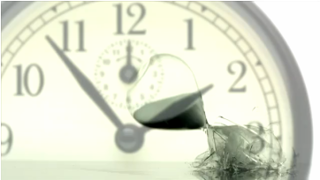

Meinen freien Willen mich heute im Laufe des Tages noch zu entscheiden, gestern eine Pizza – vielleicht war’s auch ein Pastagericht gewesen, ich weiß es jetzt noch nicht – gegessen zu haben, den lasse ich mir doch von der Physik nicht nehmen. Ich habe auch Erinnerungen an Morgen. Denn soweit ich gucken kann ist die Zeit in der Physik umkehrbar. Sie erlaubt mir nach rechts und links zu gehen und schauen genau wie nach gestern und morgen. — Der zweite Satz der Thermodynamik? Kein Gesetz wie die anderen, eine Wahrscheinlichkeitsaussage, die allein sagt, dass die Entropie mit der Zeit anwächst und zwar auch mit der umgekehrten Zeit, wenn ich den Zeitpfeil umdrehe. Das war schon Josef Loschmidts Umkehreinwand, den er prompt seinem Schüler Ludwig Boltzmann zurecht entgegenbrachte. [Den Zeitpfeil kann der zweite Satz der Thermodynamik allein gar nicht erklären](http://www.edge.org/response-detail/25538).

Woran liegt es eigentlich, dass unser Gehirn Erinnerungen an gestern besitzt aber nicht von morgen? Das ist kein Problem des Gehirns allein. Im Fotoalbum kleben auch nur Bilder aus der Vergangenheit und nicht aus der Zukunft. Auch wenn wir noch nicht verstehen, wie Erinnerungen sich im Gehirn manifestieren. Es sind in Aspekten, die den Zeitpfeil betreffen, d.h. im abstrakten Sinn, Zeugnisse nicht unähnlich den Fotografien.

Woran liegt es eigentlich, dass wir denken, die Zukunft planen zu können aber die Vergangenheit für uns fest steht? Auch das ist kein Problem des Gehirns allein.

Wenn wir also das Gehirn als kognitives System in seinem Fundament verstehen wollen, kommen wir um ein allgemeines Verständnis des Zeitpfeils nicht herum. Thermodynamik ist allerdings nicht Teil des Curriculums der diverseren Studiengängen, die sich mit dem Gehirn beschäftigen. Nächste Woche zum Beispiel unterrichte ich eine Blockvorlesung mit insgesamt 15 Doppelstunden über neuronale Modelle einzelner Gehirnzellen und Netzwerke. Dort kommt u.a. auch das Hopfield-Netz vor, eine besondere Form eines künstlichen neuronalen Netzes das als Modell eines assoziatives Gedächtnis gilt. Ich weiß, dass ich gerade bei den Kursteilnehmern (Doktorandinnen und Doktoranden meist mit einem Hintergrund aus der Psychologie) viel Wissen voraussetzen kann. Leider wird jedoch ein Grundverständnis der Aussagen der Thermodynamik wohl eher nicht dazu gehören, weil dies eben nicht zum ihrem Curriculum gehört.

Auch wenn es keine ganze Physikvorlesung ersetzt, es gibt eine [verständliche Einführung von Sean Carroll](http://www.thegreatcourses.com/tgc/courses/course_detail.aspx?cid=1257), eine Vorlesung allein zum Zeitpfeil. Sie ist erschienen in der Reihe [The Great Courses](http://www.thegreatcourses.com/tgc/professors/professor_detail.aspx?pid=339) (TGC), eine schöne Reihe von College-Level-Audio- und Video-Kursen. Die aber leider nur auf englisch verfügbar ist. Bei audible gibt es den Audio Kurs (12 Stunden) für ca. US\$40. Wo der Unterschied zu den US\$129 liegt, der auf der TGC Website angeben ist, weiß ich nicht. Den audible-Kurs habe ich gehört und kann ihn sehr empfehlen.
