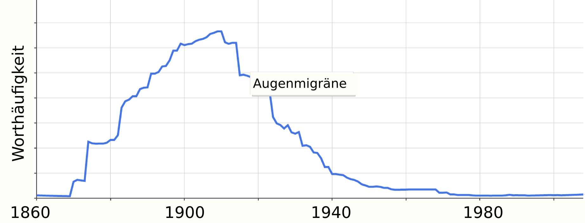
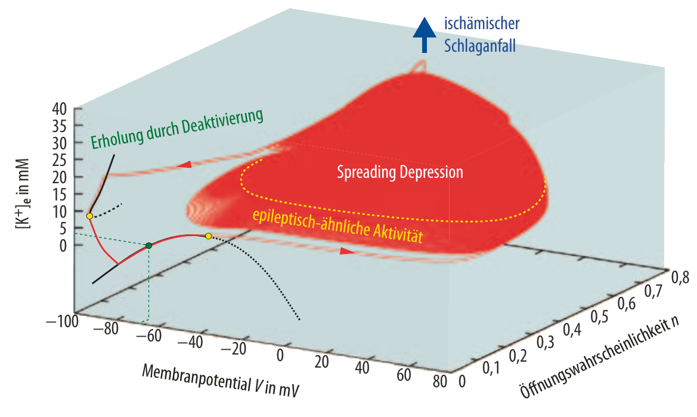

---

***Prolog***

*Im Internet kommt immer mal wieder der Begriff »Augenmigräne« auf. So auch in einem Forum letzten Jahres in einer Diskussion, die ich mit diesem Beitrag nochmal ausführlicher aufgreifen will. Denn auch auf vielen anderen Webseiten liest man darüber, nicht selten falsches. Seitdem ich im Internet über Migräne schreibe, und das sind nun immerhin schon 16 Jahre, bekomme ich jedes Jahr mehrfach Email von Betroffenen, in denen der Begriff auch auftaucht: »Augenmigräne«. Jedesmal antwortete ich bisher individuell. Mal mehr, mal weniger ausführlich und sicher auch mal missverständlich oder gar so, dass die Antwort aufgeschreckt und verunsichert. Grund genug nun einmal hier die Geschichte der »Augenmigräne« zusammenzufassen, auf die ich gegebenenfalls verweisen kann. Es ist eine spannende Wissenschaftsgeschichte – hoffentlich verständlich dargeboten.*

---

Der Begriff »Augenmigräne« ist veraltet. Längst wurde er aus der Fachliteratur entsorgt. So schnell, wie er Mitte des 19ten Jahrhunderts aufkam, so schnell verschwand er in der ersten Hälfte des 20ten Jahrhunderts wieder. Doch die Krankheit blieb natürlich. Was ist also geschehen?

Googles Analyse zeigt, dass das Wort »Augenmigräne« vor allem vor 100 Jahren häufiger in der Literatur genutzt wurde. Um 1910 war der Höhepunkt.

## Sind alle elektrischen Entladungen in der grauen Substanz gleicher Natur?

Mit Augenmigräne bezeichnete man früher, ungefähr von 1870 an, Migräne mit einer »visuellen Aura«, d.h. Migräne mit Sehstörungen verschiedener Art aufgrund »fokaler« Störungen. »Fokal« meint, dass die Störung zunächst auf eine Ansammlung von Gehirnzellen begrenzt ist, auf den neuronalen Fokus oder Herd, und sich von dort womöglich weiter ausdehnen kann. Liegt der Herd in einem Teilgebiet des Gehirns, das für das Sehen zuständig ist, kommt es folglich zu Sehstörungen.

Sehstörungen waren zudem damals schon bei epileptischen Anfällen gut bekannt; wie jene werden auch diese seit jeher »Aura« genannt und auch die epileptische Aura ist eine fokale Störungen. Epilepsie und Migräne mit Aura wurden vor hundert Jahren noch nicht so strikt getrennt betrachtet. Die Migräne mit Aura wurde lange als eine »epileptiforme« Störung gesehen. Nach diesem Prinzip der epileptiformen Störungen galt die Migräne mit Aura als eine der möglichen Verlaufsformen innerhalb des breiteren Spektrums an Epilepsien.

„*Epilepsy is the name for occasional, sudden, excessive, rapid and local discharges of grey matter.*“  
(*John Hughlings Jackson, 1873*)

## »Tollhaus-Theoretiker« vom Rang eines Einsteins, Bohrs oder Plancks

Epilepsie war demnach eine übergeordnete Bezeichnung für gelegentliche, plötzliche, übermäßige, schnelle und lokale Entladungen der grauen Substanz (Nervengeflecht aus Zellkörpern und Zellfortsätzen). Dies dachte zumindest der englische Neurologe und  »Tollhaus-Theoretiker«∗ John Hughlings Jackson (1835-1911). Hughlings Jackson setzte den theoretischen Rahmen für die wissenschaftliche Neurologie. Einen Rahmen, der in seiner Bedeutung mit den Arbeiten von Einstein, Bohr und Planck verglichen wurde [1]. Das Zitat vom ihm (oben) stammt aus dem Jahr 1873  [2,3] – genau zu der Zeit, zu der auch der Begriff  »Augenmigräne« aufkam. Nach Hughlings Jackson wurden später einfache fokale Anfälle ohne Bewusstseinsstörung benannt: der Jackson-Anfall, ein Term, der heute ebenso schon wieder überholt ist.

Die Mißempfindungen einfacher fokaler Anfälle (ehemalige Jackson-Anfälle), insbesondere Sehstörungen bei der »Okzipitallappenepilepsie« (fokale Störung im Hinterhauptslappen, dem hintersten Anteil des Großhirns) aber auch motorische Störungen (aus anderen Gehirnbereichen entstammend), können eine Migräneaura *imitieren* [4]. So drücken wir es in der Terminologie des 21. Jahrhunderts aus. Sollte gar ein epileptischer Anfall zwischen der Migräneaura und der Kopfschmerzphase auftreten, was sehr selten geschieht, nennt man es »Migralepsie« [4].

Nun sollte man sich fragen, was heißt »imitieren« eigentlich konkret physiologisch? Eine Gehirnzelle leidet ja weder an Epilepsie noch an Migräne. Wo liegt der Unterschied im Verhalten der Gehirnzelle? Anders gefragt: Wann führt ein neuronaler Herd zur Epilepsie und wann zur Migräne?

## Wiedergeburt der Hughlings Jackson’schen Idee der Einheit der Entladungen

Für Jackson waren das zunächst alles verwandte Formen. Er benannte alle diese krankhaft physiologischen Veränderungen (»Pathophysiologien«) gleich mit einem Namen: Epilepsie. Freilich wusste Hughlings Jackson aus heutiger Sicht betrachtet nahezu gar nichts über die Pathophysiologie der zugrundeliegenden lokalen Entladungen der grauen Substanz. Messen, was vor sich geht, konnte er um 1873 nicht.

Man mag es kaum glauben, aber bis heute wissen wir noch vieles nicht. Wir haben zum Beispiel keinen direkten Zugang zu den zellulären Vorgängen in neuronalen Herden der Migräne, sondern nur (und auch hier nur sehr eingeschränkt) bei einigen Formen der Epilepsie, die wiederum *keine* einfachen fokalen Anfälle sind (nur in schwere Fällen sind die zur direkten Messung nötigen epilepsiechirurgischen Eingriffe gerechtfertigt). Ersatzweise greifen wir auf Tiermodelle zurück [5], was allerdings nicht unproblematisch, denn es bleibt unklar, wie diese mit der Humanphysiologie zusammenhängen.

Es gibt einen zweiten Weg. Er führt tief in die elektrischen Prozesse der Gehirnzelle. Elektrische Prozesse lassen sich stark abstrahieren, so dass von einem theoretischem Standpunkt – den auch Hughlings Jackson vertrat – solche Vorgänge in ihrer Essenz vor uns liege.  Wir können ein elektrisches Ersatzschaltbild aufzeichnen und dies auf eine Formel bringen. Mit dieser Methode können heute im Computermodell neuronale Herde nachgebildet werden. So kommt man der Verbindungen zwischen Migräne und Epilepsie auf die Spur [6,7].

Ziehen wir eine kurze Zwischenbilanz.

Allein von den Symptomen her betrachtet gibt es Ähnlichkeiten zwischen Migräne und Epilepsie. Beides sind chronische Krankheiten mit episodischen Attacken, die in der Regel sehr unterschiedlich verlaufen, die jedoch in einigen Formen sich auch »imitieren« können. Tier- und Computermodell verraten viel über das Verhalten der Gehirnzellen bei Migräne und Epilepsie. Natürlich gibt es auch andere Ansätze. Vor allem über Methoden der Genetik, zu der wir noch kurz kommen, kann man Wissen über das Zusammenspiel von Migräne und Epilepsie ableiten.

So haben wir fraglos sehr viel dazu gelernt, seitdem uns John Hughlings Jackson den Rahmen für die wissenschaftliche Neurologie setzte. Wie werden wir wohl den heutigen Stand unseres Wissens, der, wenn wir ganz ehrlich sind, immer noch auf wackeligen Füßen steht, weil wir keinen direkten Zugang zu harten Fakten aus der Humanphysiologie besitzen, in 100 Jahren beurteilen?

*It takes 50 years to get a wrong idea out of medicine, and 100 years a right one into medicine.*  
(John Hughlings Jackson)

## Dynamische Krankheiten

Bleiben wir beim heute. Denn etwas durchaus spannendes passiert gerade. Nach allem was wir heute wissen, erlebt die Zellphysiologie gerade eine Hughlings Jackson-Renaissance: Betrachtet man massive, elektrische Entladungen der Zellen in der grauen Substanz, besteht ein fließender Übergang zwischen den fokalen Störungen beider Krankheitsbilder ganz im Einklang mit dem Wissen des 19ten Jahrhunderts [3]. Die Terminologie ist zwar eine andere heute. (Sie ist besser.) Doch spricht aus ihr der Geist, den schon Hughlings Jackson beschwor. Er sah nämlich nicht alle Krankheiten aus je einer abgetrennten Pathophysiologie entspringend, sondern stellte sich im Gegenteil gegen die rigide Krankheitslehre (»Nosologie«) einer künstlichen Einheit. Deswegen sprach er von Epilepsien im Plural. Diese Epilepsien sollten Augenmigräne und andere fokalen Störungen einschließen, denn er vermutet Verwandschaften, die sich in der klinischen Terminologie abbilden müssen. Ansonsten würden gerade junge Ärzte diese Verwandschaften übersehen. Sie brauchen einen Überbegriff für diese – heute könnten wir Patchwork-Familie der Epilepsien sagen.

Wir sprechen heute zwar noch von Epilepsien, also im Plural, aber nicht mit im Sinne einer Patchwork-Familie, die Migräne mit Aura mit einschließt. Wenn wir diesen Verbindungen meinen, sprechen die Fachkreise heute von einem »Kontinuum«. Zu diesem gehören neben Migräne und Epilepsie auch episodisch wiederkehrende Formen des ischämischen Schlaganfalls (ischämisch ≡ eine Minderdurchblutung betreffend).

In diesem Begriff des »Kontinuum« erleben wir die Wiedergeburt der Hughlings Jackson’schen Idee einer Einheit der Entladungen in der grauen Substanz und zugleich die Vielfalt der verschiedenen Formen. Die Theorie (Mathematik) liefert uns eine eigene Sprache dafür, was Hughlings Jackson in seinen Worten beschrieb. Krankheiten wie Migräne, Epilepsie und episodisch wiederkehrende Formen des ischämischen Schlaganfalls können heute auch jenseits ihrer rigiden Nosologien verstanden werden.

Das jeweilige (patho)physiologische Verhalten zeigt bestimmte fließende Übergänge. Um es einmal auch in der mathematischen Fachsprache auszudrücken: Das Verhalten zeigt sich im Raum aller möglichen Zustände einer Gehirnzelle durch ein bestimmtes Muster, ein sogenanntes Verzweigungsmuster (»Bifurkation«) eines Flussfeldes.

Mit einem dreidimensionalen Schnitt durch den Raum aller möglichen Zustände einer Gehirnzelle gewinnt der Fachmann ein theoretisches Verständnis der fast 150 Jahre alten Annahme von Hughlings Jackson über die Einheit abrupt-massiver elektrischer Entladungen in der grauen Substanz. Bewegungsgleichungen dieser dramatischen Veränderungen in den Konzentration elektrisch geladener Teilchen (»Ionenhomöostase«) zeigen im Rahmen der sogenannten Verzweigungstheorie (»bifurcation theory«) Verwandschaftbeziehungen der Entladungszustände bei Migräne, Epilepsie und Schlaganfall. (aus: Ref. [7], siehe auch Refs. [6]).

Diese mathematische Fachsprache hilft sicher nicht dem Laien. Bleiben wir deswegen näher an dem Begriff des »Kontinuums«. Vielleicht hilft eine Analogie, die man aus der Physik entlehnt: weißen Licht besitzt ein *kontinuierliches* Spektrum. Ein Prisma zerlegt weißes Licht in die einzelnen Spektralfarben und jedes Material reflektiert nur Teile des weißen Licht, so dass wir sagen, das Material besitzt eine Farbe. In diesem Bild wären die heutige Krankheitslehren (Nosologien) so etwas wie Materialien. Eine Krankheit oder sagen wir ein Krankheitsspektrum kann aus Linienspektren und breiten Spektrallinien bis hinzu einem spektralen Kontinuum bestehen. Migräne beispielsweise besteht aus etwa zwanzig solcher »Spektrallinien«, also Unterformen. So weit so gut. Doch nun kommt eine entscheidende Tatsache: Untereinander können sich diese Krankheitsspektren teilweise überlappen. Genau deswegen sind die Nosologien letztlich künstliche Einheiten. Sie sind historisch gewachsen, oder anders gesagt: Sie sind menschengemacht. Eine natürliche Definition, die nicht an historsichen Gegebenheiten hängt, begründet ein eigenes Forschungsfeld, das der sogenannten »dynamischen Krankheiten« [7].

Hier geht es natürlich nicht um ein selbstzweckhaftes theoretisches Fundament sondern um die Gemeinsamkeiten in der Therapien, die diese Verwandschaften nahelegen. Unterstützt wird diese einheitliche Sicht nicht allein durch Tier- und Computermodelle, sondern zusätzlich auch durch die genetischen Risikofaktoren sowie durch die sehr seltenen, monogen vererbten Formen dieser Krankheiten, die man erst in den letzten Jahren entschlüsselte. Diese Daten aus der Genetik sind einerseits so wichtig, weil wir keinen direkten Zugang zu den zellulären Vorgängen der Humanphysiologie dieser Krankheiten haben. Andererseits aber auch, weil sie völlig hypothesenfrei zustande kommen, was weder für Tier- noch Computermodell gilt.

Beispielsweise wurden über 150 Mutationen in einem Gen gefunden, die alle einen bestimmten Natrium-Kanal verändern (den sogenannten SCN1A). Diese verschiedenen Mutationen rufen Formen der Epilepsie hervor, meist relativ harmlose. Allerdings nicht fünf von ihnen. Bei ihnen gibt es einen bemerkenswerten Unterschied: diese fünf führen uns zu einer seltenen Unterform der Migräne!

„*Both migraine and epilepsy have genetically based forms caused by various mutations in genes, while the mutation in FHM3 differs markedly within the several mutations in SCN1A therein that it is not associated with epilepsy …*“  
(Dahlem et al. Ref. [8])

Der Laie fragt sich da schon, ob es nicht ein medizinhistorischer Unfall war, dass einige Verläufe der Krankheiten als Migräne gelten (die monogen vererbten Form FHM3) und andere als Epilepsie, obwohl sie nahezu gleiche genetische Grundlagen haben, die Symptomatik sich ähnelt (oder gar die eine die andere perfekt imitiert) und sogar eine hohe Evidenz dafür besteht, dass gewisse Medikamente bei beiden eine vorbeugende Wirkung erzielen.

Ob ein neuronaler Herd eine Epilepsie oder eine Migräne ist, entscheidet sich oft erst klar und eindeutig, wenn die Aktivität von dem Herd ausbricht und die Verlaufsform der Epilepsie sich nochmal weiter deutlich ändert. Zuvor gibt es milde Verlaufsformen der Epilepsie die bestimmten Migräneformen ähneln und wären die Cousins im Kinderbett der Medizingeschichte vertauscht worden, hätte es bis heute wohl niemand bemerkt. Vielleicht erschien uns es sogar so schlüssiger.

Es geht aber nicht um die Nachnamen der Krankheiten. Worum geht es wirklich beim Migräne-Epilepsie-Schlaganfall-Kontinuum?

„*… Investigating the underlying ion homeostasis in the three conditions of epilepsy, migraine, and stroke may yield interesting results in future investigations of computational models that can unify certain dynamical aspects and link disease genotype to phenotype.*“  
(direkte Fortsetzung des Zitats oben. Dahlem et al. Ref. [8])

## Das Migräne-Epilepsie-Schlaganfall-Kontinuum?!?

Was heißt das, dass Migräne, Epilepsie und Schlaganfall Teil eines »Kontinuums« sind? Ich kann verstehen, dass Betroffene nun aufschrecken und verunsichert sind. Doch vor dieser Aussage braucht man als Betroffener keine Angst zu haben. Denn seit der Zeit von Hughlings Jackson haben sich ja nur die Einordnungen und Bezeichnungen geändert. Heute, neu überdacht und mit experimentellen Daten sowie theoretischen Überlegungen gestützt, taucht die Hughlings Jackson’schen Idee der Einheit wieder in dem Begriff des »Kontinuums« auf. So ein zweifaches Umdenken und Reden über die Namen der Krankheiten, die bekanntlich Schall und Rauch sind, ändert ja weder das symptomatische Krankheitsbild an sich, noch die Wahrscheinlichkeit, von einem ins andere zu wechseln. Letzteres – das Wechseln des Krankheitszustandes – ist sicher eins von zwei Dingen, wofür man sich als Betroffener unmittelbar interessiert. Man leidet unter Migräne und bekommt Angst nun auch leichter einen Schlaganfall zu erleiden. Diese Angst wäre unbegründet.

Wenn zwei Krankheitsbilder teil eines »Kontinuums« sind, heißt das nicht, dass man leicht von einem zum anderen kommt. Die oben erwähnte »Migralepsie« ist extrem selten! Auch die Wahrscheinlichkeit einen Schlaganfall zu bekommen, ist für Menschen mit und ohne Migräne nahezu gleich hoch! Hingegen ist das Risiko bei anderen, bekannten Risikofaktoren (Nikotin, übermäßig Alkohol, Übergewicht, Bewegungsmangel, hoher Blutdruck, erhöhte Blutfette) für Schlaganfall in der Tat signifikant höher. Diese Faktoren und Anzeichen des Lebenstils gilt es insbesondere als Migräneerkrankter zu beachten beziehungsweise – in Absprach mit einem Arzt – zu behandeln. Hughlings Jackson ging es um die Ausbildung der Ärzte, die jeden Fall in seiner Individualität sehen sollen und dem können Hughlings Jacksons Ansicht nach zu enge Krankheitsbilder entgegen stehen. Ich denke, da hatte er recht.

## Medizin als Wissenschaft benötigt eine Klassifizierung, die Wissen vorantreibt

Das ist nämlich das andere, wofür man sich als Betroffener interessiert. Wenn zwei Krankheitsbilder teil eines »Kontinuums« sind, heißt das zwar nicht, dass man leicht von einem zum anderen kommt. Es heißt jedoch schon, dass Auslösefaktoren und Therapienformen gleich oder ähnlich sein können. Und das sind wirklich gute Nachrichten. Die wirklich relevante Interpretation dieses »Kontinuums«, als eine übergeordnete Klassifikation von Migräne, Epilepsie und Schlaganfall, ist, dass wir nur mit einem Verständnis solcher Zusammenhänge unser Wissen fundamental erweitern können. Dazu gehört es auch, die Kaskaden zu verstehen, in denen sich Zustände doch einmal verschlimmern können und diese rechtzeitig anhand kritischer Schwankungen zu diagnostizieren.

„*Medicine as a science needs a classification that advances knowledge; medicine as an art must have a clinical, practical, even if arbitrary, classification.*“  
(Owsei Temkin)

So fasst es Owsei Temkin in seinem Buch »The Falling Sickness« zusammen aus dem ich auch das Zitat von John Hughlings Jackson entnommen habe [2].  Dass medizinische Klassifikationen nicht allein wissenschaftlich begründet sein müssen, geht laut Temkin wiederum von William Milson Moxon (1836-1886) aus, der Hughlings Jackson diesbezüglich beeinflusste. Beide haben sich schon im 19ten Jahrhundert über die Klassifikation von Augenmigräne oder, wie wir heute sagen würden, Migräne mit visueller Aura, die fundamentalen Gedanken gemacht haben, mit denen wir bis heute kämpfen. Das ich regelmäßig Post mit Fragen dazu bekomme, ist nur ein Anzeichen dafür.

## Medizin als Kunst benötigt eine praktikable Klassifizierung

Um es einmal deutlich zu sagen: heute ist »Migräne mit Aura« *keine* Verlaufsform im Spektrum der Epilepsien oder einer anders zu nennenden Überkrankheit. Medizinische Klassifikationen müssen nicht allein wissenschaftlich begründet sein, sondern auch von praktischen Standpunkten gesehen werden und diesen Ansprüchen genügen. Das war auch John Hughlings Jackson klar.

Heute liegt die Klassifikation im Prinzip in der Hand der Mitglieder der Internationalen Kopfschmerzgesellschaft. Praktisch läuft alles unter Federführung einiger Experten, die sich zu Arbeitsgruppen zusammenschließen. Den Vorsitz über das gesamte Komitee aus Arbeitsgruppenleitern hat Prof. Jes Olesen (Dänemark), der zusätzlich auch die Arbeitsgruppe zur Migräne leitet.

Olesen hat fundamentale Arbeiten dazu geleistet, nachzuweisen, dass Migräne mit Aura eine andere Krankheitsform ist als Migräne ohne Aura, beider aber Unterformen der Migräne. Ob sich die Pathophsiologie aber wirklich fundamental unterscheidet, ist heute noch eine offene Frage. Meine eigene Forschung beispielsweise unterstützt die These, dass der Migräne *mit* Aura die gleiche Pathophysiologie unterliegt, wie der Migräne *ohne* Aura und die Unterschiede darin bestehen, wie weit sich die Störung vom neuronalen Herd ausdehnen kann. (In Mathematik-Sprech: das Flussfeld der Bewegunsgleichungen verzweigt.)

Die Zeit ist mal wieder gekommen: Erst 1988, dann 2003 nun 2016. Es wird eine neue Klassifikation der Kopfschmerzkrankheiten geben, die einiges umstellt. Einige durchaus revolutionäre Änderungen sind dabei: völlig neue Begriffe tauchen plötzlich auf, andere werden aufgegeben. Die Augenmigräne ist längst Geschichte. Doch findet die »retinale Migräne« einen neuen Platz. Bisher war diese, die Netzhaut der Augen betreffende Störung, noch eine eigene Unterform, genau wie die Migräne mit Aura. Jetzt wird sie eine Verlaufsform der Unterform Migräne mit Aura. Da man Unterform und Verlaufsform leicht durcheinander würfelt, nochmal anders gesagt und mit Nennung der Kodierung: Es gibt seit 1988 eine Klassifikation der Kopfschmerzkrankheiten und Migräne trägt in dieser die Nummer 1. Migräne mit Aura ist die zweite Unterform, also 1.2. Jetzt müssen wir zwischen der zweiten und dritten Ausgabe der Klassifikation unterscheiden: In der zweiten Ausgabe war die retinale Migräne die vierte Unterform, also 1.4. In der dritten Ausgabe ist die retinale Migräne eine Verlaufsform der Unterform Migräne mit Aura (1.2), nämlich die sechste Verlaufsform, also 1.2.6

An diesem Beispiel sehen wir die Grenzverschiebungen. Es wurde über diese viele Jahre heftig gestritten. Vielleicht hätte es die teils hitzigen Gemüter beruhigt, wenn sie wüssten, dass schon vor 150 Jahren Medizin als Wissenschaft *und* Kunst galt und richtige Ideen ihre Zeit brauchen, um in die Medizin hineinzubekommen.

## 

## Fußnote

∗»Bedlamite theorist« – es ist mir unklar, ob nur John Hughlings Jackson so bezeichnet wurde oder er sich auch selbst so bezeichnete. John ‚Hughlings-Jackson‘ bevorzugte die Bindestrichversion seines Namens, der sich aus den Namen seiner Mutter Sarah Hughlings und seines Vaters Samuel Jackson zusammensetzt. Allerdings habe ich, wie in der Literatur über ihn üblich, mich entschieden seinem Namen ohne Bindestrich zu verwenden, jedoch beide Namen immer zusammen (Hughlings Jackson), um die von ihm gewünschte Verbindung zu erhalten.

Siehe:

John Hughlings Jackson: Father of English Neurology: Father of English Neurology. von Macdonald Critchley und Eileen A. Critchley.

Kleine Geschichte der Hirnforschung: Von Descartes bis Eccles (Beck’sche Reihe) Taschenbuch – 23. Februar 2001 von Peter Düweke.

## Literatur

[1] York, G. K., & Steinberg, D. A. (2002). The philosophy of Hughlings Jackson. Journal of the Royal Society of Medicine, 95(6), 314-318.

[2] Jackson, J. H. (1958). *Selected writings of John Hughlings Jackson*. J. Taylor (Hrsg.) Vol. 2, Hoder and Stoughton (Londan) 1931-1932. (zitiert nach [2])

[3] Temkin, O. The Falling Sickness, John Hopkins University Press. 1954

[4]  Kopfschmerz zurückzuführen auf einen zerebralen Krampfanfall, ICHD-II, ([Link](http://ihs-classification.org/de/02_klassifikation/03_teil2/07.06.00_nonvascular.html))

[5] Eickhoff, M., Kovac, S., Shahabi, P., Ghadiri, M. K., Dreier, J. P., Stummer, W., … & Gorji, A. (2014). Spreading depression triggers ictaform activity in partially disinhibited neuronal tissues. *Experimental neurology*, *253*, 1-15.

[6] Hübel, N., & Dahlem, M. A. (2014). Dynamics from seconds to hours in Hodgkin-Huxley model with time-dependent ion concentrations and buffer reservoirs. PLoS computational biology, 10(12), e1003941.  |  Wei, Y., Ullah, G., & Schiff, S. J. (2014). Unification of neuronal spikes, seizures, and spreading depression. *The Journal of Neuroscience*, *34*(35), 11733-11743  | Ullah, G., Wei, Y., Dahlem, M. A., Wechselberger, M., & Schiff, S. J. (2015). The Role of Cell Volume in the dynamics of Seizure, Spreading Depression, and Anoxic Depolarization. PLoS Comput Biol, 11(8), e1004414.

[7] Dahlem, M. A. Dynamik der Migräne, Physik Journal, 2012

[8] Dahlem, M. A., Schumacher, J., & Hübel, N. (2014). Linking a genetic defect in migraine to spreading depression in a computational model. PeerJ, 2, e379.
