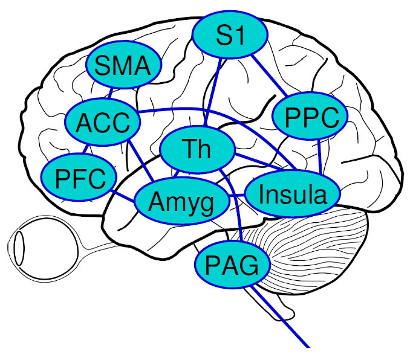
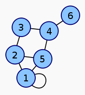
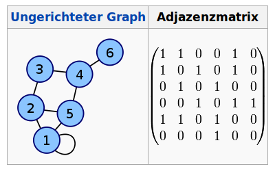
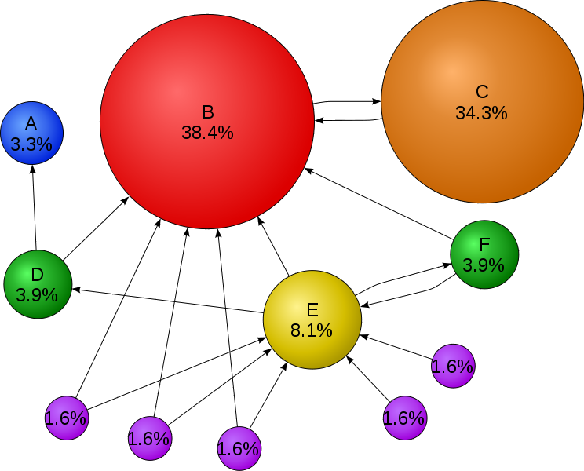

Vier Beiträge über Schmerz. Der [erste](https://scilogs.spektrum.de/blogs/blog/graue-substanz/2011-03-23/was-ist-schmerz) lag schon lang zurück als neulich – mit einer neuen Idee – der [zweite](https://scilogs.spektrum.de/blogs/blog/graue-substanz/2012-01-16/physik-des-schmerzes-jenseits-der-daumenschraube) erschien, zunächst etwas knapp formuliert, der [dritte](https://scilogs.spektrum.de/blogs/blog/graue-substanz/2012-01-25/qualen-qualia-und-querelen) füllte Lücken, der [vierte](https://scilogs.spektrum.de/blogs/blog/graue-substanz/2012-01-27/grausamer-schmerz-im-zentralen-hoehlengrau) fasste zusammen. Eine logische Reihenfolge, wie Glieder einer Kette. Die nächsten Beiträge schreibe ich vielleicht anders. Vielleicht so: Dieser fünfte könnte Bezug auf den ersten und zweiten nehmen. Dann mache ich einen langen Nachtrag im ersten und schreibe den sechsten wieder neu, wobei diesen dann wenig mit seinem Vorgänger, dem fünften, verbindet aber dafür mit Beitrag vier. Kann ich so machen.

Je mehr Beiträge ich schreibe desto wahrscheinlicher muss ich es auch so oder so ähnlich machen, denn es gibt zu viele verschiedene Zusammenhänge. Wer je eine längere wissenschaftliche Arbeit verfasst hat, weiß dass Kapitel unterschiedlich und mehrfach zusammenhängen und nicht einfach aufeinander folgen.

Sobald Dinge etwas komplizierter zusammenhängen gibt es daher oft keine logische Reihenfolge mehr. Statt Glieder einer Kette könnte ich einen Graphen zeichnen (s. Bild rechts). Genauso gut ist jedoch auch eine Tabelle, die ich aufstelle mit den Beiträgen sowohl in den Zeilen als auch Spalten und durch ein Kreuz wird markiert, ob zwei Beiträge zusammenhängen. Für das fiktive Beispiel oben sieht das so aus.

Nachbarschaftstabelle

|  |  |  |  |  |  |  |
| --- | --- | --- | --- | --- | --- | --- |
|  | Beitrag 1 | Beitrag 2 | Beitrag 3 | Beitrag 4 | Beitrag 5 | Beitrag 6 |
| Beitrag 1 | X | X |  |  | X |  |
| Beitrag 2 | X |  | X |  | X |  |
| Beitrag 3 |  | X |  | X |  |  |
| Beitrag 4 |  |  | X |  | X | X |
| Beitrag 5 | X | X |  | X |  |  |
| Beitrag 6 |  |  |  | X |  |  |

So eine Tablle ist nichts anderes als eine Matrix. Wenn es keine Reihenfolge gibt, ist das eine adequate Methode Nachbarschaften abzubilden. Daher nennt man diese Tabelle bzw. Matrix auch Nachbarschaftsmatrix oder Adjazenzmatrix. Und darum geht es. Statt der Kreuze kann ich auch Zahlen verwenden, die entweder alle auf 1 gesetzt werden und alle leeren Einträge auf 0 oder durch Zahlen, die die Stärke der Nachbarschaft gewichten.

  
Nachbarschaft als Graph und Matrix ([Wikipedia](http://de.wikipedia.org/wiki/Repr%C3%A4sentation_von_Graphen_im_Computer))

Solche Graphen müssen nicht ungerichtet sein (was zu symmetrischen Matrizen führt). Ein gutes Beispiel findet man bei Facebook und Twitter. In Facebook kann man nur gegenseitig befreundet sein (ungerichtet), bei Twitter kann man folgen ohne gefolgt zu werden (gerichtet). Auch Freundschaften und das Folgen wird in gigantischen Matrizen abgebildet und kann so mathematisch analysiert werden. Irgendwann geht man dann an die Börse damit.

Auch das WWW mit seinen Webseiten ist ein ungerichteter Graph. Setzen Sie doch einfach mal einen Link auf diesen Beitrag, ich setzte dann entweder einen zurück (ungerichtet) oder auch nicht (gerichtet).1 Googles PageRank-Algorithmus basiert auf der geschicken Analyse der Nachbarschaftmatrix.

Es gibt einen ganzen Bereich der Statistischen Physik, der sich damit heute beschäftigt. Statt das WWW zu durchsuchen oder soziale Netzwerke zu ergründen, kann man auch Schmerzforschung so machen.

## Algos trifft auf Algebra

Auch im Gehirn gibt es Netzwerke, zum Beispiel die der Sinneswahrnehmung.2 Schmerz als eigenständiger Sinn wird dementsprechend durch eine Schmerzmatrix beschrieben [1]. Die Nachbarschaftsmatrix ist dabei natürlich nur ein Teilaspekt, die Dynamik auf dem Netzwerk, also in der Schmerzmatrix, ist der wesentliche andere Teil.

  
Die Schmerzmatrix mit einigen Kerngebieten, nach [2].

Die Schmerzmatrix besteht aus dem zentralen Höhlengrau (periaqueductal grey, PAG), Thalamus (Th), primären (S1) und sekundären (S2, nicht gezeigt) sensorischen Cortex, der Amygdala (Amyg), der Inselrinde (insula cortex, Insula), der supplementär-motorischen Rinde (supplementary motor area, SMA), der hinteren Parietalrinde (posterior parietal cortex, PPC), dem präfrontalen Cortex (PFC), dem anterioren Gyrus cinguli (anterior cingulate cortex, ACC), den Basalganglien und Kleinhirn (die letzten beiden sind nicht im Graphen eingezeichnet, Abbildung übernommen aus [2]).

## 2 mal mit und 1 mal ohne Noxen

Schmerz als Warnsignal tritt über die Schmerzrezeptoren (Nozizeptoren) und Nervenbahnen in die Schmerzmatrix ein, metaphorisch gesprochen. Diesen nennt man auch *Nozizeptorenschmerz*. Vereinfacht kann man sich es so vorstellen: die Schmerzmatrix hat verschiedene Gangarten in denen neuronales Feuern durch ihr Netzwerk geschickt wird: den Müßiggang und verschiedene Arbeitsgänge. Im Müßiggang ist alles in Ordnung. Ein aktiver Arbeitsgang bedeutet Schmerzwahrnehmung. Die Nozizeptoren sind die Gangschalter.

Bekannt sind nun auch *neuropathische Schmerzsyndrome* durch vielfältige Schädigungen einzelner Regionen, sei es durch physikalische Schädigung in Form mechanischer oder elektrischer Reize – wie zuvor im Beitrag [Grausamer Schmerz im zentralen Höhlengrau](https://scilogs.spektrum.de/blogs/blog/graue-substanz/2012-01-27/grausamer-schmerz-im-zentralen-hoehlengrau) mit „Hilfe“ der Tiefenhirnstimulation beschrieben – oder sei es, dass die Schädigung durch metabolische, toxische oder entzündlichen Stoffe hervorgerufen wird.

Diese Stoffe werden auch Noxen genannt, wobei man auch die physikalische Schadensursache als Noxe bezeichnen kann. Beim neuropathischen Schmerz schaltet sich die Schmerzmatrix in einen Arbeitsgang ohne dass jemand an der äußeren Gangschaltung, den Nozizeptoren, hantiert.

In der Schmerzmatrix könnten sich aber eventuell Rhythmen verselbstständigen und sich *ohne Noxe* die Gangart abrupt ändern. Existieren solche Kipp-Punkte in der Schmerzmatrix, würde man von einer dynamischen Krankheit sprechen. In meinen Augen spricht bei den beiden primären Kopfschmerzkrankheiten, Migräne und Clusterkopfschmerz, zumindest einiges dafür, dass dieses Bild zutreffen könnte.

Hinter dem Begriff „Migräne-Generator“ steckt so eine Idee, die in einem extra Beitrag vorgestellt werden soll.  Alternativ wird aber auch die Vorstellung in Fachkreisen diskutiert, dass bei Migräne eine Entzündung der Hirnhäute durch das Phänomen der Spreading Depression die entscheidende Rolle spielt, wobei dann interne Noxen das nozizeptive System in den Hirnhäuten aktiviert. Bei Kopfschmerzen ist, im Vergleich zu anderen Krankheiten mit Schmerzursachen, aus verschiedenen Gründen3 bis heute noch wenig bekannt, welche Prozesse den Schmerz initiieren.

Mathematische Modelle, die die Dynamik in Netzwerken beschreiben, können hier helfen die Aktivitätsmuster, die durch nichtinvasive Bildgebung von der Schmerzmatrix gemessen werden können [2], richtig zu interpretieren. Wie viele grundlegend verschiedene „Arbeitsgänge“ der Schmerzmatrix gibt es? Welcher entspricht Migräne, welcher dem Clusterkopfschmerz? Wie entsteht eine Chronifizierung des Schmerzes in der Schmerzmatrix?

Auch um Vorhersagen machen zu können, sind Modell-basierte Interpretationen zwingend notwendig, da die Schmerzmatrix viel zu komplex ist, um ohne Modell zu sehen, wer wen aktiviert und inhibiert und welche Folge ein Schädigung in einem „Netzwerknoten“ hat. Ebenso sollte es zumindest im Prinzip möglich sein, durch Modelle zu berechnen, wie man die Schmerzmatrix wieder in den Müßiggang zurückschaltet durch externe Einflussnahme, Neuromodulation genannt. Wenn es soweit ist, kann man damit dann auch an die Börse gehen.

**Vorangegangene Beiträge**

[Physik des Schmerzes jenseits der Daumenschraube](https://scilogs.spektrum.de/blogs/blog/graue-substanz/2012-01-16/physik-des-schmerzes-jenseits-der-daumenschraube)

[Qualen, Qualia und Querelen](https://scilogs.spektrum.de/blogs/blog/graue-substanz/2012-01-25/qualen-qualia-und-querelen)

[Grausamer Schmerz im zentralen Höhlengrau](https://scilogs.spektrum.de/blogs/blog/graue-substanz/2012-01-27/grausamer-schmerz-im-zentralen-hoehlengrau)

**Fußnote**

1 Links, Tweets und Posts in Facebook, G+ etc. sorgen bei weitem nicht nur unmittelbar für die Verbreitung des konkreten Inhalts sondern auch für die Bewertung der Blogs und seines Rangs als Webseite. Das ist ein durchaus sehr ernst zunehmender Lohn.

2 Im Prinzip gibt es auch eine Seh- oder Hörmatrix, allerdings wird diese und andere Sinnesinformationen zunächst recht einpfadig übertragen, so dass man z.B. von dem visuellen Pfad spricht, der von der Netzhaut über Thalamus (Corpus geniculatum laterale) in die primäre Sehrinde (V1) führt und dann weiter zur den höheren Sehrindearealen  V2, V3, V4, MT, MST …, wobei es eigentlich ab V1 in einem [Netzwerk von mehreren Dutzend visuellen Arealen weiter geht](http://www.nature.com/nrn/journal/v3/n4/fig_tab/nrn783_F2.html).

3 Der Hauptgrund ist sicher, dass Tiermodelle bei Kopfschmerzen als dynamische Krankheiten fundamentale – nicht allein ethische sondern auch konzeptionelle – Probleme aufwerfen, da man eben keine Noxen „einführen“ kann. Auch dazu kommt noch mal ein extra Beitrag, denn dieses eben auch ethisch sehr sensible Thema kann nicht in einer Fußnote abgehandelt werden.

**Literartur**

[1] Iannetti GD, Mouraux A. From the neuromatrix to the pain matrix (and back). *Exp Brain Res.*  **205**:1-12. 2010

[2] May, A. A review of diagnostic and functional imaging in headache. *The Journal of Headache and Pain* . **7** 2006

© 2012, Markus A. Dahlem
