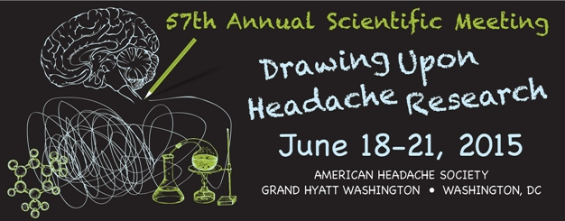

Diese Woche und noch bis morgen kann man bei Twitter unter dem Hashtag [#AHS15DC](https://twitter.com/hashtag/AHS15DC?src=hash) das 57. Jahrestreffen der amerikanischen Headache Society (AHS) mitverfolgen.

Im Mai ist gerade erst der alle zwei Jahre stattfindende Kopfschmerzkongress der Internationalen Headache Society (IHS) in Valencia zu Ende gegangen. Wer beides verfolgt hat, also den vergangenen IHS-Kongress und das noch laufende AHS-Treffen, stellt fest, die amerikanische Fachgesellschaft ist deutlich Social Media-affiner und tut mehr für die Verbreitung aktueller Ergebnisse aus der Kopfschmerzforschung.

Ich war vielfach bei beiden Tagungen vor Ort. Dieses Jahr verfolge beide Events allerdings nur über Twitter und über manche persönliche Nachfrage per Email bei den Kollegen. Das diesjährige AHS Treffen wird mir wahrscheinlich ähnlich gut in Erinnerung bleiben, wie die vorangegangen Events, bei denen ich anwesend war. So viele Slides, so viele Kommentare kann man mitverfolgen. Schade nur, dass die Vorträge bisher nicht live gestreamt werden.

Auch Laien können sich die ein oder andere Anregung holen. Direkt über den Hashtag #AHS15DC oder natürlich hier im Blog, wo ich die Themen über die nächsten Wochen und Monate aufarbeite.

Das Motte dieses Jahr lautet, man soll sich auf die Kopfschmerzforschung stützen. Das sagt schon etwas aus. Es geht nicht so sehr darum, dass es soviel Esoterik rund ums Thema Kopfschmerzen gibt. Die gibt es in der Tat. Doch auch in medizinischen Lehrbüchern sind einige Theorien veraltet und Therapieansätze durch neue überholt. Es geht also um die *aktuelle* Kopfschmerzforschung, Forschung der letzten 5 Jahre, die noch nicht unbedingt Einzug in die Lehrbücher gefunden hat und auf die man schnell weiter aufbauen muss.

Auf diese aktuelle Kopfschmerzforschung sollen sich sicher nicht nur für die Forscher auf der Tagung stützen, sondern auch für die Ärzte, Therapeuten und Betroffene zuhause. Gerade die schwer Betroffenen diskutieren viel gemeinsam in Foren und Selbsthilfegruppen. Dazu kann man sich Anregungen holen, indem man den führenden Forschern einmal direkt über die Schulter schaut. Was gibt es Neues?

Einen Beitrag über [Migräne und Stress](https://scilogs.spektrum.de/graue-substanz/stress-und-migraene/) habe ich aktuell geschrieben.
