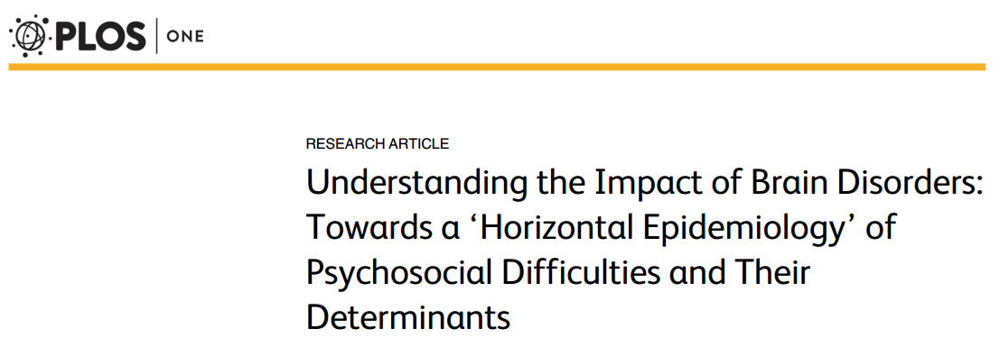
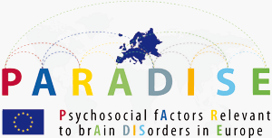

## Denkstörungen

Zuerst zu den kognitiven Symptomen der Migräne. Denkstörungen oder auch die Verschlimmerung der Kopfschmerzen oder der Übelkeit mit geistiger Tätigkeit sind nicht selten bei Migräne. Das Ziel einer neuen Studie war es nun, die Präsenz und Relevanz dieser kognitiven Symptome während der Migräneattacken zu analysieren [1]. Wie verhalten sich Intensität kognitiver Symptome und Behinderung durch sie zu anderen Symptomen der Migräne? Gefunden wurde folgendes. Kognitive Symptome sind sehr intensiv und behindern die Betroffenen stark. Der Grad dieser kognitiven Symptome korreliert subjektiv mit dem Schweregrad der anderen Symptome einer Migräne. Demnach sollten, so fordern die Autoren, zukünftige klinische Studien kognitive Symptome einbeziehen. Verbessern sich kognitive Symptome, könnte dies zumindest als unterstützend für die primären Ziele der Studie betrachtet werden. Das primäre Ziel ist meist die Reduzierung der Kopfschmerztage. Veröffentlicht wurde die Studie am 8. September [1].

## Psychosoziale Schwierigkeiten

In einer weiteren neuen Veröffentlichung vom 9. September wird die Hypothese einer „horizontalen Epidemiologie“ psychosozialer Faktoren getestet [2]. Auf die Studie wird etwas genauer eingegangen.

Migräneerkrankte erleben psychosoziale Schwierigkeiten (PSD, psychosocial difficulties), wie etwa Erschöpfung, Angst, Stress, Schlafstörungen, emotionale Instabilität, Schwierigkeiten in persönlichen Interaktionen und vieles weitere mehr. Auch der Schmerz durch seine negative motivationale Dimension gehört zu den PSDs. Manche dieser PSDs bestehen nur bei Attacken andere können auch in der anfallsfreien Zeit auftreten. Die Hypothese der horizontalen Epidemiologie heißt nun, dass die PSDs für viele neurologische Krankheiten und psychiatrische Störungen sich gleichen. Sie sind also beispielsweise nicht allein migränetypisch. Verglichen wurden nicht nur PSDs sondern auch deren umfassenderen Umweltfaktoren sowie andere bestimmende Faktoren. Bei Migräne sind dass insbesondere Medikamente, Wetter, Einstellungen und Hilfe der Familie und der der Heilberufler sowie der allgemein öffentliche Bekanntheitsgrad der Krankheit, was Bewusstsein, Solidarität und Unterstützung mit sich führt.

Verglichen wurden in der Gruppe mit Migräne vier weitere neurologische Krankheitsbilder: Epilepsie, Multiple Sklerose, Morbus Parkinson, Schlaganfall und hinzu kam eine Gruppe psychiatrischer Störungen: Demenz, Depression, Schizophrenie und Drogenabhängigkeit; also insgesamt neun Gehirnerkrankungen.

In die Untersuchung gingen ingesamt 64 PSDs ein und 20 Umweltfaktoren der PSD. Als gleich angesehen wurden die Faktoren, wenn sie in wenigsten fünf Krankheitsbildern zu über 25% auftraten und sowohl neurologische Krankheiten als auch psychiatrische Störungen betrafen.

Die Ergebnisse stützen die Hypothese einer horizontalen Epidemiologie psychosozialer Aspekte in Gehirnerkrankungen. 57 der PSDs and 16 der Umweltfaktoren der PSDs waren nach den oben genannten Kriterien unspezifisch. Die Wissenschaftler sehen die Relevanz ihrer Ergebnisse in einer veränderten Gesundheitsversorgung. Wünschenswert wäre es weniger einen vertikalen Ansatz spezifisch nach einzelnen Krankheitbildern zu verfolgen und stattdessen übergreifend die Gesundheitsversorgung anzugehen.

Es sind übrigens Ergebnisse aus einem abgeschlossenen Forschungsprojekt, [PARADISE](http://paradiseproject.eu/), das im 7. Forschungsrahmenprogramm (FP7) der EU mit knapp 1,5 Mio EUR gefördert wurde. 2010 lief es an und dauerte 3.5 Jahre. PARADISE steht für: Psychosocial Factors Relevant to Brain Disorders in Europe. Koordiniert wurde das europaweite Projekt in Deutschland, an der Ludwig-Maximilians-Universität München, am Lehrstuhl für Public Health und Versorgungsforschung in der Forschungsgruppe für Biopsychosoziale Gesundheit.

## Überempfindlichkeit

Wie die vorangegangene Studio schon zeigt, Migräne kann man als eine biopsychosoziale Krankheit ansehen. Um das „bio“ in biopsychosozial geht es in der nächsten aktuellen Studie. Welche Gehirnstrukturen sind bei Migräne verantwortlich für die Überempfindlichkeit gegenüber sensorischen Stimuli (Geräusche, Licht, Berührung, Geschmack- und Geruchswahrnehmungen etc.)? Ein Übersichtsartikel schaut auf die Ergebnisse der Bildgebung und Elektroenzephalographie der letzten Jahre [3].

## Biomarker

Bei der Studie über Biomarker verweise ich auf den Beitrag [Biomarker für Migräne entdeckt](http://www.scinexx.de/wissen-aktuell-19297-2015-09-11.html) auf scinexx.de.

## Und was sonst noch

In Großbritannien war vom 6 bis 12 September die *Migraine Awareness Week*. Die Huffington Post fasst [Ursachen, Symptome und Behandlungen](http://www.huffingtonpost.co.uk/2015/09/07/migraines-symptoms-causes-treatment_n_3858572.html) zusammen, ebenso wie – um ein weiteres Beispiel aus dem Boulevard zu nennen – die Website der Tageszeitung Daily Mirror: [Migraine Awareness Week: How you can stop the painful condition from affecting your life](http://www.mirror.co.uk/lifestyle/health/migraine-awareness-week-how-you-6362617).

Solche öffentlichen Kampagnen sollen mit beitragen, dass klinische Forschung besser kommuniziert wird. Das dies ganz unmittelbar wertvoll ist, zeigt die Tatsache, dass mangelndes gesellschaftliches Wissen über die Krankheit ein bestimmender Gesundheitsfaktor ihrer psychosozialen Schwierigkeiten ist (s.o.).

https://twitter.com/markusdahlem/status/641306228535205888

Dies war auch ein großes Thema letzten Dienstag bei dem Bürgerdialog „Zukunft verstehen“ des Bundesministerium für Bildung und Forschung (BMBF). Eine der [19 Empfehlungen an das BMBF](https://www.zukunft-verstehen.de/zukunftsforen/zukunftsforum-1/zukunftstag/b%C3%BCrgerempfehlungen), die mit der Ministerin Wanka diskutiert wurden, war die Forderung der „Förderung und Verbreitung von Gesundheitstipps in den Medien“.  Es gab dort jedoch durchaus nicht allein den Konsens, dass wissenschaftliche und klinische Forschung öffentlich besser kommuniziert werden soll. Es wurde mehr noch kritisiert, dass im Internet viele falsche Informationen stehen, insbesondere wurden Foren kritisiert.

## Literatur

[1] Raquel Gil-Gouveia, António G Oliveira, and Isabel Pavão Martins The impact of cognitive symptoms on migraine attack-related disability, Cephalalgia 0333102415604471, first published on September 8, 2015 [doi:10.1177/0333102415604471](http://dx.doi.org/10.1177/0333102415604471)

[2] Cieza A, Anczewska M, Ayuso-Mateos JL, Baker M, Bickenbach J, Chatterji S, et al. (2015) Understanding the Impact of Brain Disorders: Towards a ‘Horizontal Epidemiology’ of Psychosocial Difficulties and Their Determinants. PLoS ONE 10(9): e0136271. [doi:10.1371/journal.pone.0136271](http://dx.doi.org/doi:10.1371/journal.pone.0136271)

[3] Demarquay, G. and Mauguière, F. (2015), Central Nervous System Underpinnings of Sensory Hypersensitivity in Migraine: Insights from Neuroimaging and Electrophysiological Studies. Headache: The Journal of Head and Face Pain. [doi: 10.1111/head.12651](http://dx.doi.org/10.1111/head.12651)

[4] Peterlin BL, Mielke MM, Dickens AM, Chatterjee S, Dash P, Alexander G, Vieira RV, Bandaru VV, Dorskind JM, Tietjen GE, Haughey NH. Interictal, circulating sphingolipids in women with episodic migraine: A case-control study. Neurology. [doi: ​10.​1212/​WNL.​0000000000002004](http://www.neurology.org/content/early/2015/09/09/WNL.0000000000002004.abstract)
