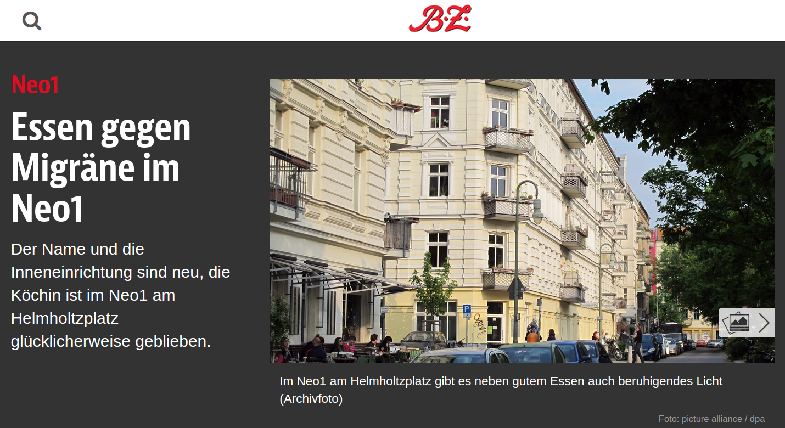
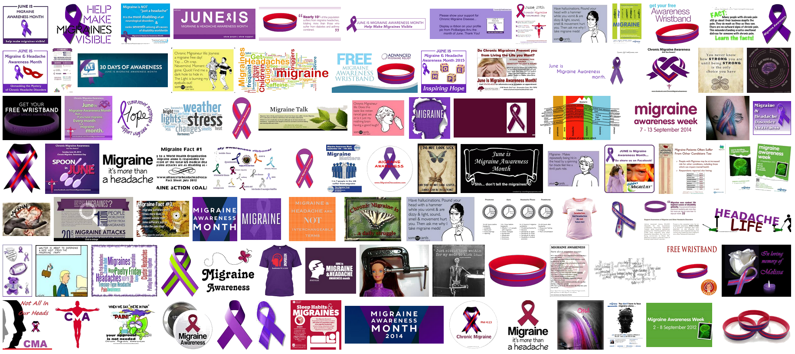

Die Tagessuppe aus Roter Bete ist es nicht.  Obwohl Rote Bete oft ins Lila geht. Es sind die Teelicht-Gläser, Kissen, Regal und Brotkörbe. Die helfen gegen Migräne. Denn sie sind lila. In einem Restaurant. In Berlin. Und das hilft gegen Migräne. [Nein, wirklich](http://www.bz-berlin.de/stadtleben/restaurant/essen-gegen-migraene-im-neo1).

Richtig ist: Die Farbe Lila wird als Erkennungszeichen für öffentliche Kampagnen genutzt, insbesondere in den USA im Juni. Dieser Monat ist dort nämich der *migraine awareness month*. Das Motto im Jahr 2012 war zum Beispiel „[Dazu beitragen, dass Migräne sichtbar wird!](https://scilogs.spektrum.de/graue-substanz/migraene-solidaritaet-und-unterstuetzung/)“. Das hatte ich für meine Crowd-Funding Kampagne übernommen. Im Jahr darauf war das Motto: „Unmasking the Mystery of Chronic Headache Disorders“. Zu dem Thema – es ist immer noch aktuell – habe ich einen Beitrag über eine neue Veröffentlichung in Vorbereitung. Im letzen Jahr dann „Dreaming of World without Headache and Migraine. Join us in raising awareness and reducing stigma!“.

Zum Motto dieses Jahr später mehr. In Großbritannien ist übrigens vom 6. – 12. September dieses Jahr die Migraine Awareness Week.

In Deutschland gibt es zwar (noch) keine solchen koordinierten Aktionen. Dafür aber Essen gegen Migräne.
