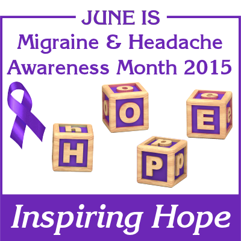

Der Juni ist in Amerika der *migraine awareness month*. Das Motto dieses Jahr ist “Inspiring Hope“ – Hoffnung geben, Hoffnung verbreiten.

Ich habe mit einigen Migräneforschern, Ärzten und Patientenvertretern gesprochen, ob man ab 2016 nicht auch eine Awareness Woche im deutschsprachigen Raum durchführen kann. Noch sind nicht alle im Boot. Es zeichnet sich aber ab, dass dies auf eine Woche beschränkt werden sollte, wie zum Beispiel im Großbritannien immer in der zweiten Septemberwoche.

Viel anderes ist mir diese Woche im Netz nicht untergekommen. Auf PubMed war ein interessanter Fachartikel zur Arzneimittel-Compliance bei Migräne („[Improving medication adherence in migraine treatment](http://www.ncbi.nlm.nih.gov/pubmed/26040703)“). Doch der ist noch nicht online verfügbar.

In diesem Juni bin ich in mein neues Büro (unten) umgezogen. Es beginnt ein neuer Abschnitt, [der für mich persönlich auch viel mit Hoffnung zu tun hat](https://scilogs.spektrum.de/graue-substanz/die-erste-migraene-app/).

