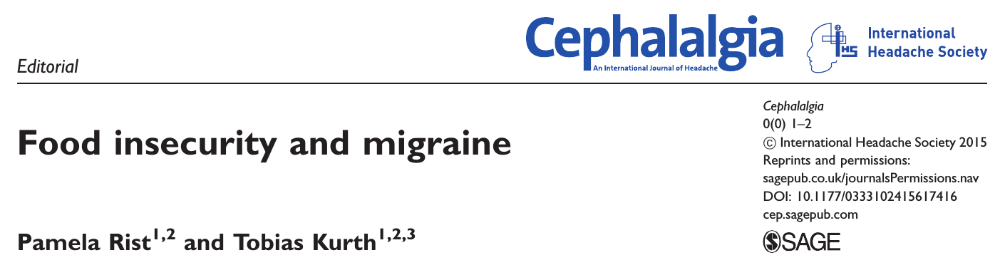

## Migräne und Hunger

Hunger erreicht in den Industrieländern nicht die katastrophalen Auswirkungen, wie in den ärmsten Teilen der Welt. Dennoch klingt der aufkommende Begriff »Nahrungsmittelunsicherheit« (engl. food insecurity) für Hunger nach einem Euphemismus. Die ersten drei Veröffentlichungen tragen ihm im Titel [1-3]. In den Industrieländern geht es vordringlich um die Gesundheit der Kinder, sie verschlechtert sich durch Hunger; bei Erwachsenen kann durch Nahrungsmittelknappheit eine angegriffene psychische Gesundheit länger bestehen und chronische Krankheiten bekommen Betroffene schlechter in den Griff [1].

Der Zusammenhang von »Migräne und Nahrungsmittelunsicherheit in Kanada« – so der übersetzte Titel – wurde nun in einer Studie untersucht [2]. Ein Vorwort weist zwar darauf hin, dass einige Fragen offen bleiben [3]. Doch relevante Zusammenhänge zwischen Migräne und  Nahrungsmittelknappheit und schlechter Ernährung werden aufgedeckt. Darunter beispielsweise auch zunächst verwunderliche, wie der zum Übergewicht (da passt Nahrungsmittelunsicherheit dann schon besser) und ganz offensichtliche, wie der Zusammenhang zum sozioökonomischen Status. Beides, Übergewicht und sozioökonomischen Status, steht wiederum im Zusammenhang mit Migräne. Explizit erwähnt werden sollte jedoch, dass vorangegangene Studien den geringeren sozioökonomischen Status als *eine Folge* der Erkrankung sehen.

## Migräne und Arbeitsausfall

Dazu passt eine weitere Studie, die auch diese Woche veröffentlicht wurde. Sie weist darauf hin, dass Migräne eine der führenden Ursachen für den Ausfall von Arbeitszeit ist [4]. Ausfallzeiten, die, wenn die Krankheit früh ausbricht, schon in der Schule beginnen, erklären den geringeren sozioökonomischen Status. Sieht man das im Zusammenhang mit den oben genannten Studien, wird der Teufelskreis für die ärmsten Schichten der Bevölkerung sichtbar.

Der Schwerpunkt der aktuellen Studie liegt auf den verursachten indirekten Kosten, die die gesamte Gesellschaft trägt. Sie übersteigen die medizinischen Behandlungskosten um ein vielfaches [4]. Es ist also schon allein daher völlig unverständlich, warum nicht, zum Beispiel durch betriebliche Gesundheitsförderung, Migräne im Speziellen und Kopfschmerzen im Allgemeinen früher therapeutisch vorsorgend angegangen werden.

Zu den anderen ausgewählten Themen dieser Woche.

## Migräne und Asthma

Das nächste Thema schaut, wie sich eine episodische Migräne innerhalb eines Jahres verschlimmert, so dass man von einer chronischen Form der Migräne spricht. Und ob auch andere Krankheiten, in diesem Fall Asthma, eine Rolle spielen.

Mit einer Stichprobe von 4446 Personen mit episodischer Migräne (Durchschnittsalter etwa 50 Jahre, viermal mehr Frauen als Männer), von denen wiederum 756 (17%) auch unter Asthma litten, wurde geschaut, wie hoch das Risiko ist, sich in einem Jahr zu verschlechtern. Es waren 131 Menschen (2,9%), die nach einem Jahr unter der chronischen Form litten. Davon stammten 40 aus der Asthma-Untergruppe, was 5,4% entspricht und nur 91 aus der Nicht-Asthma-Untergruppe, was wiederum 2,5% entspricht.

Wie genau die ursächliche Verkettung ist, wurde nicht aufgeklärt. Auch ein geringer sozioökonomischer Status gilt als Risikofaktor für Asthma. Vorgeschlagen werden explizit andere Mechanismen: bestimmte Blutzellen (»Mastzellen«), die biochemisch aktive Speichersubstanzen (»Histamin«) freizusetzen, eine Fehlfunktion im autonomen Nervensystem und/oder gemeinsame genetische Veranlagung sowie Umweltfaktoren.

## Noch zwei

Den vorletzten Fachartikel dieser Woche in aller Kürze. Er fragte nach dem Informationsverhalten bei Epilepsie auf Wikipedia, unter anderem auch, wie häufig nach »Epilepsie und Migräne« gesucht wurde [6]. Nun ja, es ist nicht sehr häufig.

Abschließend sei ein Fachartikel erwähnt, der Genetik und Erscheinungsformen (»klinische Phänotypen«) bei neurologischen Krankheiten untersucht, die durch veränderte Poren in den Gehirnzellen verursacht werden, sogenannte »Kanalopathien« [7]. Zu dem Kanalopathien zählen auch gewisse Formen der familiären hemiplegischen Migräne (d.h. FHM1 und FHM3 und, wenn man den Begriff Kanalopathie nicht zu eng definiert, eigentlich auch FHM2; bei FHM2 ist kein Ionenkanal sondern eine Ionenpumpe betroffen). Kanalopathien treten zunächst anfallsartig auf, können sich aber mit der Zeit verschlimmern, war für Umwelt- und Lebensstilfaktoren spricht, die bei diesen vererbten Krankheiten auch eine Rolle spielen können.

## Literatur

[1] Loopstra, R., Reeves, A., & Stuckler, D. (2015). Rising food insecurity in Europe. *The Lancet*, *385*(9982), 2041. ([Link](http://www.thelancet.com/journals/lancet/article/PIIS0140-6736(15)60983-7/fulltext))

[2] Dooley, J. M., Gordon, K. E., & Kuhle, S. (2015). Food insecurity and migraine in Canada. Cephalalgia, 0333102415617414. ([Link](http://cep.sagepub.com/content/early/2015/11/12/0333102415617414.abstract))

[3] Rist, P., & Kurth, T. (2015). Food insecurity and migraine. *Cephalalgia*, 0333102415617416. ([Link](http://cep.sagepub.com/content/early/2015/11/13/0333102415617416.long))

[4] Baigi K1, Stewart WF2., Headache and migraine: a leading cause of absenteeism. Handb Clin Neurol. 2015;131:447-63. doi: 10.1016/B978-0-444-62627-1.00025-1. ([Link](http://www.sciencedirect.com/science/article/pii/B9780444626271000251))

[5] Martin VT, Fanning KM, Serrano D, Buse DC, Reed ML, Lipton RB. Asthma is a risk factor for new onset chronic migraine: Results from the American migraine prevalence and prevention study. Headache. 2015 Nov 19. ([Link](http://onlinelibrary.wiley.com/doi/10.1111/head.12731/abstract))

[6] Brigo F, Otte WM, Igwe SC, Ausserer H, Nardone R, Tezzon F, Trinka E. Information-seeking behaviour for epilepsy: an infodemiological study of searches for Wikipedia articles. Epileptic Disord. 2015 Nov 12. ([Link](http://www.jle.com/fr/revues/epd/e-docs/information_seeking_behaviour_for_epilepsy_an_infodemiological_study_of_searches_for_wikipedia_articles_305778/article.phtml))

[7] Spillane J, Kullmann DM, Hanna MG. Genetic neurological channelopathies: molecular genetics and clinical phenotypes. J Neurol Neurosurg Psychiatry. 2015 Nov 11. pii: jnnp-2015-311233. doi: 10.1136/jnnp-2015-311233. [Epub ahead of print]
