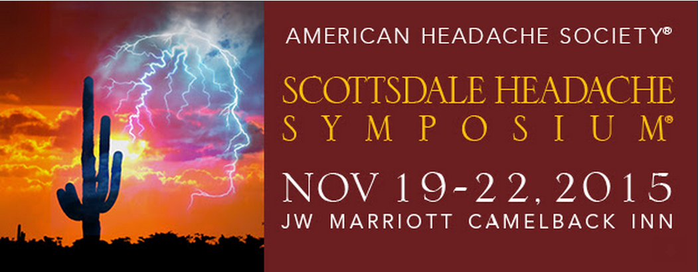

Einseitig und pulsierend, das sind die typischen Merkmale des Migränekopfschmerzes. Doch ein stumpf stechender, beidseitiger Kopfschmerz kann laut geltender Klassifikation auch ein Migränekopfschmerz sein, wenn er nur mittelschwer ist und sich bei körperlicher Routinearbeit verstärkt. Außerdem müssen in jedem Fall noch weitere Kriterien erfüllt sein. Auch bei diesen lässt die Klassifikation gewisse Spielräume zu. Mit anderen Worten, die Merkmale der Migräneattacken variieren. Nicht nur von Patienten zu Patienten, sondern auch die Attacken eines Patienten gleichen sich sehr selten, wie jetzt eine Studie zeigt [1].

Untersucht wurden nicht allein die Merkmale des Kopfschmerzes, sondern fast die ganze Bandbreite möglicher Symptome: Übelkeit und/oder Erbrechen; Licht-, Lärm- und Geruchsüberempfindlichkeit; gesteigerte Schmerzempfindlichkeit durch geringfügige Reize; mindestens eins der sechs kranialen autonomen Symptome;1und mindestens ein Vorbotensymtom.2

Diese Merkmale treten jeweils in unterschiedlichen Kombinationen in den wiederkehrenden Attacken auf. Erstmals wurde dies nun systematisch bei 30 Patienten untersucht. Mit dem Resultat, dass keine drei aufeinanderfolgenden Migräneattacken sich vollständig gleichen.

Selbst wenn man sich nur auf die typischerweise einseitig und pulsierenden Merkmale der Kopfschmerzen bei Migräne beschränkt, lagen diese Merkmale nur bei einem Drittel der Fälle immer vor. Untersucht wurde bei den 30 Patienten drei aufeinanderfolgende Migräneattacken.

Diese hohe Variabilität überraschte sogar die Experten und sie stellen sogleich die geltende Klassifikation in Frage [1].

Diese Woche gibt es im Streifzug durch die aktuellen wissenschaftlichen Veröffentlichungen nur noch ein kurzes weiteres Thema. Ein Thema, dass uns wahrscheinlich – und hoffentlich – über Jahre hinweg erhalten bleibt, denn eine neue Wirkstoffgruppe verspricht quasi eine vorbeugende Impfung gegen Attacken.

So titel eine weitere neue Veröffentlichung [2]: „CGRP-Antikörper: der Heilige Gral zur Vorbeugung von Migräne?“ Diesen CGRP-Antikörpern wird auf der kommenden Scottsdale Headache Symposium ein Extratag gewidmet. Dann gibt es sicher Neues.

Wann wird das Thema für Patienten wirklich relevant? „In drei Jahren Antikörper gegen Migräne?“ fragt die [Ärzte Zeitung](http://www.aerztezeitung.de/praxis_wirtschaft/unternehmen/article/895879/prophylaxe-drei-jahren-antikoerper-migraene.html) letzten Mittwoch und gibt damit zumindest mal den ungefähren Zeitrahmen vor.

## Fußnoten

1  Zu den zählen kranialen autonomen Symptome der Migräne zählen

* Bindehautentzündung, Tränenfluß, oder beides;
* verstopfte Nase, Fließschnupfen, oder beides;
* Lidödem (Schwellung der Augenlider);
* verstärktes Schwitzen der Stirn und Gesicht;
* Pupillenverengung, herabhängende Augenlider, oder beides;
* Druckgefühl im Ohr

2 Die Vorboten einer Migräneattacke sind sehr vielfätig. Zu ihnen grhört: Licht-, Geruchs- und Lärmempfindlichkeit und Gesichtsblässe, kalte Extremitäten (Hände und/oder Füße), Rücken- oder Nackenschmerzen, Nackenverspannung, Schlafstörungen, Intensives Gähnen, Gereiztheit, Stimmungsschwankung, Hyperaktivität, Antriebslosigkeit, depressive Stimmung, Erschöpfung, Müdigkeit, Sprachstörungen, Vergesslichkeit, Konzentrationsschwierigkeiten, Schwindel, Übelkeit, Durchfall, Appetitlosigkeit, Durst und Heißhunger.

Viele Auslöser sind nur vermeintlich die entscheidenden Anstößen einer Migräneattacke. Es können auch einfach Vorboten sein. Seit langen ist beispielsweise bekannt, dass Heißhunger nach Süßem oft ein Vorbotensymptom der Migräne ist, aber Süßigkeiten insbesondere Schokolade fälschlich als Auslöser angesehen wird.

## Literatur

[1] M. Viana, G. Sances, N. Ghiotto, E. Guaschino, M. Allena, G. Nappi, P. J. Goadsby and C. Tassorelli, Intra-variability of the characteristics of migraine attacks, *The Journal of Headache and Pain*, **16**(Suppl 1):A702015 2015

[2] Pascual, J. (2015). CGRP antibodies: the Holy Grail for migraine prevention? The Lancet Neurology. [[Link](http://dx.doi.org/10.1016/S1474-4422(15)00244-6)]
