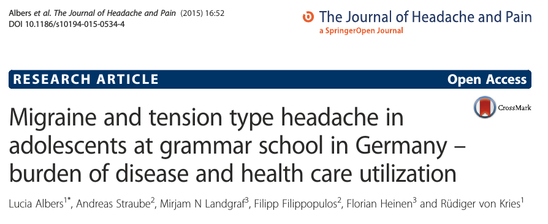
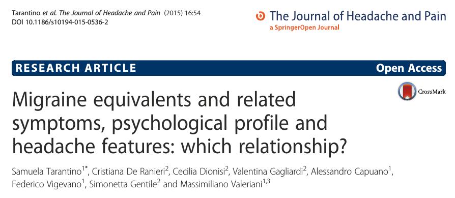

Schüler und Schülerinnen mit Kopfschmerzen nehmen selten Gesundheitsleistungen in Anspruch. Zu diesem Ergebnis kommt eine aktuelle Studie mit 1399 Gymnasiasten aus Deutschland. Zwei Drittel der Jugendlichen mit beliebiger Form von Kopfschmerzen und 40% der Gruppe mit Migräne nahmen wegen ihrer Kopfschmerzen weder ärztliche Hilfe in Anspruch, noch nahmen sie ein Schmerzmittel ein. Untersucht wurde ein Zeitraum von 12 Monaten. Gesundheitsförderung beginnt bei Jugendlichen und sie sollte das Bewusstsein für die Behandlungsmöglichkeiten für Kopfschmerzen erhöhen, so lautet das Fazit dieser ersten Studie.

Albers, L., Straube, A., Landgraf, M. N., Filippopulos, F., Heinen, F., & von Kries, R. (2015). Migraine and tension type headache in adolescents at grammar school in Germany – burden of disease and health care utilization. *The Journal of Headache and Pain*, **16**, 52. ([Link](http://www.thejournalofheadacheandpain.com/content/16/1/52))

Die andere, aktuelle Studie untersuchte 136 Kinder und Jugendliche zwischen 8 und 17 Jahren. Geschaut wurde nach den sogenannten „migraine equivalents“ (Migräne-Äquivalente). Das sind Symptome, die zumindest in ihrer Verbreitung eine Assoziation mit Migräne aufweisen. Schwindel, Bauchschmerzen, episodisch wiederkehrende Attacken mit starker Übelkeit und Erbrechen und Fehlhaltung des Halses gehören dazu. Diese können Vorläufer der Migräne sein sowie auch sogenannter Migränekomplikationen. Die Klassifikation solcher Symptome ist gerade im Wandel. Grundsätzlich gilt, dass solche Symptome im Kindes- und Jugendalter nicht leicht einzuordnen sind. Nicht nur Migräne, sondern andere Diagnosen sind denkbar. Beispielsweise können Bauchschmerzen sowohl ein Indiz für lebensbedrohliche Erkrankungen sein, wie auch völlig harmlos. Doch selbst die eher harmlosen Migräne-Äquivalente schränken das Gesundheitsempfinden und die Alltagsaktivität erheblich ein.

Kindern und Jugendlichen mit Migräne-Äquivalenten neigen laut dieser neuen Studie dazu, mehr Angst und Verunsicherung zu erleben. Verhaltensbezogene und psychologische Symptome sollten mit bei dem Krankheitsbild erfasst werden, so das Fazit hier.

Tarantino, S., De Ranieri, C., Dionisi, C., Gagliardi, V. Capuano, A., Vigevano, F., Gentile, S. and Valeriani, M. (2015) Migraine equivalents and related symptoms, psychological profile and headache features: which relationship? *The Journal of Headache and Pain*, **16**, 54. ([Link](http://www.thejournalofheadacheandpain.com/content/16/1/54))
