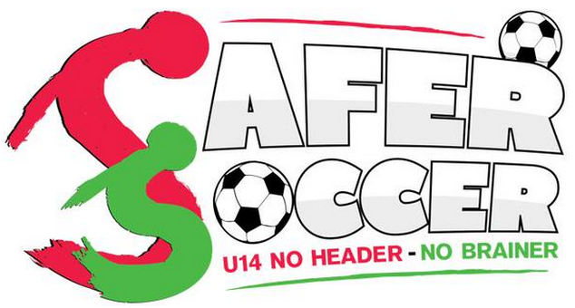

Das sind die zwei Themen dieser Woche: Gehirnerschütterungen, wie sie vor allem bei Kontaktsportarten häufiger auftreten, können eine Migräneerkrankung verschlimmern. Außerdem lässt Migräne sich nach dem Auftreten mehrer Gehirnerschütterungen hintereinander schlechter behandeln. Wie sich Migräne überhaupt behandel lässt, ist eine weitere Frage. Fangen wir damit an.

## Neue Leitlinie zur Behandlung der Migräne bei Kindern

Das erste Thema ist die [Entwicklung einer neuen Leitlinie zur Behandlung der Migräne bei Kindern](https://www.aan.com/Guidelines/Home/PublicComments). Migräneattacken sind bei Kindern kürzer und gehen häufiger mit ganzseitigen Kopfschmerzen einher. Kinder klagen allerdings auch öfter nur über Bauchschmerzen und bei ihnen steht Übelkeit, Erbrechen, und allgemeines Unwohlsein mehr im Vordergrund des Krankheitsbildes.

Nun wird in den USA eine neue Richtlinie von der Amerikanischen Akademie für Neurologie erarbeitet. Drei Fragen sollen in einer Literaturrecherche untersucht werden, um Behandlungen für Kinder und Jugendliche in Zukunft wirksamer zu machen:

1. Reduzieren Akuttherapien bei Migräne im Vergleich zu keiner Behandlung bei Kindern und Jugendlichen mit Migräne-Kopfschmerzen nachhaltig Kopfschmerzdauer und andere Symptome (vor allem Übelkeit und Erbrechen)?
2. Reduzieren präventive Behandlungen im Vergleich zu keiner Behandlung bei Kindern und Jugendlichen mit Migräne die Kopfschmerzen?
3. Reduzieren komplementäre und alternative Therapien im Vergleich zu keiner Behandlung bei Kindern und Jugendlichen mit Migräne die Kopfschmerzen?

Es geht dabei natürlich immer um die Frage, welche der konkreten Akuttherapien, präventiven Behandlungen oder alternativen Therapien besser ist. Die Liste der Möglichkeiten ist sehr lang.

Man kann noch bis morgen das Protokoll zu der Erstellung der neuen Leitlinie kommentieren. Im September soll dann die Sichtung der Literatur abgeschlossen sein und bis Mai 2016 die Ergebnisse wieder zur öffentlichen Kommentierung bereit stehen.

## Fußball soll für US-amerikanische Kinder sicherer werden

Und es wird wieder über Fußball diskutiert. In den USA. [Fußball soll dort sicherer werden](http://www.sportslegacy.org/policy/safer-soccer/). Keine Kopfbälle unter 14 Jahren, so kann man eine Initiative zusammenfassen.

[Ein eigener Beitrag geht näher darauf ein.](https://scilogs.spektrum.de/graue-substanz/fussball-soll-fuer-us-amerikanische-kinder-sicherer-werden) Wie oben erwähnt, projizieren Kinder Schmerzen bei Migräne oft auf den Bauch. Wer kennt keine Kinder mit Bauchschmerzen? Wer kennt keine Kinder, die nicht gerne Fußball spielen? Oft trifft natürlich beides zusammen. Deswegen sind solche Kampagnen relevant. Da fragt man sich schon, warum man in Deutschland zu wenig davon hört? Abgesehen davon sollten natürlich auch Kinder ohne erhöhtes Risiko einer Migräneerkrankung Gehirnerschütterungen bestmöglich meiden.
