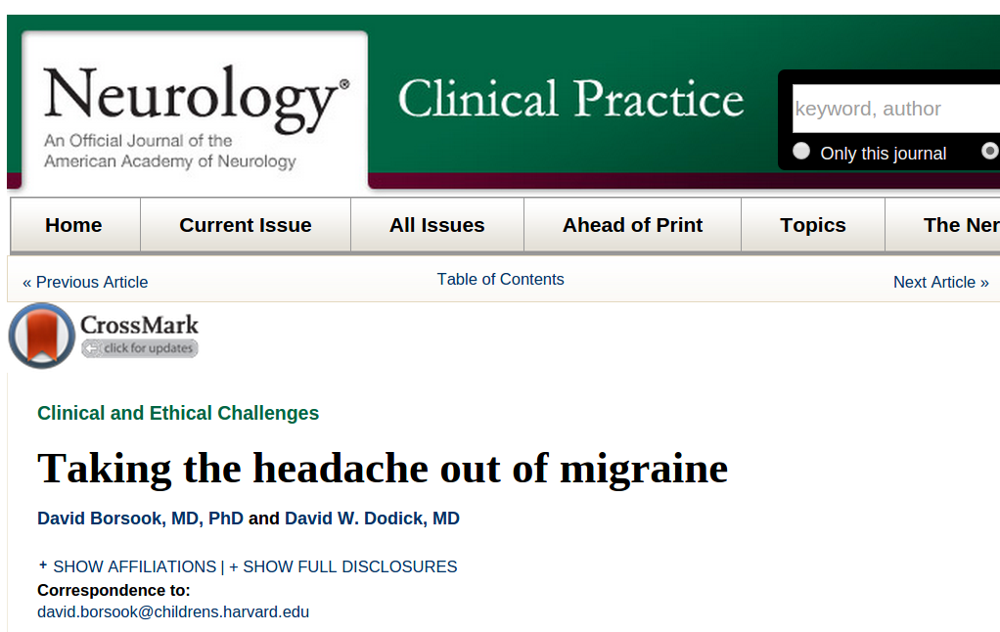

Der neuste Artikel zu Migräne in der medizinischen Datenbank *Pubmed* stammt von zwei renommierten Forschern. Er trägt den schönen, weil mehrdeutigen Titel „[Taking the headache out of migraine](http://www.ncbi.nlm.nih.gov/pubmed/26335578)“. Noch ist mir nicht mehr als die Zusammenfassung verfügbar. Es geht, soweit ersichtlich, um recht neue Erkenntnisse aus bildgebenden Methoden, die zeigen, dass Migräne Strukturen im Gehirn verändert. Zum einen könnten diese Veränderungen schon genetisch veranlagt sein, anderseits können die Attacken selbst solche Veränderungen hervorrufen – so oder so: die Veränderungen sind wahrscheinlich\* umkehrbar. Diese Erkenntnis erfordert, dass Ärzte ihre Herangehensweise verändern. Die Autoren kommen zu dem Schluss, dass Migräne nicht mit hinreichender Dringlichkeit behandelt wird [1].

Aus der Zusammenfassung dieses Papers geht nicht mehr hervor. Einer der beiden Autoren ist Koautor der auch recht aktuellen Studien über Migräne und Stress (2012 und 2013). Sie zeigen, wie [Stress das Gehirn bei Migräne verschleißt](https://scilogs.spektrum.de/graue-substanz/stress-und-migraene/) [2-3]. So lässt sich zumindest vermuten, worum es in dem neuen Artikel geht. Natürlich muss der Schmerz bekämpft werden – Taking the headache out of migraine. Wahrscheinlich geht es jedoch um deutlich mehr: Man muss den Menschen mit seiner Migränekarriere ernst(er) nehmen. Als die beiden vorangegangenen Studien dieses Jahr auf dem 57. Jahrestreffen der amerikanischen Headache Society vorgestellt wurden, gab es drei konkrete Handlungsweisen, wie sich durch Migräne veränderte Gehirnstrukturen wieder normalisieren, egal, ob nun genetisch oder durch Attacken verändert: regelmäßig Sport treiben, Stress besser verarbeiten, z.B. mit Mindfulness-Based Stress Reduction, und soziale Unterstützung und Integration suchen, die einen ausgeglichenen Gemütszustand ermöglichen. Es geht um die richtige Bewältigung der Krankheit.(„Taking the mickey out of someone“ bedeutet, jemanden, oft öffentlich, subtil und doch gutmütig, nicht allzu Ernst zu nehmen.)

Wie dem auch sei, es ist auffällig, wie die besondere Rolle psychosozialer Prozesse in den letzten Jahren in vielen neuen Studien über Migräne hervorgehoben wird. Dem wurde lange kein Wert zugemessen, nicht mal mehr ein heuristischer. Vermutlich sollte Migräne keinesfalls wieder in die Ecke psychogener Schmerzen rücken (also ohne organische Ursache), aus der der Neurologe Harold Wolff die Krankheit Anfang des 20. Jahrhundert herausgeholt hatte. Heute können psychosoziale Prozesse im Gehirn lokalisiert werden: in einem weiteren, aktuellen Artikel vom 19. August wird eine zentrale Schaltstelle in der Inselrinde identifiziert. Sie soll die psychosozialen Prozesse quasi organisch vertreten, so dass wir wieder eine somatogene Krankheit vor uns haben. Der Artikel stammt teils von den gleichen Autoren, wie die zuvor zitierten [1-3], und trägt den Titel „The Insula: A ‘Hub of Activity’ in Migraine“ [4].

Die Stoßrichtung der Aussage „*migraine .. is not taken seriously … [and] … is currently not treated with the urgency that it deserves*“ [1] (dass also Ärzte Migräne weder ernst genug nehmen, noch mit hinreichender Dringlichkeit auf eine Behandlung hinwirken) wird damit zwischen den Zeilen lesbar. Zumindest kann ich das nur so lesen: wenn die Bedingungen, die Migräne aufrechterhalten, nicht geändert werden und wenn daraufhin Komplikationen und Chronifizierung eintreten, die nachweislich Schäden im Gehirn verursachen, dann darf man von Behandlungsfehlern ausgehen. Ärzte wissen, dass ohne nachweisliche Schäden der Patient auf sich allein gestellt ist. Ihm obliegt grundsätzlich die Beweislast, käme es zu dem Vorwurf eines Behandlungsfehlers (es sei denn, der Arzt macht groben Behandlungsfehler). Die Zusammenfassung des aktuellen Artikles kann man in diesem Kontext durchaus als Mahnung an die Ärzte lesen.

Ein weiterer aktueller Artikel [5] berichtet von der Häufung folgender Auslösefaktoren bei Migräne mit Aura: verschlafen, prämenstruelle Phase, belastende Ereignisse im Leben, heißes/kaltes Wetter, Entspannung nach Stress, Menstruation, Wind, intensive Emotionen, Hunger und hellem Sonnenlicht. Untersucht wurde eine Gruppe von 116 Patienten in Griechenland. Wirklich neu ist das nicht. Es gibt allerdings nur wenige Arbeiten, die versuchen Auslösefaktoren einzelnen Unterformen der Migräne zuzuordnen. Darin könnte zukünftig ein Wert liegen – gerade weil ich dem oft zu [einfach interpretierten Konzept der Auslösefaktoren](https://scilogs.spektrum.de/graue-substanz/gibt-es-ausloeser-der-migraeneattacken-und-wenn-ja-zu-welchem-zeitpunkt/) eher kritisch gegenüber stehe.

Abschließend noch ein Hinweis zu einem vierten Artikel, veröffentlicht im August – es war ja nicht nur eine Woche, sondern ein Monat Pause, bedingt durch Urlaub und Ferienzeit; allein wöchentlich werden übrigens durchschnittlich 30 Artikel über Migräne publiziert, die Wochen- bzw. Monatsschau hebt also nur eine kleine, persönliche Auswahl wichtiger Themen hervor (ein Blogbeitrag folgt noch zu einem eigenen wissenschaftlichen Artikel veröffentlicht im August) – Abschließend also noch ein neuer Artikel: „Migraine in menopausal women: a systematic review“ [6]. Diesen Artikel fasse ich vielleicht auch nochmal in einem eigenen Beitrag zusammen. Die Einleitung ist auch für Laien gut zu lesen und dass ist mein Lesetipp.

## Literatur

[1] Borsook, D., & Dodick, D. W. (2015). Taking the headache out of migraine. *Neurology: Clinical Practice*, **5**(4), 317-325. ([Link](http://www.ncbi.nlm.nih.gov/pubmed/26335578))

[2] Borsook, D., Maleki, N., Becerra, L., & McEwen, B. (2012). Understanding migraine through the lens of maladaptive stress responses: a model disease of allostatic load. *Neuron*, **73**(2), 219-234. ([open access](http://dx.doi.org/10.1016/j.neuron.2012.01.001))

[3] Maleki, N., Becerra, L., Brawn, J., McEwen, B., Burstein, R., & Borsook, D. (2013). Common hippocampal structural and functional changes in migraine. *Brain Structure and Function*, 218(4), 903-912. ([open access](http://www.ncbi.nlm.nih.gov/pmc/articles/PMC3711530/))

[4] Borsook, D., Veggeberg, R., Erpelding, N., Borra, R., Linnman, C., Burstein, R., & Becerra, L. (2015). The Insula A “Hub of Activity” in Migraine. *The Neuroscientist*, 1073858415601369. ([Link](http://nro.sagepub.com/content/early/2015/08/19/1073858415601369.abstract))

[5] Iliopoulos, P., Damigos, D., Kerezoudi, E., Limpitaki, G., Xifaras, M., Skiada, D., … & Skapinakis, P. (2015). Trigger factors in primary headaches subtypes: a cross-sectional study from a tertiary centre in Greece. *BMC Research Notes*, **8**(1), 393. ([open access](http://www.ncbi.nlm.nih.gov/pmc/articles/PMC4553925/))

[6] Ripa, P., Ornello, R., Degan, D., Tiseo, C., Stewart, J., Pistoia, F., … & Sacco, S. (2015). Migraine in menopausal women: a systematic review. *International journal of women’s health*, **7**, 773. ([open access](http://www.ncbi.nlm.nih.gov/pmc/articles/PMC4548761/pdf/ijwh-7-773.pdf))

\* In der ersten Fassung hatte ich noch nicht „wahrscheinlich“ geschrieben, die Autoren sind allerdings an dieser Stelle vorsichtiger, weil eben nur Ergebnisse von der Stressforschung übertragen werden. (Nachtrag am Montag, 7. Sept. 9:50)
