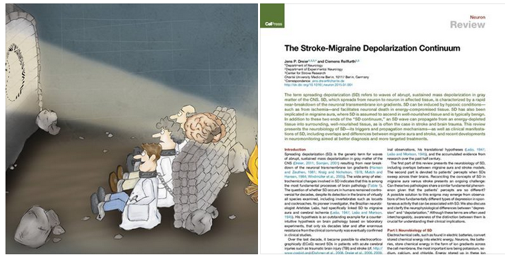

Das Projekt “Migräne Sichtbarmachen” hat sein Fundingziel bei Sciencestarter recht klar verfehlt. Was schade ist. Die Migräneforschung macht zum Glück Fortschritte. Alte und neue Theorien der Migräne werden teils heiß von Forschern diskutiert. Elektrische Hirnstimulatoren werden implantiert, Botox gespritzt, Gehirnerschütterungen bei Sport verschlimmern Migräne … zu all diesen aktuellen Themen wird geforscht – ohne viel Öffentlichkeit.

Herausheben will ich diese Woche eine ganz aktuelle Veröffentlichung. Sie fasst in einer Fachzeitschrift klinische Krankheitsbilder zusammen. Eine massive Wellen neuronaler Übererregung mit anschließender Erschöpfung spielt bei Migräne, Schlaganfall und Zwischenformen eine Rolle. Die Welle ist das wichtigste pathologische Phänomen des Gehirns, das noch vor 20 Jahren kaum ein Forscher ernst nahm.

Dreier, J. P., and C. Reiffurth. „The stroke-migraine depolarization continuum.“ Neuron (2015).

Der Internationale Kopfschmerzkongress in Valencia ging zu Ende. Einige Trends habe ich in diesen Tweets zusammengefasst.

https://twitter.com/truncer\_health/status/599519455052431361

Unter anderem wurde auf wichtige frühe Verbindungen der oben genannten Welle zur Migräne hingewiesen und in einen aktuellen Kontext gestellt.

> Dr Hayrunnisa Bolay First to link CSD to [#Migraine](https://twitter.com/hashtag/Migraine?src=hash&ref_src=twsrc%5Etfw) almost 2 decades ago… [#IHCVALENCIA2015](https://twitter.com/hashtag/IHCVALENCIA2015?src=hash&ref_src=twsrc%5Etfw) [pic.twitter.com/RbOgwkwyue](http://t.co/RbOgwkwyue)
>
> — International Headache Society (@ihs\_official) [May 14, 2015](https://twitter.com/ihs_official/status/598894049504927744?ref_src=twsrc%5Etfw)

Auch Hirnstimulatoren als Implantate und deren Komplikationen waren ein Thema.

> Occipital nerve stim. maintains effectiveness for years, but complications are a concern [#IHCVALENCIA2015](https://twitter.com/hashtag/IHCVALENCIA2015?src=hash&ref_src=twsrc%5Etfw) [#ihc2015](https://twitter.com/hashtag/ihc2015?src=hash&ref_src=twsrc%5Etfw) <http://t.co/wanEGeXpHG>
>
> — Practical Neurology (@PracticalNeuro) [May 15, 2015](https://twitter.com/PracticalNeuro/status/599284210264875009?ref_src=twsrc%5Etfw)

Und natürlich Sport und Gehirnerschütterungen.

> Are you screening for HA sxs in athletes for return to play decisions? [#physicaltherapy](https://twitter.com/hashtag/physicaltherapy?src=hash&ref_src=twsrc%5Etfw) [#IHCVALENCIA2015](https://twitter.com/hashtag/IHCVALENCIA2015?src=hash&ref_src=twsrc%5Etfw) [#migraine](https://twitter.com/hashtag/migraine?src=hash&ref_src=twsrc%5Etfw) [pic.twitter.com/56FgMavWUU](http://t.co/56FgMavWUU)
>
> — Lyssa Cleary (@lyssacleary) [May 15, 2015](https://twitter.com/lyssacleary/status/599158631322525696?ref_src=twsrc%5Etfw)

Die Geschichte der Ursachen einer Migräne ist lang. Kommt jetzt wieder eine Renaissance der vaskulären Theorie?

> Back to vascular? [@juliopascualg](https://twitter.com/juliopascualg?ref_src=twsrc%5Etfw) and [@TobiasKurth](https://twitter.com/tobiaskurth?ref_src=twsrc%5Etfw) among speakers getting new insights from vascular diseases in [#migraine](https://twitter.com/hashtag/migraine?src=hash&ref_src=twsrc%5Etfw) [#IHCVALENCIA2015](https://twitter.com/hashtag/IHCVALENCIA2015?src=hash&ref_src=twsrc%5Etfw)
>
> — International Headache Society (@ihs\_official) [May 16, 2015](https://twitter.com/ihs_official/status/599491514427924480?ref_src=twsrc%5Etfw)

Und wie funktioniert Botox bei Migräne?  
https://twitter.com/CephEditorial/status/599604551210160128
