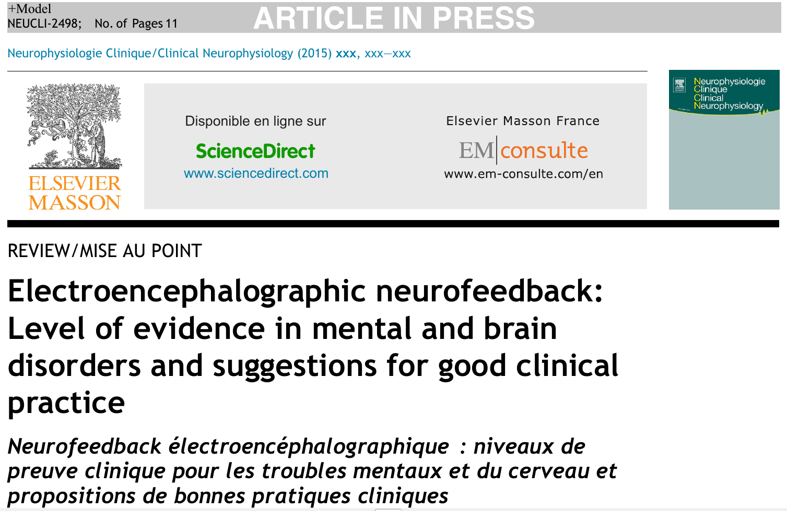

Ein Übersichtsartikel kritisiert, dass die Mehrheit der vergleichenden, randomisierten klinischen Studien zur prophylaktischen Migränetherapie keine Placebo-Gruppe enthält [1].

Ein weiterer schaut auf Neurofeedback. Damit meint man eine Unterform des [Biofeedback](https://scilogs.spektrum.de/graue-substanz/biofeedback-40-jahre-in-zeitschriften-populaer/), was als Überbegriff für alle Arten der Rückmeldung von Körpersignalen, die normalerweise unbewusst ablaufen, steht. Wie steht es mit der Anwendung in der Neurologie und Psychiatrie? Die therapeutische Rolle des Neurofeedback bleibt umstritten. Die Krankheit Migräne nimmt in diesem Artikel nur einen Absatz ein, mit dem Verweis, dass statt Neurofeedback dass periphere Biofeedback (Messung der Signale im peripheren Nervensystem) weniger umstritten ist. Außerdem könnte die Hämoenzephalographie (Messung der Blutzirkulation in den Frontallappen), eine Art Neurofeedback (was normalerweise ein EEG-Biofeedback ist), zukünftig einen interessanten neuen Weg darstellen [2].

In dem dritten Übersichtsartikel geht es um Computermodell, die physiologische Mechanismen neurologischer Krankheiten abbilden. Um es ganz kurz zu machen: Die Autoren schließen, dass solche Computermodelle nicht nur eine wichtige Rolle spielen können sondern auch sollten für die Entwicklung effektiver und patientenspezifischer therapeutischen Hirnstimulation [3].

## Literatur

[1] Hougaard, A., & Tfelt-Hansen, P. (2015). General lack of use of placebo in prophylactic, randomised, controlled trials in adult migraine. A systematic review. Cephalalgia, 0333102415616880. ([Link](http://cep.sagepub.com/content/early/2015/11/06/0333102415616880.abstract))

[2] Micoulaud-Franchi, J. A., McGonigal, A., Lopez, R., Daudet, C., Kotwas, I., & Bartolomei, F. (2015). Electroencephalographic neurofeedback: Level of evidence in mental and brain disorders and suggestions for good clinical practice. Neurophysiologie Clinique/Clinical Neurophysiology. ([Link](http://www.sciencedirect.com/science/article/pii/S0987705315001513))

[3] Wang, Y., Hutchings, F., & Kaiser, M. (2015). Computational modeling of neurostimulation in brain diseases. *Progress in brain research*. ([Link](http://www.sciencedirect.com/science/article/pii/S007961231500103X))
