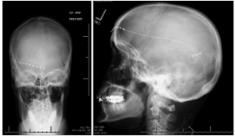

Gleich fünf Themen diesmal. Erstens: Erneut kam diese Woche die Frage auf, [was Migräne und Schlaganfall gemeinsam haben](http://www.charite.de/charite/presse/pressemitteilungen/artikel/detail/tsunamis_im_gehirn_was_haben_migraene_und_schlaganfall_gemeinsam/). Schon oft stand die Antwort, nämlich die massive Migränewelle, im Zentrum hier im Blog und unter dem Titel [Tsunami im Kopf](http://www.bild-der-wissenschaft.de/bdw/bdwlive/heftarchiv/index2.php/?object_id=32705084) erklärt schon 2011 ausführlich „Bild der Wissenschaft“ die Zusammenhänge.

Neurosurgical Focus Sep 2013 / Vol. 35 / No. 3 / Page E9

Zweitens: Eine neue wissenschaftliche Veröffentlichung beschreibt, wie Patienten nachuntersucht wurden. Diese Migräniker zeigten in einer vorangegangenen Studie eine positive Reaktion auf eine Dual-Therapie, eine Kombination zweier Neuromodulationsverfahren, die supraorbitale Stimulation und die Occipitalis-Nervenstimulation ([Hann & Sharan (2013) *Neurosurgical focus*](http://dx.doi.org/10.3171/2013.6.FOCUS13233)). Die supraorbitale Stimulation stimuliert den Nervus trigeminus; die Occipitalis-Nervenstimulation stimuliert die Okzipitalnerven. Eine Verbesserung gegenüber nur einer Methode war damals nur im zeitlichen Umfeld des chirurgischen Eingriffs nachgewiesen und der Effekt verschwand, wie nun die Langzeitstudie zeigt ([Clark et al. (2015a) *Neurosurgery*](http://www.ncbi.nlm.nih.gov/pubmed/26182031)).

Das dritte Thema der Woche kommt von teilweise den selben Autoren, wie das vorangegangene und wieder betrifft es Patienten mit chronischer Migräne ([Clark et al. (2015b) Neurosurgery](http://www.ncbi.nlm.nih.gov/pubmed/26182033)). Diesmal scheint ein früheres Ergebnis bestätigt zu werden: ein Vergleich der neuralen Aktivierung während optimaler und suboptimaler Occipitalis-Nervenstimulation wurde durchgeführt. Es ist zu vermuten, dass, wenn eine Therapie besser Anschläg, dies sich auch in neuronalen Korrelaten zeigt. Diese neuronalen Korrelate suchte man nun durch Aktivitätsmuster in der PET (Positronen-Emissions-Tomographie). Wie beim zuvor erwähnten Artikel liegt bisher nur die oben verlinkte Zusammenfassung vor. Die Studie wird erst im August veröffentlicht und noch erschließt sich mir nicht alles aus der Zusammenfassung.

Also weiter mit viertens: Ein Fallbericht über eine migräneartige visuelle Aura erregte meine Aufmerksamkeit. Diese Sehrstörung wurde von einem großen Aneurysma verursacht ([Kung et al. (2015) Migraine-like Visual Aura Rriggered [sic] by a Large Aneurysm in the Left Extracranial Internal Carotid Artery with Successful Prevention of Recurrence by the new Anticoagulant Dabigatran: First Case Report](http://www.ncbi.nlm.nih.gov/pubmed/26179686),*Acta Neurol Taiwan*. 24:19-24.).

Das erinnerte mich sofort an jemanden, der mich vor 10 Tagen anschrieb:

„*Durch deine Beschreibung habe ich heute das erste Mal eine Migräneaura erkannt.*“

Und weiter:

„*Danke dafür, sonst hätte ich wahrscheinlich total Panik bekommen.*“

Wie immer in solchen Fällen schrieb ich sofort zurück:

„*Ohne dich nun doch noch verunsichern zu wollen: bei Änderung der bisherigen Kopfschmerzcharakteristik (wozu die Erstmanifestation der Aura gehört) sollte unbedingt der neurologische Befund nochmal abgeklärt werden.*“

Gleiches gilt für alle, die hier mitlesen. Sei es heftigster, bisher nicht gekannter Kopfschmerz, eine Erstmanifestation der Kopfschmerzen, vor allem im Alter von über 40 Jahren, Fieber und Nackensteifigkeit als Begleitsymptome, vorausgehende epileptische Anfälle, Persönlichkeitsveränderungen (auch andere Fragen), weitere Änderung der bisherigen Kopfschmerzcharakteristik oder Trauma/Gehirnerschütterung in der Vorgeschichte, immer gilt: unbedingt den neurologischen Befund klären lassen und sich nie allein auf Informationen im Internet verlassen.

Zu guter Letzt, fünftens, eine neue Kernspintomographie-Studie über das Migränegehirn im Wandel: Mädchen gegen Jungs. [In dem eigenen Beitrag zu diesem Thema](https://scilogs.spektrum.de/graue-substanz/das-migraenegehirn-im-wandel/) verweise ich auch noch auf den Kontext, nämlich zum einen auf eine Studie vom Mai diesen Jahres über Migräne und den Lebensstil bei Kindern sowie zum anderen auf weitere Unterschiede im Erwachsenenalter.
