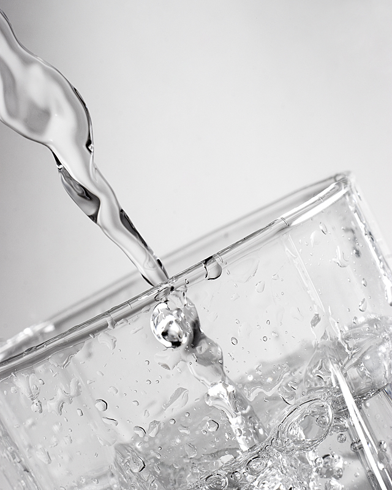

Mit Sport Kopfschmerzen vorbeugen, diesen Rat hört man immer wieder. Doch die Erkenntnisse über den positiven Einfluss körperlicher Aktivität auf Kopfschmerzen sind widersprüchlich. Ein kompliziertes Zusammenspiel bestimmt die körperliche Fitness. Welchen Beitrag einzelne Faktoren, wie Herzfrequenz, Sauerstoffaufnahme, Laktatschwelle (Belastungsbereich, in dem Sauerstoffbedarf und -verbrauch gerade noch ausgeglichen sind) u.v.w., leisten, ist heute zumindest teilweise immer noch unklar. Zumal sich bestimmte Faktoren sowohl mit zunehmendem Alter verändern, als auch bei gesunden Erwachsenen anders wirken als bei chronisch kranken.

In einer großangelegten sog. HUNT-Studie wurde nun der Zusammenhang zwischen Kopfschmerzen und körperliche Fitness untersucht [1]. Das durchführende HUNT Research Centre ist Teil der Medizin-Abteilung der zweitgrößten Universität Norwegens. Dieses Center führt seine HUNT-Studien schon seit 1984 durch. Drei gab es bisher. Sie gelten als die größten Studien ihre Art. In dieser Querschnittsstudie wird in einer einmaligen Stichprobe die maximale Sauerstoffaufnahme (VO2 peak) gemessen. VO2 peak gilt als eine der wichtigen physiologischen Maße, die die körperliche Fitness bestimmt.

Untersucht wurde neben sehr vielen anderen Krankheiten nun auch das Verhältnis von VO2 peak zur Kopfschmerzhäufigkeit bei Migräne und Spannungskopfschmerz. Gefunden wurde eine inverse Beziehung zwischen VO2 peak und Kopfschmerzen für Erwachsene, die jünger als 50 Jahre sind. Noch habe ich nicht mehr als die Zusammenfassung gelesen. Der Artikel erschien letzten Donnerstag. Sobald mir der ganz Artikel vorliegt, schreibe ich nochmal mehr dazu.

## Randomisiert und kontrolliert Wasser trinken

Genügend Wasser trinken. Das ist auch ein häufig gegebender Rat. Wasser ist quasi umsonst, zumindest in den Mengen, in denen es getrunken wird, und es hat keine Nebenwirkungen. Eine bessere vorbeugende Maßnahme könnte es ja eigentlich gar nicht geben, wenn Wassertrinken denn wirklich positiv wirkt. Oft vermuten Betroffene, dass Wassermangel des Körpers (Dehydratation) ein Auslöser ihre Kopfschmerzen ist. Allerdings darf man feststellen, dass praktisch alle Aspekte des Lebens schon im Verdacht standen, auf Migräne oder auch Spannungskopfschmerz negativ einzuwirken. Die wissenschaftlichen Beweise dafür sind bescheiden [2].

In der Zeitschrift *Journal of Evaluation in Clinical Practice* (Zeitschrift der Evaluierung der klinischen Praxis) wurde nun zumindest die Transparenz einer vormaligen Studie [3] über den Effekt von Wassertrinken auf Kopfschmerzen gewürdigt [4]. Die Studie gilt als nicht aussagekräftig. Gleichzeitig werden die Schwachstellen benannt, so dass Autoren für eine noch ausstehende, randomisierte kontrollierte Studie hieraus lernen können.

## Literatur

[1] Hagen K, Wisløff U, Ellingsen Ø, Stovner LJ, Linde M. [Headache and peak oxygen uptake: The HUNT3 study](http://cep.sagepub.com/content/early/2015/07/22/0333102415597528.abstract). Cephalalgia. 2015 Jul 23.  
[2] Wöber, C., & Wöber-Bingöl, Ç. (2010). Triggers of migraine and tension-type headache. *Handbook of clinical neurology*, *97*, 161-172.

[3] Spigt, M., Weerkamp, N., Troost, J., van Schayck, C. P., & Knottnerus, J. A. (2012). ‘A randomized trial on the effects of regular water intake in patients with recurrent headaches.’ Family practice, 29(4), 370–5. Doi: 10.1093/fampra/cmr112

[4] Price A, Burls A. [Increased water intake to reduce headache: learning from a critical appraisal.](http://dx.doi.org/10.1111/jep.12413)  
J Eval Clin Pract. 2015 Jul 21. doi: 10.1111/jep.12413.

Beitragsbild: Greg Riegler, [Glass of Water](https://www.flickr.com/photos/gfrphoto/1695650382)
