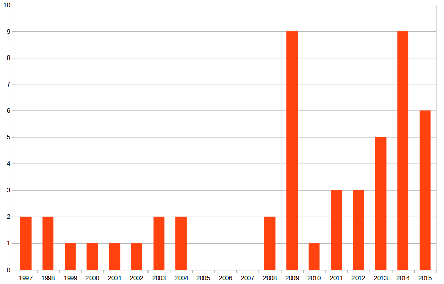

Zwei Veröffentlichungen dieser Woche über Migräne zusammengebracht offenbaren die zukünftige Bedeutung personalisierter Migränetherapie.

## Neue Ära

Im Rückblick auf das letzte Jahrzehnt sieht ein Fachartikel vom letzten Dienstag außergewöhnliche Fortschritte auf dem Weg hin zu einer besseren Migränebehandlung [1]. Gekommen sah der Autor die Zeit für den Aufbruch durch die Erkenntnis, dass Migräne eine Gehirnkrankheit ist. Lange, zu lange, dachte man, dass Migräne eine Gefäßerkrankung sei und erkannte nicht, dass dortige Veränderungen vom Gehirn fehlgesteuert sind. Als Beleg der nun außergewöhnlichen Fortschritte werden 50 neuere klinische Studien gelistet. Sie reichen zwar über das letzte Jahrzehnt bis 1997 zurück. Doch ab 2008 steigen die zitierten Studien merklich an.

Anzahl der in Supplementary Table 1 von Ref. [1] zitierten klinischen Studien. (Eigene Auswertung.)

## Mechanismen und Indikationen

Eingeteilt wurden die Mechanismen und medizinische Maßnahmen in acht Gruppen.

In der ersten und wohl wichtigsten Gruppe sind Gegenspieler eines bestimmten Gefäßerweiterers. Es geht um das gefäßerweiterende Neuropeptid Calcitonin Gene-Related Peptide (CGRP). Verschiedene Gegenspieler dieses Botenstoffes wurden in klinischen Studien getestet: Sieben Antagonisten des CGRP-Rezeptors, drei Antikörper gegen CGRP und ein Antikörper gegen den CGRP-Rezeptor.

Das wirklich neuartige an diesem therapeutischen Ansatz ist, dass sowohl Prophylaxe als auch Akuttherapie möglich sind (weswegen es auch an anderer Stelle mit einer Impfung verglichen wurde). Als einer der stärksten gefäßerweiternden Botenstoffe steht CGRP in Verdacht die Schmerzen bei Migräne zu erzeugen oder zumindest zu verstärken.

Die Antagonisten verhindern diese Wirkung. Man fasst sie auch unter dem Begriff „Gepants“ zusammen. Das ist vergleichbar mit dem Begriff „Triptane“,  mit dem Agonisten (also Mitspieler) des Serotonin-Rezeptores zusammengefasst werden (Serotonin wirkt gefäßverengend und Agonisten sind ähnlich wirkende Substanzen).

Studien mit zwei Gepants mussten wegen ihrer Lebergiftigkeit abgebrochen werden. Als Folge wurden monoklonale Antikörper gegen CGRP entwicklet, die eine höhere Spezifität aufweisen.

## Glutamat, Entzündunghemmer, Stickstoffmonoxid

Hoffnung darf man auch in eine andere Gruppe setzen. Dort werden Substanzen mit einem glutamatergen Wirkprinzip zusammengefasst, die unter anderem bei Migräne mit prolongierter Aura getestet wurden. Der Botenstoff und Geschmacksverstärker Glutamat steht seit langem im Verdacht. Glutamat ist als Neurotransmitter bei der Migränewelle „sprading depression“ in der Großhirnrinde beteiligt. Auch genetische Studien weisen auf ihn hin (siehe unten). Und als Geschmacksverstärker gehört Glutamat zu den stärksten Auslösefaktoren.

Hingegen sind andere Ansätze überwiegend gescheitert. So beispielsweise solche, die ein neuroinflammatorisches Therapie-Konzept verfolgten. Substanz P steuert Entzündungsprozesse und spielt eine Rolle bei der Schmerzübertragung. Es ist allerdings zumindest im Moment nicht mehr von klinischem Interesse. Oder der gasförmige Botenstoff Stickstoffmonoxid (NO). Auch er rückte aus dem Fokus nachdem Studien scheiterten. NO wirkt gefäßerweiternd und wird von Enzymen produziert, den NO-Synthasen, die erfolglose Angriffspunkte waren.

In der Veröffentlichung wird außerdem eine Gruppen mit Substanzen zusammengefasst, die noch an der Schwelle echten pharmazeutischen Interesses stehen.

## Wearables und Implantate – Tragbare Therapie?

In der letzten Gruppe stehen Neuromodulatoren. Das sind tragbare medizinische Geräte und Implantate. Mittels elektrischer Ströme und/oder magnetischer Felder sollen sie das Nervensystem positiv beeinflussen. Hier ist das Bild geteilt. Die invasive Occipitalis-Nervenstimulation und ein an den Hals gesetzter Vagusnerv-Stimulator sind in (bisher) gescheitert. Andere, wie der auf der Stirn sitzende Trigeminusnerv-Stimulator zeigten Wirkung und werden schon vermarktet.

Übrigens: Man sollte nochmal explizit zwischen Abbruch der klinischen Studien und Scheitern unterscheiden. Beim Abbruch waren die Nebenwirkungen nicht mehr hinnehmbar, wie beispielsweise bei zwei der Gepants, die Maßnahme selbst kann aber durchaus die gewünschte Wirkung gezeigt haben. Beim Scheitern wurden die klinischen Endpunkte (Studienziele) verfehlt, die Maßnahme kann aber als zulassungsüberschreitende Anwendung (Off-Label-Use) oder in der klinischen Forschung weiter eingesetzt werden.

## Erbgut bestimmt Therapieerfolg

Eine andere Fachpublikation vom Montag fragt, ob das Erbgut den Therapieerfolg bestimmt [2]. Diese Frage wird in meinen Augen die Ära einer besseren Migränebehandlung, wie sie in der vorangegangen Publikation vorhergesehen wird, entscheidend bestimmen.

Ohne ins Detail der Publikation einzusteigen, kann man sich das Prinzip an einem Beispiel klar machen: Zwei Menschen, nennen wir sie Anne und Bob, bekommen aufgrund ihrer Symptome die selbe Diagnose, jedoch fand man nur bei Bob einige der typischen Veränderungen an bestimmten Genorten, die man mit Migräne assoziiert. Was macht man mit dieser Information? Zukünftig vorstellbar wäre es, dass für Bob sowohl das Risiko der Nebenwirkungen als auch die Erfolgsaussichten einer spezifischen Therapieform (siehe oben) anders liegen als für Anne. Demnach würde Bob also anders behandelt als Anne. Im Extremfall wäre es beispielsweise vorstellbar, dass Bob keinerlei Nebenwirkungen bei einer sehr wirksamen Maßnahme zeigt, die für Anne hingegen aufgrund massiver Nebenwirkungen völlig inakzeptabel ist.

## Polygenetischer Ursprung und epigenetische Einflussfaktoren

Der eigentliche Erfolg der genetischen Forschung bei Migräne, bei den sog. genomweiten Assoziationsstudien (GWAS), könnte in dieser Art der zugeschnittenen Therapie liegen.

Die bisherigen Ergebnisse der Migräne-GWAS werden hingegen oft stark verkürzt so dargestellt, dass Migräne eine genetische Erkrankung sei. Falsch ist das zwar nicht. Doch die Bedeutung wird von Laien eher missverstanden und helfen tut diese Erkenntnis auch nicht.

Das Erbgut erklärt nämlich nicht die Entstehung der Migräneerkrankung. Migräne ist polygenetischen Ursprungs und zusätzlich tragen epigenetische Faktoren zur Entstehung bei. Vielleicht sind epigenetische Faktoren sogar allein hinreichend. Epigenetische Faktoren meint, dass äußere Faktoren, wie Verhalten und Umweltveränderungen, Zugriff auf das Erbgut bekommt.

Das Erbgut erklärt also nicht die Entstehung der Migräne, die Resultate der GWAS könnten allerdings zukünftig den Weg aus der Erkrankung aufklären, d.h. die Erbinformation könnte für eine personalisierte Therapie notwendig sein.

Darüberhinaus kommt man mit GWAS systematisch und hypothesenfrei neuen Mechanismen auf die Spur, da man Genorte entdecken kann, die man vorher nicht mit dem Krankheitsbild in Verbindung gebracht hätte. Veränderungen an Genorten können also auf physiologische Kreisläufe Hinweise geben, deren Fehlfunktion mit der Erkrankung zusammenhängt, so dass zu den oben schon genannten acht Gruppen eines Tages eine neunte und zehnte hinzukommt. (Mehr zu GWAS schrieb Sebastian Reusch: „[Genomweite Assoziationsstudien: Bewährtes Mittel oder Geldverschwendung?](https://scilogs.spektrum.de/enkapsis/genomweite-assoziationsstudien-bew-hrtes-mittel-oder-geldverschwendung/)“)

Zusammengebracht zeigen die beiden aktuellen Fachpublikationen [1,2], wie eine personalisierte Migränetherapie in 10 Jahren aussehen könnte. Viel spricht dafür, dass Patienten über ihre Diagnose Migräne hinaus nochmal in klinisch relevante Untergruppen, sog. Strata, eingeteilt werden. Auf der genetischen Ebene wird die Medizin demnach *stratifiziert* – und noch nicht im wahrsten Sinne des Wortes *personalisiert*. Doch der Einfluss der epigenetischen Faktoren spricht dafür, dass neben dem Erbgut zusätzlich persönliche Indikatoren des Verhaltens mit prognostischer Aussagekraft hinzukommen, so dass wirklich auf die Person maßgeschneiderte Therapien möglich werden könnten.

## Literatur

[1] Goadsby P, Decade in review—migraine: Incredible progress for an era of better migraine care, Nature Reviews Neurology (2015) [doi:10.1038/nrneurol.2015.203 Published online 27 October 2015](http://www.nature.com/nrneurol/journal/vaop/ncurrent/full/nrneurol.2015.203.html) (die Publikation ist nur offen lesbar durch diesen Link über SciLogs, dank der Zusammenarbeit von SciLogs mit Nature.)

[2] Christensen AF, Esserlind AL, Werge T, Stefánsson H, Stefánsson K, Olesen J. The influence of genetic constitution on migraine drug responses. Cephalalgia. 2015 Oct 26. pii: 0333102415610874. [[Epub ahead of print](http://cep.sagepub.com/content/early/2015/10/23/0333102415610874.abstract)]
