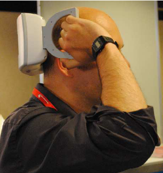

Am 13. Dezember 2013 wurde durch die FDA (Food and Drug Administration, Zulassungsbehörde der USA für Lebens- und Arzneimittel) ein neues Medizingerät zugelassen. Es war der zweite Anlauf. Ein sogenanntes „nichtinvasives“ Verfahren, die transkranielle Magnetstimulation, ist nun in den USA zur Migränetherapie zugelassen. Siehe auch meinen Beitrag in Gray Matters “[FDA allows marketing of magnetic stimulator for migraine with aura](http://www.scilogs.com/gray-matters/fda-allows-marketing-of-magnetic-stimulator-for-migraine-with-aura/)”.  (Der Ordnung halber an dieser Stelle die Offenlegung eines Interessenkonflikts: Ich war 2013 beratend für die Herstellerfirma, eNeura Therapeutics LLC, tätig.)

Ich selbst habe das Gerät schon mehrfach an mir ausprobiert, ohne unter Migräne zu leiden. Es “wirkt” völlig harmlos. Trotzdem hat die FDA es im ersten Verfahren nicht zugelassen. Es ist eben keine risikofreie Behandlung.

Als „nichtinvasiv“ bezeichnet man gewöhnlich medizinische Prozeduren, die nicht gegenständlich in den Körper eindringen. Wie man z.B. auf Wikipedia nachlesen kann, wird der Begriff „nichtinvasiv“ insbesondere verwandt, um die geringen Unannehmlichkeiten und Risiken bestimmter Verfahren zu betonen. Genau deswegen wird nun in einer neuen Veröffentlichung vom 23. Dezember 2013 ([Front. Syst. Neurosci., 2013](http://dx.doi.org/10.3389/fnsys.2013.00076)) vorgeschlagen, auf die Kombination der Begriffe „nichtinvasive Gehirnstimulation“ völlig zu verzichten.

## Unangebracht und gar widersprüchlich

Der Begriff „nichtinvasive Gehirnstimulation“ sei unangebracht wenn nicht gar widersprüchlich (“*inappropriate and perhaps oxymoronic”*). Der Begriff täusche Laien über die Wirkung auf das Hirngewebe, sowohl bezüglich der akuten wie auch der langanhaltenden Wirkung. Deswegen sollte in Zukunft diesem Verfahren mit dem gleichen Respekt begegnet werden, wie einer chirurgischen Technik. Dementsprechend müssten z.B. Ethik-Leitlinien in Institutionen vorschreiben, den Begriff „nichtinvasiv“ nicht für Hirnstimulation zu nutzen.

Dazu muss man wissen, um welche Anwendungsgebiete es geht. Wo kommt der Laie in Berührung mit dieser Technik, also der Stimulation seines Gehirns mit elektrischen und magnetischen Feldern?

Die transkranielle Magnet- und Stromstimulation wird in der Therapie neurologischer Erkrankungen und psychiatrischer Störungen sowie [bei der Rehabilitation eines Schädel-Hirn-Traumas](http://www.ncbi.nlm.nih.gov/pmc/articles/PMC3342413/) erforscht und angewandt. Aber nicht nur dort sondern auch in der Diagnostik. Und obendrein sogar auch in der Psychophysik also bei gesunden Probanden, meist Studenten, um grundlegende Eigenschaften der Wahrnehmung und Motorik zu erforschen. Oft um Tierexperimente zu ersetzen. [Zum Beispiel, ob man sich mit nichtinvasiver transkranieller Magnetstimulation selber kitzeln kann](https://scilogs.spektrum.de/graue-substanz/eine-kitzlige-frage/). Es klingt gleich weniger spaßig, wenn man fragt, ob man sich mit elektromagnetischer Strahlung selber kitzeln kann. (Die Frage dahinter – nach der Efferenzkopie bei unwillkürlicher Bewegung – ist durchaus interessant und hat schon Herrmann von Helmholtz sich gestellt. Das nur am Rande). Von der Heimwerker-(DIY)-Hirnstimulation will ich an dieser Stelle nicht mehr erwähnen, als dass sich gerade in Berlin die „[Cyborgs e.V. – Gesellschaft zur Förderung und kritischen Begleitung der Verschmelzung von Mensch und Technik](http://cyborgs.cc/)“ gegründet hat.

## Invasion in Nachbargebiete

Die Autoren, die nun vorschlagen von einer „nichtinvasiven Gehirnstimulation“ nicht mehr zu sprechen, führen ein Argument an, an dass ich bisher nicht gedacht habe. Nämlich das „nichtinvasiv“ auch bedeutet, dass das Verfahren und dessen Wirkung sich nicht in benachbartes Gewebe ausbreitet, weg von dem Zielgebiet. Diesbezüglich ist die transkranielle Magnetstimulation (TMS) und auch die transkraniellen Stromstimulation (auch transkranielle Elektrostimulation genannt, TES) letztlich invasiver als z.B. eine implantierte Tiefenhirnstimulation (deep brain stimulation, DBS). Obgleich es unsinnig wäre, deswegen TMS oder TES wirklich als invasiver zu betrachten, ist das ein guter Punkt. Ein chirurgischer Eingriff ist an sich schon ein Risiko, er wird postoperative Schmerzen verursachen, er kann zu vorübergehenden und dauerhaften neurologische Komplikationen führen, es können allergische Reaktion auf die implantierten Materialien auftreten und schlimmstenfalls eine Infektion verursachen. Trotzdem stimmt die Tatsache, dass TMS und TES großflächiger stimulieren müssen als DBS und somit nicht nur ein Zielgebiet punktgenau treffen können.

## Vergleich mit dem Cyberknife

Die Autoren weisen außerdem darauf hin, dass man den Begriff „nichtinvasiv“ angeblich auch nicht bei radiochirurgischen Bestrahlung verwenden würde, und damit sei die Stimulation des Gehirns mit elektrischen und magnetischen Feldern (TMS und TES) zu vergleichen. Ein nicht uninteressanter Gedanke.

Doch das stimmt nicht wirklich. Man liest sehr wohl und zurecht von der „nichtinvasiven radiochirurgischen Behandlung im Vergleich zu operativen Methoden“ so z.B. wird jemand von der AOK [im Ärzteblatt](http://www.aerzteblatt.de/archiv/53071/Radiochirurgie-Tumoren-im-Strahlenkreuzfeuer) zitiert. Oder als in Berlin das [CyberKnife Center](http://cyberknife.charite.de/) gegründet wurde, stand auf [www.aerztezeitung.de](http://www.aerztezeitung.de/praxis_wirtschaft/klinikmanagement/article/670351/charite-buendelt-kompetenz-radiochirurgie.html): „Das nicht-invasive, bildgeführte und robotergestützte Verfahren zur gezielten radiochirurgischen Bestrahlung ist vor allem für den Einsatz bei chirurgisch schwer zugänglichen und atembeweglichen Tumoren geeignet.“ Wenig erstaunlich schreibt selbst der Hersteller, Accuray Inc, “*The CyberKnife® Robotic Radiosurgery System is a non-invasive alternative to surgery for the treatment of …”.*

Cyberknife ist zwar ein Herstellername, taugt m.E. aber auch zum Gattungsnamen wie Flex für Winkelschleifer, um in Genre zu bleiben. Oder Tempo für Papiertaschentücher, Fön für Haartrockner. Vielleicht setzt sich dieser Begriff ja einmal durch. Es mag ironisch klingen, aber was man nicht außer Acht lassen sollte ist, dass es sehr wohl im Sinne der Hersteller sein kann, auf „nichtinvasiv“ in Zukunft zu verzichten. Denn es ist nicht ausgeschlossen, dass die Nähe zu chirurgischen Methoden mit einen erhöhten Plazebo-Effekt einhergeht! Das ist schließlich auch der Hintergrund der Kritik, der Begriff sei widersprüchlich, ein Oxymoron.

## Es kommt darauf an

Für mich gilt, solange als Vergleich eine operativen Methode steht, ist der Zusatz „nichtinvasiv“ durchaus sinnvoll, um geringer Risiken zu betonen oder zumindest die nicht vorhandenen Unannehmlichkeiten einer Operation. Wird dagegen der Vergleich zu einer pharmakologischen Therapie gezogen, ist „nichtinvasiv“ wenig geeignet, um Unterschiede aufzuzeigen. Als Beispiel denke man an eine pharmakologische Behandlung psychischer Störungen und die elektrische Krampftherapie. Natürlich sind als Nebenwirkungen Nieren- oder Leberfunktionsstörung bei einer elektrischen Krampftherapie nicht zu erwarten, [bei Psychopharmaka schon](http://de.wikipedia.org/wiki/Neuroleptikum#Weitere_unerw.C3.BCnschte_Wirkungen). Die Invasion in andere Organsysteme ist also kein Problem bei der Stimulation des Gehirns mit elektrischen und magnetischen Feldern. Das allein rechtfertigt m.E. aber nicht den Zusatz „nichtinvasiv“ bei diesem Vergleich.

Die Situation bei Migräne verdient gesondert beleuchtet zu werden. Hier steht das Eingangs erwähnte neue TMS-Medizingerät z.B. in Konkurrenz zu der invasiven Occipitalis-Nervenstimulation. Dazu schreibe ich vielleicht später einmal mehr.

Fazit: Es kommt auf den Vergleich an, ob man „nichtinvasiv“ als Beschreibung hinzufügen sollte. Und allein durch weglassen des Adjektivs „nichtinvasiv“ ist es natürlich sowieso nicht getan. Ich hätte zum Einstieg bezüglich der Frage über die rasante Entwicklung in diesem Bereich auch von elektromagnetischer Strahlung – statt von Feldern – sprechen können. Strahlung hat eine negative Konnotation.

Es gibt also viele Möglichkeiten Methoden in ein Licht zu rücken, in dem man es sehen will. Dagegen hilft nur möglicht viele voneinander unabhängige Quellen zu Rate zu ziehen.
