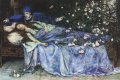

Das Semester hat wieder angefangen und ich habe kurzfristig die Vorlesung "Statistischer Physik" übernommen, eine [Vertiefung in Theoretischer Physik (VI) im Masterstudiengang Physik](http://www.itp.tu-berlin.de/menue/lehre/lv/ws1112/wahlpflichtveranstaltungen/theoretische_physik_vi_vertiefung_statistische_physik_i/) an der TU Berlin. Meine Abende sind nun mit der Ausarbeitung dieser Vorlesung belegt.

Damit die Wartezeit auf den nächsten Beitrag nicht zu lange wird,[^1] stelle ich heute eine Frage, die auch die Studenten in der Übung zur Vorlesung beantworten müssen. Ich werde folglich erst nach dem 8. November hier eine eigene Antwort einstellen (falls ich es durchhalte, solange nichts zu sagen).

Hier die Frage:

Dornröschen muss sich folgendem Experiment unterziehen. Am Sonntag wird ihr ein Allgemeinanästhetikum verabreicht, so dass sie ohne jegliches Bewusstsein ist. Schon am Montag soll Dornröschen wieder geweckt und dann interviewt werden. Zuvor aber wird noch eine faire Münze geworfen, um den weiteren Verlauf des Experiments nach dem Interview zu bestimmen. Wenn die Münze Kopf zeigt, ist das Experiment beendet. Wenn die Münze allerdings Zahl zeigt, bekommt sie eine zweite Dosis des Anästhetikums und wird erneut am Dienstag geweckt und ein zweites mal interviewt. In diesem Fall endet das Experiment dann endgültig am Dienstag.

Man beachte, dass die Münze nur einmal geworfen wurde. Außerdem sei angenommen, dass die zweite Dosis des Anästhetikums zu einer kontinuierlichen Amnesie führt beginnend ab der ersten Dosis bis zum erneuten Erwachen am Dienstag, so dass Dornröschen sich nicht an den bisherigen Verlauf des Experiments (Interview am Montag) erinnern kann. Während des Interviews hat sie auch keinen Hinweis auf den Tag der Woche. Allerdings kennt sie vorab alle Details des Experiments und kann sich an diese im Interview genau erinnern.

Das Interview besteht aus einer einzigen Frage: "Was ist Ihre persönliche Überzeugung für die These, dass unsere Münze auf dem Kopf gelandet ist?"

Frage/Aufgabe:

* (a) Was würden Sie antworten und warum?
* (b) Schreiben Sie ein Computerprogramm, das dieses Experiment 1000 mal wiederholt und bei dem Dornröschen immer einen Euro bekommt, wenn sie die Frage im Interview (Montag oder Dienstag) mit "Ich glaube die Münze zeigt Kopf/Zahl" beantwortet und damit Recht hat, sie aber nichts bekommt, wenn sie falsch liegt (beachten Sie, dass Sie in (a) auch die Wahrscheinlichkeit abgeben sollen).

[^1]: Einige Leser warten wahrscheinlich auf die angekündigte Fortsetzung des Beitrages "[Satte Spezialisten überreizen das Gehirn](https://scilogs.spektrum.de/blogs/blog/graue-substanz/2011-10-04/satte-spezialisten-ueberreizen-das-gehirn)". Ich bitte um noch etwas Geduld.
