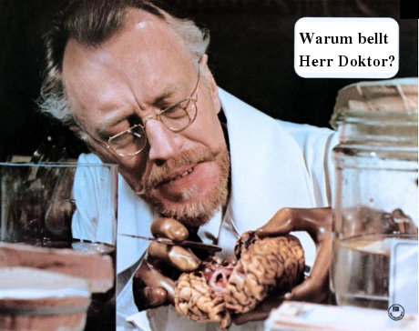

"Hundeherz" von Michail Bulgakow ist meine Buchempfehlung für den Sommer. Für das Loch in das man unfreiwillig fällt. Aktuell ist daran gewiss nicht das Thema Eugenik, die Verbesserung der menschlichen Art, um die es zunächst dem Protagonisten des Buches, Professor Filipp Filippowitsch Preobashenskij, geht. Obschon es uns einige glauben machen wollen, hat die Präimplantationsdiagnostik in seiner jetzigen Form aber auch gar nichts mit Eugenik zu tun.

Das Buch ist aktuell, weil der eugenische Versuch von Filipp Filippowitsch spektakulär fehlschlägt. Durch die Transplantation einer menschlichen Hypophyse in ein Hundehirn wird aus dem Hund Bello Herr Bellow. Den neuen Namen lässt Bello, Verzeihung, Herr Bellow, sich auch gleich in seine Papiere eintragen. Das "w" wird zum Namenszusatz, der nun in voller Länge Polygraf Polygrafowitsch Bellow lautet. Namen schmücken, diesmal ist er sogar Programm. Der Ploygraph: ein Verweis auf eine Vielzahl von Stilrichtungen und die Vervielfältigung von Schriften. Aber auch auf den Lügendetektor.

Doch Namen bleiben Schall und Rauch,

> [s]eine [Bellows] ordinäre Sprechweise, seine destruktive Energien wie überhaupt sein ganzes ruppiges Benehmen lassen nirgens die Hoffnung aufkommen, daß er sich je zu einem gesitteten Wesen entwickelt.  
>  (Wolffheim, 1996)

So wurde ihm die Hypophyse auch wieder entfernt und folglich verlor Bello die Leitung der "Unterabteilung zur Säuberung der Stadt Moskau von streunenden Tieren (Katzen usw.) bei der Stadtreinigung der Moskauer Kommunalwirtschaft", und das natürlich gerade weil er dieses Position erst durch und folglich nach Erhalt der Hypophyse überhaupt bekleiden konnte.

Bello war als gemeiner Hund ein durchaus angenehmer Kerl, vernunftbegabt lässt Bulgakow ihn über die ersten 50 Seiten, bevor es zu Übernahme geistiger Fremdfähigkeiten kam, die Welt kommentieren. Ich gehe davon aus, dass er, Bello, zurück in der Hundewelt, auch wieder Fuß fasste. In der Kommunalwirtschaft hat er nichts mehr verloren.

**Literatur**

Elsbeth Wolffheim, *Michail Bulgakow*, rororo Monographie, 1996

**Bildquelle**

Aus "Warum bellt Herr Bobikow?" deutsch-italienische Verfilmung von Alberto Lattuada mit Max von Sydow als Professor Filipp Filippovich Preobrazenskij.

**Link**

Kurze URL zum Beitrag

http://goo.gl/8grGu
