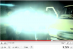

Vorgestern berichtete ich über die [Sperrung meines Migräne-Videos bei YouTube](http://www.brainlogs.de/blogs/blog/graue-substanz/2011-05-04/youtube-sperrt-mein-migraene-video). Bisher kann ich mir nur zwei Gründe für die Sperrung vorstellen, zum einem eine Verletzung des Copyrights, weil ich die Animation einer Sehstörung bei Migräne (Migräne*aura* genannt) auf dem Hintergrund der Homepage von Google illustriete. Nachdem im Film die Buchstaben „m i g r a i n e  w i t h  a u r a“ hintereinander im Suchfeld erschienen, beginnt hinter dem Wort „aura“ diese, d.h. eine sehr realistische Simulation einer Sehstörung, wie sie für Migräne typisch ist, ein flackerndes Zickzack-Muster.

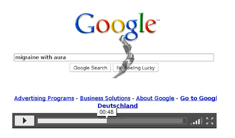

Der andere Grund für die Sperrung könnte sein, dass YouTube befürchtet, dass dieses Flickermuster selber einen Migräneanfall auslösen könnte. Über diese Möglichkeit schrieb ich ausführlich im [vorangegangenen Post](http://www.brainlogs.de/blogs/blog/graue-substanz/2011-05-04/youtube-sperrt-mein-migraene-video). Als ich gestern in Twitter nach „migraine“ und „video“ suchte, wurde ich auf das aktuelle Album „Migraine“ von der Gruppe [*ArtOfficial*](http://artofficial.bandcamp.com/) aufmerksam.

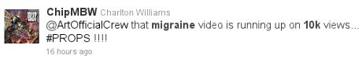

Immerhin 10 000 Hits seit dem 20. April. Das Video wird oft gesehen. Ich habe es mir angeschaut und zeige einige Ausschnitte hier.

Nach 11 Sekunden ein Lichtblitz von einem Scheinwerfer eines Vans.

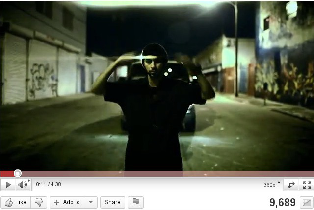  
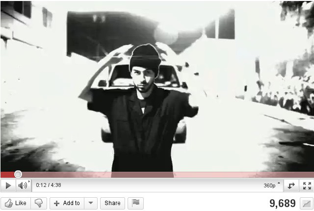  
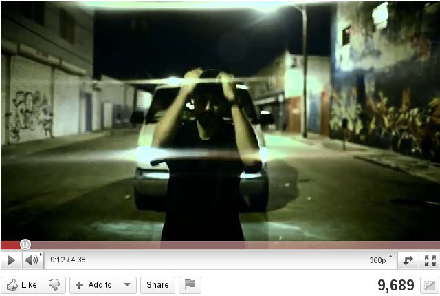

Das ist ein maximaler Helligkeitskontrastwechsel innerhalb weniger als einer Sekunde mit einem konstant dunklen vertikalen Streifen (der Mann im Vordergrund) in der Mitte.  Besser können die Gehirnzellen nicht überstimuliert werden. Fast eine perfekte Annäherung an einen sogenannten [Gabor-Filter](http://en.wikipedia.org/wiki/Gabor_filter), der die Struktur des [rezeptiven Feldes](http://de.wikipedia.org/wiki/Rezeptives_Feld) der Gehirnzellen in der Sehrinde beschreibt.

Wenige später Sekunden kommen dann Gehirnzellen dran, die horizontale Reize verarbeiten.

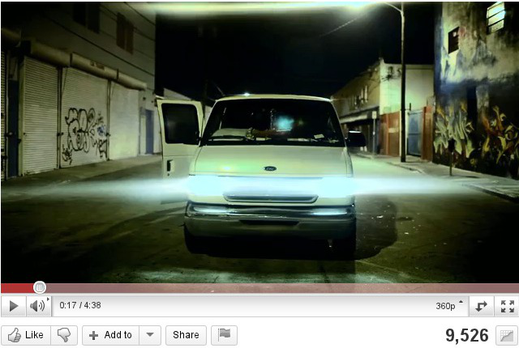

An dieser Stelle war ich entsetzt. Für einen Moment glaubte ich ernsthaft an eine Verschwörungstheorie. Wenn ich mit all meinem Wissen über die Verschaltungen in der Sehrinde des Gehirns eine Migräneanfall mit Lichtreizen auslösen wollte, ich wüsste nicht, wie es besser ging. Das mag Zufall sein. Gucken wir weiter.

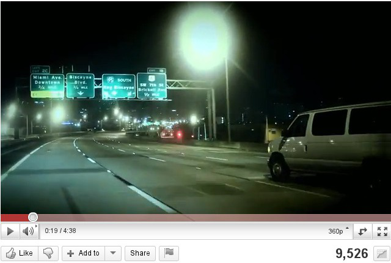

Immer wieder helle kontrastreiche Lichtflecken tauchen auf.

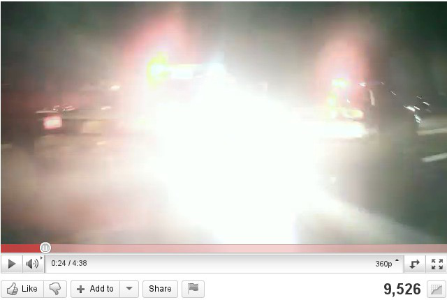

Wummmms. Das hier oben flackert wieder. Was noch nicht genug? OK, dann halt mit Gewalt.

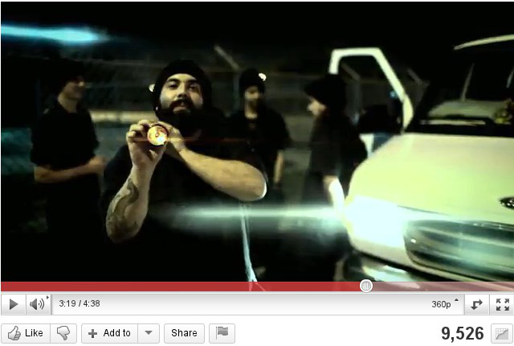  
  
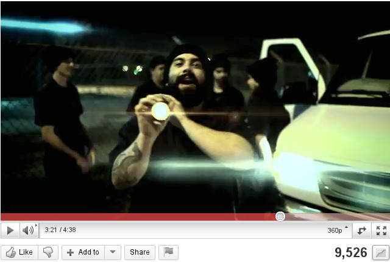

Ich überlasse die weitere Kommentierung dem Leser. Wer das Video sehen will, ich empfehle es dem Migräniker **nicht**, [hier entlang](http://www.youtube.com/watch?v=ywWDFqWEYkE) zu YouTube, die übrigens mein Video noch gesperrt halten. Warum nochmal?
