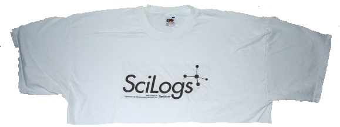

*Das Modeblog [Les Mads](http://www.lesmads.de/2011/01/skinny-hosen_sind_ein_bleibender_trend.html) spricht das Offensichtliche noch einmal aus und heute notiere ich: T-Shirts sind hoffentlich ein bleibender Trend bei dem kommenden SciLogs-Treffen in Deidesheim.*  *Das durchgehend banal geschnittene T-Shirt, das im 19. Jahrhundert noch als Unterwäsche galt, ist heute längst zu einem Klassiker avanciert. Einige Experten aus der Sciencebranche haben zu diesem Thema letztes Jahr Stellung genommen: "Heimfahrt mit guter Laune, Kochschürze und -haube, T-Shirt, Wein … danke @Zinken @fischblog et al. #scilogs10" kommentiert auf Twitter zum Beispiel Beatrice Lugger als [BLugger](http://twitter.com/#!/blugger) und David Salzberg, wissenschaftlicher Berater der Sitcom "The Big Bang Theory" und Physik-Professor an der University of California in Los Angeles sagt: "The four equations that describe all of classical electricity, magnetism, and light – Maxwell’s Equations – are simple enough to fit on a T-shirt."*

Dieser einleitende Absatz plagiiert einen Beitrag des Modeblogs *"[Les Mads](http://www.lesmads.de/)"* wäre da nicht diese Fußnote.[^1] Les Mads wurde von Jessica Weiß und Julia Knolle ins Leben gerufen. Sie und mittlerweile weitere Autoren informieren über Mode, Models, Trends, Outfits, Lifestyle, Musik und Fotografie und erreichen so 650 000 Besucher pro Monat. 650 000. Hut ab. Dies las ich neulich unter der Überschrift "[*Es gehört auch ein bisschen Wahnsinn dazu*](http://www.faz.net/s/RubB62D23B6C6964CC9ABBFCB78BC047A8D/Doc~E762EB7943A7C439393947399A1140CEF~ATpl~Ecommon~Scontent.html)" in der FAS.

Zu einen Wissenschaftsblog gehört auch ein bisschen Wahnsinn. Es gibt sicher andere Gemeinsamkeiten. Die Länge der Beiträge gehört nicht dazu. Es ist nicht untypisch auf Les Mads Beiträge zu finden, die nicht länger sind als der obere Absatz.  Darüber lohnt etwas länger nachzudenken. Welche Regeln gelten wo?

Was erwarte ich von einem Modeblog? OK, ich lese keinen. Aber wenn? Als Physiker wurde ich über Jahre trainiert Gedankenexperimente zu Ende zu denken, selbst wenn oder gerade weil diese so nicht realisierbar sind. Ein Kinderspiel dies hier: angenommen ich lese regelmäßig ein Modeblog. Daraus folgt, dass ich offensichtlich darauf vertraue regelmäßig passende Anregungen zu bekommen. Anders wäre das nicht zu erklären. Und wenn es so wäre, dann würde ich ganz selbstverständlich ein Modeblog lesen.

Letztlich bindet Vertrauen die Leser. Wohin mich nun letztlich diese Gedanken führen, ist diese Frage zu stellen: Worauf vertraue ich als Leser eigentlich bei Wissenschaftlsblogs? Eine Antwort darauf kann sich jeder selber geben.

Über diesen Themenkreis, insbesondere die vielfältigen [Interessenkonflikte beim Bloggen](http://www.brainlogs.de/blogs/blog/graue-substanz/2010-08-18/verhaltenskodex) und dass letztlich [Wissenschaftsbloggen Lobbyismus](http://www.brainlogs.de/blogs/blog/graue-substanz/2010-09-19/wissenschaftsbloggen-ist-lobbyismus) ist, schrieb ich letztes Jahr. Heute will ich vor dem kommenden SciLogs-Treffen am Samstag in Deidesheim nochmal diese Beiträge in Erinnerung rufen.

Auf die neuen Trends und Änderungen bei SciLogs bin ich gespannt. Nächste Woche werden wir sicher in dem ein oder anderen Blogbeitrag darüber lesen. Ich hoffe zu den bleibenden Trends gehört der Weißwein in Deidesheim und ein neues T-Shirt.

[^1]: Vgl. "[Skinny-Hosen sind ein bleibender Trend](http://www.lesmads.de/2011/01/skinny-hosen_sind_ein_bleibender_trend.html)" vom 10 Januar 2011.

