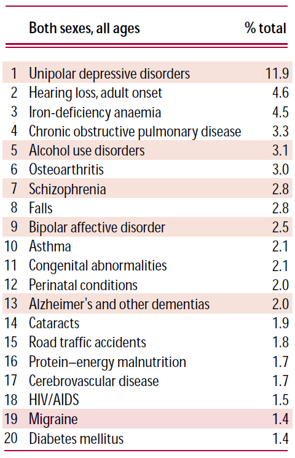
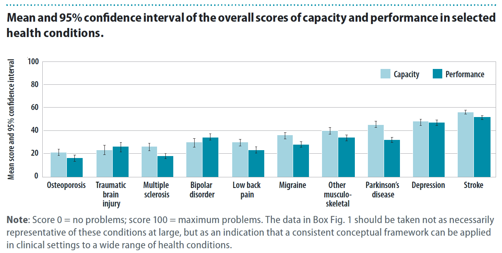

Vergleiche hinken und Faustregeln sind nicht präzise. Kombiniert wird es manchmal dessen ungeachtet schlagkräftig. Der aktuelle Vorfall [der Umleitung einer Boeing 747 wegen eines angeblichen Migräneanfalls](https://scilogs.spektrum.de/blogs/blog/graue-substanz/2012-11-20/lufthansa-ko-pilot-mit-migr-ne-in-boing-474) und die nicht wirklich überraschende Umdeutung eines kuriosen Zufalls zur Heldentat lassen mich mal wieder einen Beitrag schreiben.

Überwiegend ignoriert die Presse den Vorfall, was letztlich auch richtig ist, wenn man die eigentliche Nachricht nicht herausarbeiten kann. Diese ist gut in der gesellschaftlichen Unkenntnis verborgen – wobei es dadurch erst zur Nachricht wird: Migräne, eine Volkskrankheit, kann extrem schwer verlaufen. Querschnittsgelähmte können keine Boeing fliegen, könnte die Nachricht auch lauten.

Ein Prozent der Menschheit erleidet an einem Tag pro Woche eine Migräneattacke.

Diese Attacken können so sehr behindern wie eine Querschnittslähmung.

So lautet Faustregel (1% an 1 Tag in 1 Woche) und Vergleich (Querschnittslähmung), was ich beides in diesem Zusammenhang genauer anführen will.

Die Faustregel und den Vergleich zur Querschnittslähmung las ich schon so vor gut zehn Jahren in einem Artikel im  *New England Journal of Medicine*, eine angesehene medizinische Zeitschrift. Der Artikel wurde bis heute über 1100 mal zitiert.

> In the United States and Western Europe, the one-year prevalence of migraine is 11 percent overall: 6 percent among men and 15 to 18 percent among women.  The median frequency of attacks is 1.5 per month, and the median duration of an attack is 24 hours; at least 10 percent of patients have weekly attacks, and 20 percent have attacks lasting two to three days.
>
> Thus, 5 percent of the general population have at least 18 days of migraine per year, and **at least 1 percent** — that is, more than 2.5 million persons in North America — **have at least 1 day of migraine per week**. The lifetime prevalence of migraine is at least 18 percent, although among older subjects the figures are deflated by recall bias. In the United States, most patients with migraine have not seen a physician for headache during the previous year, have never received a medical diagnosis of migraine, and use over-the-counter medications to the exclusion of prescription drugs. A recent survey by the World Health Organization (WHO) rates severe migraine, along with quadriplegia, psychosis, and dementia, as one of the most disabling chronic disorders. This ranking suggests that in the judgment of the WHO, **a day with severe migraine is as disabling as a day with quadriplegia**.
>
> [Hervorherbung von M.A.D.]

Ich habe damals mir gedacht, na ja Vergleiche hinken und Faustregeln sind nicht präzise. Was soll man damit anfangen. Aufmerksamkeit und Bewusstsein über den Grad der Behinderung bei einer Migräneerkrankung, das ist ohne Zweifel was man erreichen kann (Sie lesen ja jetzt auch). Und genau das ist leider bis heute noch nicht in der Gesellschaft angekommen. Wenn also wirklich mal eine Boeing umgeleitet wird und noch ein Ersatzpilot mitspielt wie es im keinem Drehbuch vorkäme, nehme ich dies gerne zum Anlass, diesen Sachverhalt erneut im Blog hervorzuheben.

Der Vergleich des Grades der Behinderung stammt von einer Einschätzung der Weltgesundheitsorganisation (WHO), die ich in dieser Form so nicht kenne. Die Krankheitshäufigkeiten stammen aus einer Studie mit 6491 Erwachsenen im Alter zwischen 20 und 65 [2] (wobei sich die Zahlen dort vielfach in anderen Studien wiederfinden lassen) und Deutung in Form dieser 1-1-1-Faustregel stammt von den Autoren selbst.

Der Vergleich ist nicht wörtlich zu nehmen. Betroffene sind nicht gelähmt, wobei Lähmungserscheinungen nicht untypisch sind bei Migräne. Der Vergleich ist also auch deswegen nicht wörtlich zu nehmen, weil Betroffene nicht nur gelähmt sein können. Sie können z.B. [auch massive Gesichtsfeldeinschränkungen haben, also teilweise blind sein](https://scilogs.spektrum.de/blogs/blog/graue-substanz/2012-03-28/autofahren-mit-migraene).

Es ist nur ein Vergleich der Schwere der Behinderung. Auch nicht jede Attacke verläuft so schwer, im Schnitt aber immer noch so schwer, dass Migräne in den Top 20 der schwersten Behinderungen liegt , auf Platz 19 laut eines mir bekannten [Berichtes der WHO](http://www.who.int/whr/2001/en/index.html). Gemessen wird in YLDs, was für „years of life lived with disability“ (Lebensjahre mit der Krankheit) steht und die Erkrankung „leading causes“ (Hauptursache) sein muss.

  
[[Quelle](http://www.who.int/whr/2001/en/whr01_en.pdf), Seite 28, Abb. 2.3 ]

Vielleicht kommt es die Tage ja sogar heraus, dass es gar kein Migräneanfall war, der die Boeing 747 zur Umleitung zwang. Denn es ist nicht wahrscheinlich, dass bisher bekannt war, dass der Ko-Pilot an schwerer Migräne litt (sonst wäre das die Nachricht, [man erinnere sich an Bachmann](https://scilogs.spektrum.de/blogs/blog/graue-substanz/2011-07-22/eine-us-amerikanische-praesidentin-mit-migraene)). Somit muß mit der Diagnose aber gewartet werden. Wie immer sie ausfällt, für diesen Beitrag ist das irrelevant.

Dass es eine Migräne sein kann und dass manche Anfälle so schwer verlaufen, dass schlicht fast **nichts** mehr möglich ist und sei das eigene Leben und das von 264 Passagieren an Bord davon anhängig, dass ist eine Nachricht wert. Wenn der Ko-Pilot z.B. einen Arm kaum noch bewegen kann und die Anzeigem im Cockpit nicht lesen kann, dann hilft ein „komm schon, sind doch nur Kopfschmerzen“ wenig.

Und wo wir gerade dabei sind, noch ein Vergleich von der WHO, [den ich letztens erst las](http://act.allianceforheadacheadvocacy.org/5624/urge-congressional-hearings-on-impact-migraine-headache-disorders/):

The WHO estimates that migraine causes more lost years of healthy life in the US annually than multiple sclerosis, epilepsy, ovarian cancer, and tuberculosis combined…*,* …whereas in 2010 the combined NIH research funding on these four disorders (\$684M) was more than 45 times greater than that for migraine (\$15M).

Hier werden die Forschungsgelder für Migräne mit denen für andere Krankheiten verglichen. Ja ja, [Forscher wollen künftig leichter Fördermittel bekommen](https://scilogs.spektrum.de/blogs/blog/graue-substanz/2010-09-19/wissenschaftsbloggen-ist-lobbyismus), ich auch. Das mag man bei solchen Vergleichen zurecht monieren. Auf der anderen Seite muss eine Gesellschaft entscheiden, wofür ein begrenzter Forschungstopf eingesetzt wird. Dafür Maßstäbe vorzugeben, ist mit eine der Aufgaben der WHO.

Kann man den Grad der Behinderung überhaupt messen?

Zumindest gibt es eine gewisse Konsistenz dabei (s. Abb. oben). Migräne kommt in einem aktuellen Bericht der WHO, dem „[World report on disability](http://www.who.int/disabilities/world_report/2011/en/index.html)„, nur am Rande vor. Der Vergleich zur Querschnittslähmung, wie oben genannt, findet sich dort nicht direkt. Der Begriff schwere Behinderung („severe disability“) allerdings gilt dort als Äquivalent zu Behinderungen wie Querschnittslähmung, schwere Depression oder Blindheit ([Bericht](http://www.who.int/disabilities/world_report/2011/en/index.html), Seite 29). Insofern kann ein Tag mit Migräne sicher als ein Tag mit schwerer Behinderung bezeichnet werden.

Was ich mich nun frage, gilt für den Piloten oder andere Betroffene damit auch ein schärferer Kündigungsschutz  ([§§ 85 ff SGB IX](http://www.gesetze-im-internet.de/sgb_9/__85.html)) in Sinne des Sozialgesetzbuches?

 

**Literatur**

[1] PJ Goadsby, RB Lipton, MD Ferrari, Migraine—current understanding and treatment, N Engl J Med, 2002

[2] Lenore J. Launer, Gisela M. Terwindt, Michael D. Ferrari, The prevalence and characteristics of migraine in a population-based cohort: The GEM Study. [Link](http://www.neurology.org/content/53/3/537.short).
