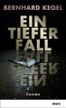

In dem [Wissenschaftskrimi „Ein tiefer Fall“ von Bernhard Kegel](http://www.science-shop.de/artikel/1141252?eqsqid=71476bc0-ddec-4840-bfc1-5e7a646b17ad) geht es um eine nicht reproduzierbare Studie, eine der besonderen Art. Nachgewiesen — jedoch nur einmalig — wurde eine völlig fremdartige Lebensform aus der Schatten-Biosphäre. Die Ergebnisse sind nobelpreiswürdig, wären sie nur reproduzierbar. Sind sie aber nicht. Die genauen Hintergründe liegen tiefer als nur in einem offenbar fehlgeschlagenem Experiment. [Wie las ich erst neulich](http://edoc.bbaw.de/volltexte/2010/1146/pdf/16_hohlfeld.pdf)?

> *Es gehört zum wissenschaftlichen Überzeugungssystem der Genomiker und synthetisierenden Molekularbiologen, daß sie ›alles im Griff‹ haben.*

Das trifft den Kern, um den sich diese Geschichte vor allem dreht.

Mehr will ich gar nicht verraten, zumal das Buch schon mehrfach gut rezensiert wurde (z.B. [hier](http://www.spektrum.de/alias/ein-tiefer-fall/im-strudel-der-luege/1171163) und [hier](http://www.ndr.de/kultur/literatur/buchtipps/nbeintieferfall101.html)).

Es wäre aber kein Wissenschaftskrimi, spielte die Geschichte nicht vor dem Hintergrund hoher Motivation der Wissenschaftler und ihrer eigentümlichen Gesetze, insbesondere die Abhängigkeiten und Zerwürfnisse, die durch die verengten Karrierestrukturen entstehen. Selbst aktuelle Bezüge zu „unseren“ Plagiatsfällen (leider eher ein deutsches Phänomen, da [eine politische Laufbahn hier eng an akademische Titel geknüpft ist](http://www.sueddeutsche.de/bildung/us-uni-boykottiert-ex-minister-kein-forum-fuer-guttenberg-an-hochschulen-1.1581753)) und Wissenschaftsblogger kommen am Rande vor.

Meine aktuelle Leseempfehlung muss ich noch mit einem Disclosure abschließen: Ich habe das genannte Buch regulär im Buchhandel erworben und auch sonst keinerlei finanziellen Verbindungen zu dem genannten Autor, der nur rein zufällig mein Nachbar ist. Wenn er das lesen sollte, kann ich nicht ausschließen, mal auf einen Kaffee eingeladen zu werden. (Bernd: mit Milch ohne Zucker.)
