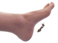
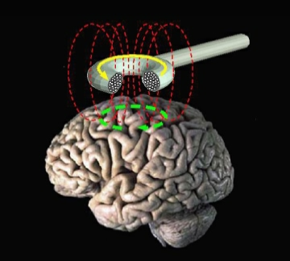

Selber kitzeln geht nicht. Was aber, wenn ich einen Roboter mit einer Fernbedienung steure und dieser mich an den Füßen kitzelt? Nicht kitzlig [1]. Was nun aber, wenn ich ein Gehirnimplantat trüge, das von jemanden gekapert wird und ich unfreiwillig mich so nun ferngesteuert „selbst“ kitzle? Das ist die kitzlige Frage.

Kann man sich vielleicht doch unter gewissen Bedingungen, und wenn ja, unter welchen, selber kitzeln? (Über das „selber“ müssten wir wohl nochmal von Fall zu Fall reden.)

> A ticklish question: does magnetic stimulation of the primary motor cortex give rise to an ‚efference copy‘? [2]

Die Frage wurde gestellt und beantwortet. Der Titel des Artikels heißt in etwa: Eine heikle/kitzlige Frage: Führt magnetische Stimulation des primären motorischen Kortex zu einer ‚Efferenzkopie‘?

Auf die Idee muss man kommen, nämlich die Frage nach der Efferenzkopie bei unwillkürlicher Bewegung durch transkranielle Magnetstimulation (TMS, s. Bild rechts; was eine Efferenzkopie ist, erkläre ich sofort, es ist jedenfalls eine Frage von allgemeiner Bedeutung und nicht in erster Linie auf Kitzeln bezogen) durch ein Experiment zu beantworten, bei dem man versucht, sich selber zu kitzeln und zwar in dem durch den Schädel hindurch mit einem starken Magnetfeld die Hirnrinde so angeregt wird, dass die induzierte neuronale Aktivität dann meine Finger bewegt, die meine Füße kitzeln sollen [2].

## Die Efferenzkopie

Ein Organismus muss fortlaufend Sinnesreize beurteilen. Berühre ich mich oder werde ich berührt? In einigen Situationen sehr wichtig. Drehe ich mich oder dreht sich die Welt um mich? Spreche ich oder wer spricht da? Alles nicht unwichtig.

Ins Gehirn eingehende Signale nennt man afferente Signale oder kurz Afferenzen. Hier muss nun sogleich eine Fallunterscheidung gemacht werden: Sind Afferenzen Folge einer Veränderung der Umwelt, ist es eine *Exafferenz*, sind sie Folge des eigenen Handelns, ist es eine *Reafferenz*. Ein Beispiel: Bei der Ausführung glatter Augenbewegungen bewegt sich die Abbildung eines in der Außenwelt völlig still stehenden Objektes auf der Netzhaut (Reafferenz). Die Signale von der Netzhaut (engl. Retina) allein für sich betrachtet könnten ebenso durch die Bewegung des Objektes in der Außenwelt verursacht worden sein (Exafferenz). Bewegung auf der Netzhaut als afferentes Signal ohne diese Fallunterscheidung sagt also noch nicht allzu viel aus.

Die sichere Beurteilung der retinalen Information erfordert offensichtlich zusätzliche extra-retinale Informationsquellen, um zu entscheiden, ob sich etwas absolut und nicht nur relativ zu mir (oder relativ zu meiner Augenposition) bewegt. Anders wäre eine raumstabile Wahrnehmung gar nicht möglich.

Um das – im wahrsten Sinne beider Worte – eindrucksvoll einzusehen, hilft ein kleines Experiment. Wenn Sie mit Ihrem Finger leicht auf das untere Augenlid drücken und damit Ihren Augapfel schnell hin und her bewegen, wackelt Ihr Gesichtsfeld wie bei einem Erdbeben. Am besten das andere Auge zu halten. (Überlegen Sie vielleicht auch mal, warum der schwarzen Fleck, den Sie dann vielleicht sehen, oben rechts erscheint, obwohl sie unten links drücken! Bitte bei all der Freude am Experiment nicht zu feste drücken.). Wenn Sie dagegen die Augen über die Augenmuskulatur schnell hin und her bewegen, wackelt Ihr Gesichtsfeld nicht. Das nennt man raumstabile Wahrnehmung. Dazu brauch unser Gehirn auch Informationen über die Aktivität der Muskulatur. Diese aus dem Gehirn herausgehenden Signale nennt man efferente Signale oder kurz Efferenzen.

## Lachen über das Fehlen der Kopie fremder Willensanstrengung

Wie bereits Helmholtz (1867) erkannt hat, erfolgt die Kompensation reafferenter, d.h. selbst verursachter retinaler Bildverschiebungen nicht etwa durch propriozeptive Information über die Augen*stellung* sondern vielmehr durch ein zentralnervöses Referenzsignal der *geplanten* Augen*bewegung*, welches man Efferenzkopie nennt. Die Efferenz steuert die Muskulatur und von diesem Signal wird zuvor eine Kopie erstellt, die dann zur Korrektur der Afferenz genutzt wird. Dieses Korrektursignal vergleicht Helmholtz mit der „Intensität unserer Willensanstrengung durch welche wir die Muskeln in Wirksamkeit zu setzen suchen“. Dieser Wille wird als Kopie gespeichert. Mitte des 20. Jahrhundert wurde dieses Reafferenz-Prinzip von von Holst und Mittelstaedt weiterentwickelt.

Edward Chronicle und sein Kollege Glover fanden nun 2003 heraus, dass bei einer TMS-induzierten Bewegung keine solche Efferenzkopie anlegt wird, denn es kitzelt egal, ob es die eigene TMS-gesteuerte Hand war oder die eines anderen. Es war beides mal kitzlig und dies, so nehmen die Autoren  an, liegt an dem Fehlen einer Referenzkopie.

Das kann in Zukunft ja wichtig werden, verstieße doch die Kopie fremder Willensanstrengung, wenn es sie denn gäbe, wahrscheinlich gegen SOPA, PIPA und ACTA zugleich und es hätte befürchtet werden müssen, dass die gesamte TMS-Forschung lahmgelegt worden wäre.

## Edward Chronicle 1966 – February 9, 2007

 Ich erlaube mir einen persönlichen Nachtrag. Viele Gedanken und wissenschaftliche Ideen von Edward Chronicle, kurz Ed, entstanden aus einer ungewöhnlichen Kombination, sie waren scharf und humorvoll zugleich. Ich kannte ihn gut, da er hauptsächlich über Migräne forschte. Ed schlug mir z.B. vor, mit meinen Computersimulationen der Sehstörungen bei Migräne mit Aura psychophysikalische Experimente durchzuführen. Wir schrieben erst ein Review [3] und machten uns dann an eine Studie, die nicht mehr zu Ende geführt werden konnte. Ed starb heute vor 5 Jahren im Alter von 40 Jahren.

Ich besuchte ihn 1999 erstmals in England, als er noch im Psychology Department der Lancaster University war. Er hatte eine Stelle ausgeschrieben und obwohl uns beiden schon nach einem ersten Telefoninterview klar war, dass ich als Physiker nicht auf diese Stelle passe, bestand er darauf, mich einzuladen, damit wir uns kennenlernen und über mögliche Projekte reden können (und er so meine Reise über den Topf abrechnen konnte, der für die echten Bewerber da war, Ed war auch pragmatisch veranlagt).

Ich ging dann Ende 2000 nach Schottland, ironischerweise nun doch in ein Psychology Department, und traf Ed von Zeit zu Zeit. Anfang 2002 bekam er £102,000 von der britischen Stiftung Dr. Hadwen Trust für tierversuchsfreie Forschung, um TMS bei Migräne zu erforschen. In diesem Rahmen entstand und löste er eben diese kitzlige Frage. Als wir uns das letzte mal trafen war Ed mittlerweile Professor auf Hawaii und dort, wie ich im Nachhinein feststellte, genauso beliebt wie zuvor in UK:

> Ed is the hottest professor on campus. He is funny, handsome and big time fun!

Wir trafen uns dieses letzte mal allerdings nicht auf Hawaii sondern in Kanada bei einem Migräneprojekt. Wenige Tage vorher war auf der Website von Nature – ich finde es heute nicht mehr, aber es war im journalistischen Teil, keine wissenschaftliche Veröffentlichung – erstmals von einem „migraine zapper“ die Rede, einem tragbaren TMS-Gerät als Migränetherapie und dies wurde sehr kritisch diskutiert. Es fehlte an guten, aussagekräftigen Studien. Ed war nicht nur daran interessiert, solche Probleme auf die ihm eigene Art zu lösen, sondern dachte immer schon einen Schritt weiter, was ihn irgendwann dann zu der Frage führte, wie überhaupt Probleme gelöst werden. So gründete er mit anderen das [Journal of Problem Solving](http://docs.lib.purdue.edu/jps/). Doch manche Probleme ließen sich einfach nicht lösen.

Aloha ʻoe, Ed.

**Literatur**

[1] Blakemore SJ, Wolpert DM, Frith CD (1998). „Central cancellation of self-produced tickle sensation“. *Nat. Neurosci.* **1**: 635–40.

[2] Chronicle EP, Glover J. (2003) A ticklish question: does magnetic stimulation of the primary motor cortex give rise to an ‚efference copy‘? , *Cortex.* **39**:105-10.

[3] Dahlem MA, Chronicle EP. (2004) A computational perspective on migraine aura. *Prog Neurobiol.* **74**:351-361.

© 2012, Markus A. Dahlem
