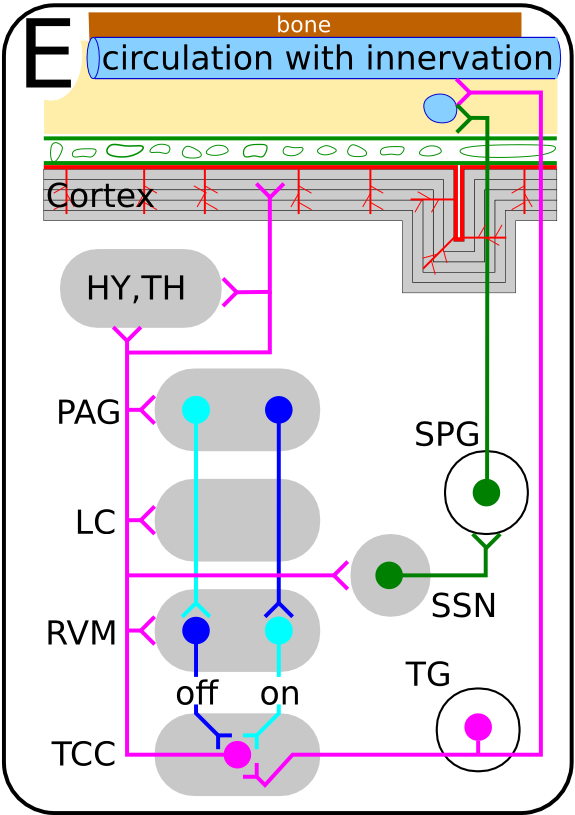

Typischer Arbeitsprozess im Bereich mathematische Modellierung und Simulation.

Kann man Migräneforschung als Physik oder Ingenieurwissenschaft begreifen? Ja. Ich bin gerade Gast am besagten MPI in Dresden in der [Abteilung Biologische Physik](http://www.mpipks-dresden.mpg.de/pages/institut/frames_struktur.html). In dieser Zeit kann ich ein zeitlich begrenztes Projekt durchführen. Vorgenommen habe ich mir die Entwicklung zentraler Mustergeneratoren vom Arbeitsmodell zum physiologischen Modell der Migräne.

Das sind die ersten zwei Schritte eines größeren Projektes. Das Teilziel dieses begrenzten Projektes ist ein minimales physiologisches Modell wiederkehrender Migräneattacken. Es soll also in der Lage sein einen Rhythmus abzubilden.

Der erster dieser zwei Schritte geht von dem neurobiologischen und klinischen Wissen aus, vereinfacht dieses und endet so in einem Arbeitsmodell (s. Abbildungen). Konkret geht es um die Auswahl der beteiligten Gehirnstrukturen und ihrer Botenstoffe ([Neurotransmitter](https://scilogs.spektrum.de/graue-substanz/neurotransmitter-fuer-physiker/)) sowie um die beteiligten Strukturen des Blutkreislaufsystems.

Der zweite Schritt repräsentiert dieses Arbeitsmodell in einem physiologischen Modell – oder in dem, was ich ein physiologisches Modell nenne. Im Prinzip ist das nämlich schon ein mathematisches Modell, das dann übersetzt in ein Computermodell Simulationen erlaubt, die wiederum interpretiert werden können (was dann schon Schritt drei, vier und fünf wäre, siehe Abbildung).

## Was ist ein physiologisches Modell?

Ein physiologisches Modell beantwortet genau eine Frage: Wie funktioniert das?

Neulich wurde das in einen enthusiastischen, 160 minütigen Vortrag ([hier](http://www.fields.utoronto.ca/video-archive/2014/07/297-3) und [hier](http://www.fields.utoronto.ca/video-archive/2014/07/297-3546)) von [Robert Eisenberg](http://www.phys.rush.edu/RSEisenberg/) deutlich gemacht – in den ersten 10 Minuten, weil es einfach fundamental wichtig ist.

Er wies nämlich darauf hin, dass wir das Wort “Physiologie” in einigen Bereichen durch ein neues ersetzt haben, durch “Ingenieurwissenschaft”. Hätten wir nicht die Ingenieurwissenschaft als solche neu benannt (vielleicht denkt er an eine “anorganische Physiologie” stattdessen?), auch unser Verständnis von der organischen Physiologie wäre heute ein anderes. Er sagt allerdings auch, dass er mit der Mentalität eines Gebrauchtwagenhändlers geboren wurde und dies sei nicht gut in der Wissenschaft. Doch man darf ihm das abkaufen, es vereinfacht die Historie, richtige ist aber: Ein physiologisches Modell ist wie ein Ingenieurmodell.

Je schneller man dies wieder begreift, desto eher verliert man Skrupel mit Mathematik auf physiologische Systeme loszugehen. Das ist wichtig, denn die Physiologie braucht dringend quantitative Methode und d.h. Menschen die diese dort einbringen. Leider begreifen viele die Physiologie nicht als kausale und analytische Wissenschaft.

## Das Arbeitsmodell

Ein Teil des Arbeitsmodells

Man beginnt zunächst mit dem Arbeitsmodell. Es liegt dem physiologischen Modell zugrunde. Dies ist mit der Arbeit des  – wo er schon da ist – Gebrauchtwagenhändlers zu vergleichen. Wie er hat man in diesem Schritt die Aufklärungspflicht hinsichtlich präsentem neurobiologischen und klinischen Wissen, aber keine Untersuchungspflicht des bisher noch Unbekannten.

Das Arbeitsmodell ist in der Abbildung rechts gezeigt. Es ist im Prinzip nur ein wenig überarbeitet von früheren, eigenen Publikationen. Zusätzlich werden durch Bildgebung gewonnene zyklische Aktivitätsmuster im Gehirn sowie und epidemiologische Daten in Zusammenarbeit mit Klinikern erhoben bzw. aus der Literatur entnommen. Diese sind dann ein zusätzlicher Teil des Arbeitsmodelles.

## Projekt: Plausible zentrale Mustergeneratoren

Geplant ist in dem Projekt dann aus dem Arbeitsmodell oszillierende neuronale Netze zu erstellen und zu analysieren. Dies sind eigentlich Schaltkreise, wichtig ist, dass sie selbst keine rhythmusbestimmenden Schrittmacherneurone als Einzelbausteine enthalten.

Mit Hilfe von Zustandsübergangsdiagrammen soll in den nächsten Wochen eine erste Bestandsaufnahme möglicher Netzwerkstrukturen erstellt werden. [Dazu kann man diesen Beitrag lesen](https://scilogs.spektrum.de/graue-substanz/salamander-schritte-verstaendnis-mind-brain/). Das Projekt steht übrigens gerade am Anfang des zweiten Monats. Diese Zeilen sind quasi der erste Zwischenbericht.

Die hoffentlich bald zur Verfügung stehenden Netzwerkstrukturen führen alle zu dem gleichen stabilen Migränezyklus (per Konstruktion). Sie werden daher als mögliche zentrale Mustergeneratoren (ZMG) angesehen.

Es werden daraufhin konkrete Schritte zu einer Unterscheidung zwischen den bis dahin als gleich plausiblen geltenden ZMG entwickelt.

Ein abschließendes Ziel ist es die Entstehung des Migränezyklus aus einem Kippprozess heraus zu verstehen. Langfristig kann dies zu einem Maß für die Nähe zu kritischen Schwellen und der Vorhersage der Wahrscheinlichkeit einer Migräneattacke führen. Das jetzige Projekt ist aber mit den ZMG gleicher Plausibilität vorerst abgeschlossen.
