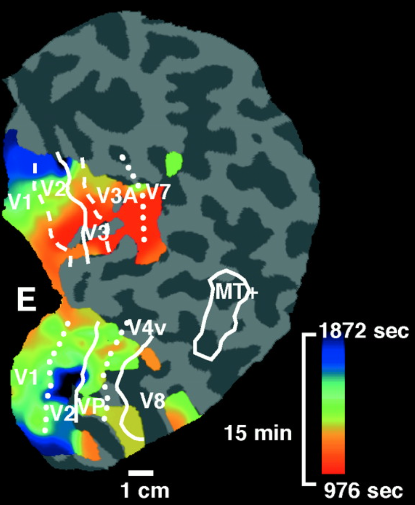

Was haben die im Titel aufgeführten Begriffe »Europa, Fußballstadion, Großhirnrinde« gemeinsam? Alle wären gültige Antworten auf die Frage: „Ja wo laufen sie denn?"

Wer läuft da? Keine Pferde, Erregungswellen laufen durch Europa, im Fußballstadion und in der Großhirnrinde. Die Aufzählung im Titel könnte weiter gehen: Waldboden, Froschei, Katalysator und weiteres mehr. Überall dort laufen sogenannte Erregungswellen.

Erregungswellen? Fangen wir mit einem Beispiel an: Im Stadion geben Fußballfans ihre Erregung durch Aufspringen und Hinsetzen ihren Sitznachbarn weiter. So organisiert sich eine Welle, ganz ohne einen Koordinator, der dies dirigiert. In der Physik sprechen wir von Selbstorganisation. Auf Europa und die Großhirnrinde will ich noch im Detail kommen. Der Vollständigkeit halber zuvor kurz zu dem Waldboden, Froschei und Katalysator.

Im Waldboden organisieren sich einzellige Amöben des Schleimpilzes Dictyostelium Discoideum bei Nahrungsmangel durch Erregungswellen zu einem überlebensfähigen, vielzelligen Fruchtkörper. Spannende Sache. Was genau den Erregungszustand bei den Amöben ausmacht, muss aussen vor bleiben. Das würde zu weit führen. In Froscheiern wurden Calcium-Wellen gemessen, die die typischen Charakteristika von selbstorganisierten Erregungswellen zeigen. Und Erregungswellen wandern auf der Oberfläche eines Platin-Katalysators. Letzteres Beispiel, das mir sehr am Herzen liegt – apropos Herz, hier führen Erregungswellen zur Kontraktion aber auch zum Herzflattern und -flimmern – der Platin-Katalysator also liegt mir am Herzen, denn der Nobelpreisträger Gerhard Ertl hat als Mitbegründer der modernen Oberflächenchemie diese Wellen untersucht. Im Rahmen seines vor 12 Jahren ins Leben gerufenen Sonderforschungsbereich „Komplexe Nichtlineare Prozesse" arbeite ich heute.

Erregungswellen sind also eine universelle Erfindung der Natur. Offensichtlich führen einfache Regeln, so einfach, dass Amöben und Fußballfans kein Problem bei deren Umsetzung haben, zu recht komplexen Verhalten.

Nun über Europa und zur Großhirnrinde. Zur Beulenpest und zur Migräne!

](./_pestilence_spreading_1347-1351_europe.png)

Im Jahr 1346 erkrankten die ersten Menschen nahe der östlichen Grenze des damaligen Europas an einer seltsamen Krankheit. In einem Akt biologischer Kriegsführung banden Truppen der Golden Horde ihre mitgebrachten Seuchentoten auf Katapulte und schleuderten sie über die Mauer einer Hafenstadt auf der Krim*. Wahrscheinliche wäre die Krankheit jedoch durch Ratten auch so übertragen worden.

Wie dem auch sei, die Zeit zwischen 1347 bis 1353, in der nun diese Krankheit durch ganz Europa als Erregungswelle sich ausbreitete, wurde später als der Schwarze Tod bekannt. Es war wahrscheinlich die Beulenpest.

Würde ich die obigen Daten über dem Ausbreitungsverlauf der Beulenpest durch Europa als einfache Kontourlinie, so dass Europas Umriss nicht mehr erkennbar ist, Fachärzten präsentieren, nämlich Neurologen, die sich auf die Krankheit Migräne spezialisiert haben, und würde ich behaupten, es handele sich um den Verlauf einer pathologischen Erregungswelle gemessen in der Großhirnrinde zwischen 13:47 und 13:51, diese Fachärzte hätten wohl kaum eine Chance meinen Schwindel aufzudecken. In der Tat entstand dieser Blogbeitrag, weil ich genau das in meinem nächsten Vortrag vorhabe. (Nachtrag: es hat funktioniert!)

Messungen pathologischer Erregungswelle in der Großhirnrinde, die Migräne auslösen können und die auch bei Schlaganfall auftreten, sehen zum Beispiel so aus, wie in der folgenden Abbildung gezeigt (N. Hadjikhani et al. PNAS 2001).

Wir sehen oben einen Ausschnitt der Großhirnrinde in flacher Darstellung, d.h. die dunkelgrauen Bereiche liegen normalerweise inseitig, die hellgrauen außen auf unserer wallnussförmigen Hirnrinde. Farbig ist der Verlauf einer sich ausbreitenden Erregungswelle zu sehen, genau wie bei dem Verlauf des Schwarzen Todes. Vom rot zu blau vergeht eine Viertelstunde in der in etwa 4.5 cm der Hirnrinde von einem bestimmten Erregungszustand überquert wurden. Die Länder heißen hier Areale und tragen so fantasielose Namen, wie V1, V2, V3 …

Es ist durchaus hilfreich, über diese pathologische Welle im Hirn in Analogie zur Ausbreitung der Beulenpest nachzudenken. Durch diesen Perspektivenwechsel erkennen wir, dass eine ausschließlich molekulare oder auch zelluläre Beschreibung dieser Pathologie der Großhirnrinde keine Aussagen erlaubt, ob und wie sich eine Erregung ausbreitet. Denn wir können auf der molekularen und zellulären Ebene alles über die Beulenpest wissen (oder auch die Schweinegrippe, um ein aktuelles Beispiel zu nennen). Dies allein sagt uns nicht, ob sich der Erreger ausbreitet! Wir können vielleicht einen Impfstoff entwickeln, aber wie wir ihn sinnvoll einsetzen, ist eine Frage der Ausbreitungscharakteristik der Erregungswelle, die dieser Erreger eventuell auslösen könnte. Ob und wie schnell er sich ausbreitet, hängt zum Beispiel davon ab, ob wir in Flugzeugen durch die Gegend fliegen, oder nur gelegentlich mit Katapulten über Stadtmauern geschossen werden. Darüber weiß der Erreger natürlich nichts.

Pathologien des Gehirns müssen folglich auf zwei komplementären Ebenen beschrieben werden, der lokalen zellulären Ebene und der Ebene der Transmission innerhalb des neuronalen Gewebes. Im Gewebe sind die Regeln programmiert, wie Erregungszustände sich ausbreiten. Diese Regeln gilt es zu verstehen, möchten wir eine Ausbreitung durch einen therapeutischen Eingriff verhindern.

**Vorschau**

Im nächsten Beitrag soll es dann um die Schweinegrippe und Epilepsie gehen. Beides breitet sich nicht als Welle sondern quasi schlagartig aus, in Europa, ja der ganzen Welt bzw. in der Großhirnrinde.

\* Fußnote: Mein Dank an Prof. Theo Geisel vom Max-Planck-Institut für Dynamik und Selbstorganisation, Göttingen, der auf bei einem Vortrag auf der Krim 2006 diese Anekdote zum besten gab.
