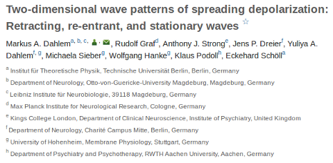
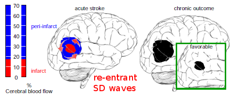

Ein wissenschaftlicher Artikel mit Bezug zur Medizin ist nahezu wertlos, wenn er nicht in PubMed erscheint, denn ihn findet niemand. [PubMed](http://www.ncbi.nlm.nih.gov/pubmed) ist die größte medizinische Datenbank mit bisher fast 22 Millionen Artikeln aus dem gesamten Bereich der Biomedizin.

Als ich beim Wissenschaftsverlag Elsevier nachfragte, warum ein bestimmter Artikel von mir nicht in PubMed gelistet wurde und wie ich in Zukunft sicher stellen kann, dass meine Artikel dort erscheinen, bekam ich zur Antwort, dass die Zeitschrift („[Physica D](http://www.journals.elsevier.com/physica-d-nonlinear-phenomena/)„), in der mein Artikel erschien, exakte Wissenschaft veröffentlicht und die Artikel dort nicht generell in PubMed aufgenommen werden sondern nur Beiträge mit „dramatischen biomedizinischen Auswirkungen“.

> Dear Dr Dahlem,
>
> Thank you for your e-mail.
>
> As per advised by our colleagues, this journal (Physica D: Nonlinear Phenomena) is not a PubMed journal.
>
> PubMed covers only the biomedical sciences, and does not include all journals in that field. The journal is a physics journal. It would not be in PubMed generally and an individual article would only appear in PubMed if it had dramatic biomedical implications.
>
> They add that unfortunately free databases parallel to PubMed do not generally exist for the hard sciences.

Die Antwort ist schlicht Blödsinn. Wie soll man die „dramatic biomedical implications“ verstehen? Arbeiten mit Nobelpreis verdächtigen Auswirkungen nehme ich an? Und wer nochmal genau entscheidet das zum Zeitpunkt der Veröffentlichung? Immerhin, bisher haben es sieben Artikel aus der Zeitschrift *Physica D* geschafft.

Gab es vielleicht sogar nur diese sieben Artikel, die eindeutig in den Bereich der Biomedizin fielen, unabhängig von ihrer Bedeutung? Auch das ist klar nicht der Fall, ich kenne bei weitem mehr. Sieben Artikel sind also nicht wirklich viel für eine renommierte Zeitschrift, die seit 1980 alle zwei Wochen erscheint und zwar mit dem Themenschwerpunkt „Nichtlineare Phänomene“, der viele biologisch relevante Themen abdeckt. Bei meinem eigenen Artikel zum Beispiel hätte man diesen Bezug auch nicht anzweifeln oder gar übersehen können (s.u.), es sei denn, ein automatisiertes System trifft die Entscheidung auf einer anderen Basis.

Ganz sicher bin ich mir zwar immer noch nicht. Ich denke aber, die Auflösung ist recht banal.

Wer beim Einreichen seines Manuskripts in der Physik versäumt, die richtigen PACS anzugeben, der kommt nicht in PubMed. Vermute ich zumidest. PACS steht für [**P**hysics and **A**stronomy **C**lassification **S**cheme](http://www.aip.org/pacs/pacs2010/individuals/pacs2010_regular_edition/index.html),  eine Klassifikation für die Bereiche Physik und Astronomie, vom American Institute of Physics (AIP) herausgegeben. Die Codes 87.19.L- (für Neuroscience) und  87.19.X- (für Disease) hätten den Trick wohl gemacht. Wäre nur schön gewesen, dies auch vom Customer Support von Elsevier zu erfahren, oder, falls es doch anders läuft, wer auf welcher Basis diese Entscheidung trifft.

Leider sind in der Tat nur [14](http://www.ncbi.nlm.nih.gov/pubmed?term=Dahlem%20MA[Author]) meiner Veröffentlichungen in PubMed gelistet. Es scheint mir daher ein generelles Probelm zu sein. Denn bei mindestens elf weiteren wäre ein Erscheinen in PubMed gerechtfertigt gewesen, auch wenn diese Arbeiten in physikalischen Zeitschriften erschienen.

Das ist ein Problem. Ich selbst nutze sehr häufig PubMed für die Literatursuche. Andere machen es wahrscheinlich ebenso, ich kenne Mediziner, die ausschließlich PubMed nutzen und wir übersehen so manchmal wichtige Beiträge.

Es stellt sich vielleicht noch die Frage, ob nur Artikel übersehen werden, die zwar einen klaren Bezug zur Biomedizin haben mögen aber dennoch zu mathematisch sind, wie zumindest implizit in der Antwort angedeutet. Zum einem ist dies in vielen Fällen nicht so.  Der besagte Artikel ist nur in Teilen mathematisch geprägt. Ich glaube auch generell nicht, dass man diesbezüglich eine Trennlinie anhand des Begriffs „exakte Wissenschaft“ („hard sciences“) ziehen kann.

Als Beispiel hier der besagte Artikel von mir und meinen Mitautoren.

(M. A. Dahlem, R. Graf, A. J. Strong, J. P. Dreier, Y. A. Dahlem, M. Sieber, W. Hanke, K. Podoll, and E. Schöll: Two-dimensional wave patterns of spreading depolarization: retracting, re-entrant, and stationary waves, Physica D 239,889 (2010). [DOI](http://dx.doi.org/10.1016/j.physd.2009.08.009))

Die Adressenliste zeigt allein den klaren Bezug zur Medizin, von der einen Physik-Adresse abgesehen: zwei Kliniken für Neurologie, ein Leibniz-Institut für Neurobiologie, ein Max-Planck-Institut für Neurologie und zwei Kliniken für Psychiatrie. Für den Fall, dass man den Bezug nicht anhand der Adressen festmachen will, zeige ich noch eine Abbildung[^1].

Es ist leicht zu erkennen, dass es um keine reine Physik handelt, nur für den Verlag leider nicht. Und nicht für potentielle Leser, die über PubMed nach Literatur suchen. Sie finden den Artikel nämlich erst gar nicht. Ob der Artikel nachträglich dort gelistet werden kann, weiß ich leider immer noch nicht. Den Customer Support von Elsevier brauche ich wohl nicht mehr zu fragen. Auch eine erneute Anfrage ergab schlicht die gleiche Antwort.

[^1]: Die Abbildung ist leicht verändert.
