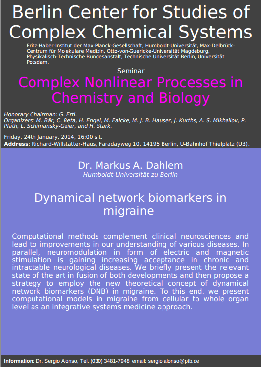
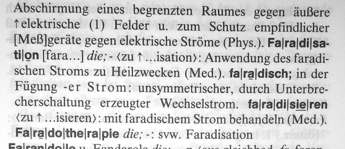
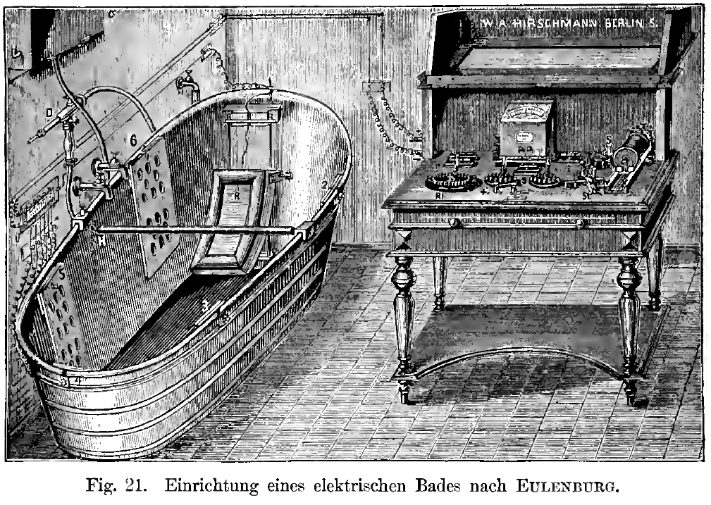
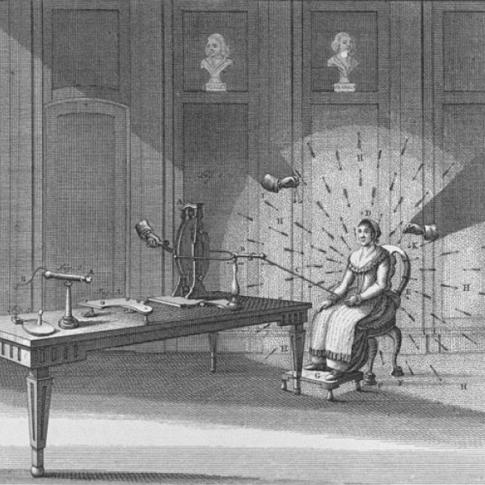
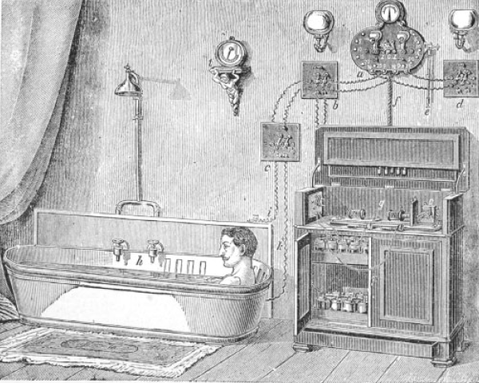
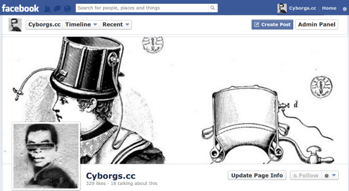

Der Erfolg sei unleugbar obgleich ein suggestiver. Folglich wird diese Behandlungsmethode auch insbesondere empfohlen für nervöse Allgemeinleiden, Hysterie, Neurasthenie etc.

Bei der Recherche zu meinem Vortrag gestern am „[Berlin Center for Studies of Complex Chemical Systems](http://www.bcsccs.de/welcome.html)“ stieß ich auf den erfrischenden Einfluss faradischer Bäder ([hier geht’s zu den Folien](http://www.slideshare.net/markusdahlem/dahlem-bcsccs)).

Dass Migräne sich oben ins „Et cetera“ einreiht, darf man vermuten. Denn schon damals gehörten [hydroelektrische Bäder zu praktizierten Migränetherapie](http://brain.oxfordjournals.org/content/133/8/2489.long). Um solche und ähnlich Methoden geht es.

So genau müssen wir es nun aber auch nicht mehr wissen. Das Adjektiv „faradisch“ verrät es – es ist nicht mehr im Gebrauch, ich musste nachschlagen. Oder auch der veraltete Fachbegriff „[Hysterie](http://de.wikipedia.org/wiki/Hysterie)“ bzw. der nur noch selten verwendete Begriff der „[Neurasthenie](http://de.wikipedia.org/wiki/Neurasthenie)“. Ich las einen Text aus einem vergangen Jahrhundert. Ich las das „[*Lehrbuch der klinischen Hydrotherapie für Studierende und Ärzte*](https://archive.org/details/39002086175214.med.yale.edu)“ von Max Matthes, Professor für Innere Medizin und Rektor der Universität Königsberg. Das Buch erschien 1902 und ist dank des Internet Archive frei verfügbar.

Erstaunt war ich, dass Max Matthes in klaren Worte die westlichen, heute noch aktuellen Probleme benennt. Zum einen sein Verdacht, dass hier vor allem der Placebo-Effekt wirkt. Ich nahm jedoch eine Folie mit den folgenden Zitat (Seite 108f) in meinen Vortrag auf, weil Matthes auch das andere, wirklich für die Neuromodulation mit elektrischen Feldern spezifische und fundamentale Problem beschreibt.

> *Über die physiologischen Wirkungen der elektrischen Bäder liegen eine Reihe von Angaben, namentlich von Eulenburg und Lehr vor, die ergeben, daß die farado-cutane Hautsensibilität z.B. herabgesetzt wird, während der Raumsinn gesteigert ist. Die motorische Erregbarkeit der Muskulatur wird durch dieselben gegenüber dem elektrischen Strom verringert.*
>
> *Körpertemperatur, Respirationsfrequenz scheinen nicht beeinflußt zu werden. Die Pulsfrequenz soll nach Eulenburg herabgesetzt werden. Der Eiweißstoffwechsel soll nach Lehr gesteigert sein.*
>
> *Im allgemeinen haben faradische Bäder einen erfrischenden Einfluß, galvanische sollen müde machen.*
>
> *Es kommt für die Wirkung entschieden auf die Dauer der Bäder an, kürzere werden mehr anregend, längere mehr erschlaffend wirken.*
>
> *Durchsichtig ist jedenfalls die physiologische Begründung dieser Bäder durchaus nicht, man wird sich vorstellen, daß sie im allgemeinen die eines indifferenten Bades, mit dem ein milder Hautreiz verbunden ist, haben.*
>
> *Es mögen dadurch Aenderungen in unseren Allgemeingefühlen, also Wohlbehagen, Erfrischung oder Müdigkeit bedingt werden. Nach meiner Ansicht liegt aber die Hauptwirkung dieser elektrischen Bäder in erster Linie auf suggestivem Gebiete, und das rechtfertigt ihre Anwendung und ihre unleugbaren Erfolge auf dem Gebiete der nervösen Allgemeinleiden, wie Hysterie, Neurasthenie etc.*

Dass ein kurzes Bad erfrischt, ein langes hingegen ermüdet, richtig wundern konnte man sich darüber also schon im 19ten Jahrhundert nicht. Dass faradische Bäder, also Wechselstrom, einen erfrischenden Einfluss haben, galvanische Bäder, also Gleichstrom, jedoch müde machen, ist nicht sofort evident. Ich habe keine Ahnung, ob das heute noch so stehen bleiben kann. Mich hat es aber sofort an die für mich gleichsam wunderliche Behauptung erinnert, dass bei der Elektrokrampftherapie Gehirnzellen unter der Anode stimuliert werden, unter der Kathode aber gehemmt. Dafür gibt es zwar durchaus empirische Belege und auch die theoretischen Erklärungen folgten. Doch so wirklich klar, d.h. theoretisch gut verstanden, ist das keinesfalls.

**Die Frage nach der Dauer, wo die Erdung optimal platziert ist, der Stromrichtung oder, bei Wechselstrom, der Frequenz, bis hinzu komplexen Stimulationsprotokollen ist bis heute nicht systematisch erforscht.**

Das ist ungefähr so, als würde man sich in der Pharmakologie zuerst intensiv mit der Pharmakokinetik befassen und die Pharmakodynamik zunächst außen vor lassen. In anderen Worten, man würde zuerst mit ausgefeilte Methoden erforschen, dass ein Wirkstoff im Körper spezifisch an sein Ziel und sonst nirgends hingelangt, welcher Wirkstoff wäre dabei allerdings erstmal nebensächlich.

In Prinzip verläuft also der Ansatz zu immer technisch ausgeklügelteren Methoden in der Neuromodulation zunächst genau andersherum als in der Pharmakologie. Man versucht erstmal den Strom, oder auch magnetische Felder, an das Ziel zu bekommen. Das hat durchaus seine Berechtigung. Nur muss irgendwann der zweite Schritt folgen. Wie stimuliert man dort angekommen eigentlich? Faradisch oder galvanisch ist dabei nur die eine Frage.

## Quo vadis Neuromodulation?

Es gibt eine lange Tradition elektrischer und magnetischer Stimulation zur Kopfschmerztherapie. Bevor die Leidener Flasche 1745-6 erfunden wurde, griff man auf die Zitterrochenartigen zurück. Die waren nicht programmierbar, daher musste man sich um das Stimulationsprotokoll keinen, äh, Kopf machen. Um 1788 hat man dann mit der direkten Elektrifizierung versucht, Migräne zu therapieren. (Die folgenden zwei Bilder sind aus: [A history of non-drug treatment in headache, particularly migraine](http://brain.oxfordjournals.org/content/133/8/2489.long).)

Ich nehme an, dass hier der Strom zu unkontrolliert floss, so dass man knapp ein Jahrhundert später Elektrotherapie mit der Hydrotherapie verband. Das Badewasser nutze man als großflächig und konstant anliegende Elektrode.

Nachdem die elektrische Badewanne erfunden war, galt es die Miniaturisierung und vor allem den Kopf in Angriff zu nehmen. So entstand 1896 das Hinterhauptbad von Gräupner, das z.Z. die Facebook Seite der Cyborgs ziert.

Dazu meint Matthes wohl zurecht nassforsch auf Seite 116 der Strom sei „gleichfalls entbehrlich“.

> *Beim Hinterhauptbad legt man den Hinterkopf in eine Wanne mit Halsausschnitt. Neuerdings ist von Gräupner (1) eine Kopfbadewanne angegeben, die im wesentlichen einen Cylinder ohne Boden darstellt. Dieselbe wird durch einen aufblasbaren Gummischlauch dem Kopfe adaptiert, so daß nun die Kopfwölbung den Boden der Wanne darstellt. Sie kann auch als Elektrode benutzt werden. Mir scheint sie gleichfalls entbehrlich.*

Aus meiner Sicht ist noch heute unklar, ob über den Placebo-Effekt hinaus die nichtinvasive ([vgl. jedoch hier](https://scilogs.spektrum.de/graue-substanz/doch-nicht-nichtinvasive-hirnstimulation/)) Stimulation des Gehirns mit Hilfe elektrischer und magnetischer Felder wirklich bei Kopfschmerzen hilft. Es gibt Studien, die zeigen das. Aber es gibt auch Zweifel an der korrekten Placebokontrolle. Ich bin überzeugt, dass es solche Methoden geben wird, die auch gleichzeitig deutlich geringere Nebenwirkungen haben werden als pharmakologische Therapie.

Auf dem Weg zu einer wirklich neuen Generation müssen wir allerdings systematisch, d.h. in Sinne einer[Steuerungstechnik](https://scilogs.spektrum.de/graue-substanz/migraene-ctrl-alt-del/), die optimale Dauer und den optimalen Wirkungsmix faradischer und galvanischer Stimulation erforschen.

