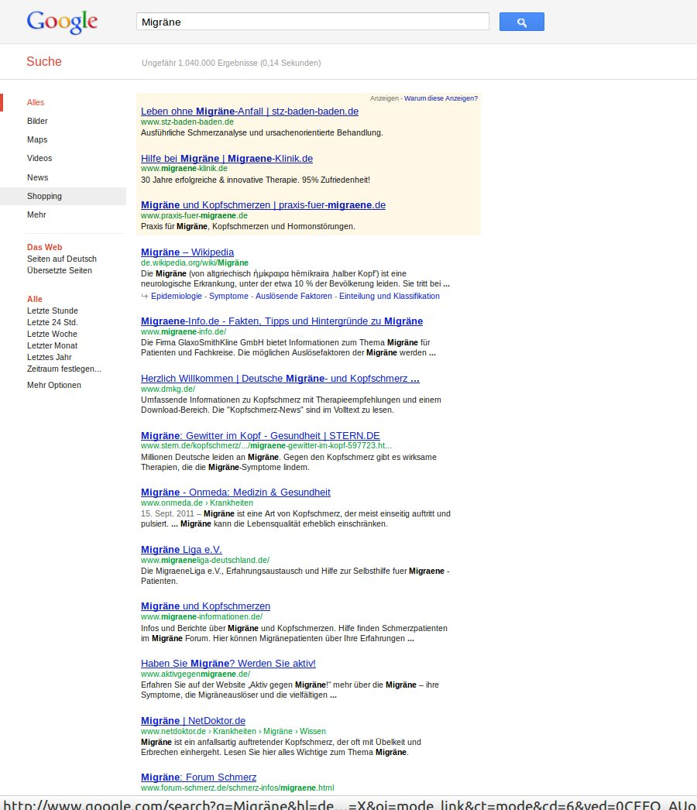
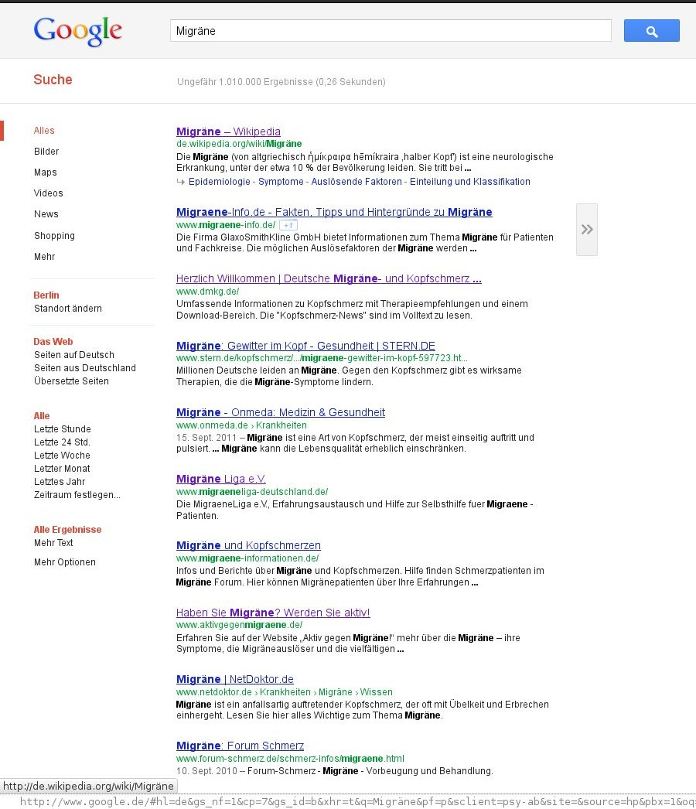

Die Filter Bubble bezeichnet das von dem Rechtswissenschaftler und Politologen Eli Pariser beschriebene Phänomen, dass ein Suchergebnis im Internet von den zuvor getätigten Suchvorgängen abhängt, des weiteren von dem vormaligen Klickverhalten und eventuell noch weiteren Daten, die zuvor gesammelt werden konnten.

  
*Seh ich nur blaues oder das ganze Spektrum im Internet?*

## Ausverkauf der Information und Meinung

Wenn ich in einem gut sortierten Geschäft etwas suche und der Verkäufer kommt sogleich auf mich mit der freundlichen Frage zu „Kann ich Ihnen helfen?“, dann sage ich meist „Danke, ich schau mich erst mal um“. Das ist schließlich Teil des Vergnügens. Wenn Pariser recht hat, dann wird das Geschäft absichtlich auf mich bezogen sortiert und Waren weg gestellt, just in dem Moment, in dem ich eintrete. Warum? Um mir nur Jeans, schwarze Socken, weiße Trägershirts, blaue Hemden und vielleicht noch einen Fahrradhelm zu zeigen, alles was ich sowieso gerade trage. Wie so schnell mein Trägershirt entdeckt wurde, das ich unter dem Hemd verborgen – dachte ich – trage, frage ich mich grundsätzlich. In dem Moment aber ist für mich vor allem wichtig, dass ich eigentlich heute grüne Socken suche, die ausverkauft zu sein scheinen.

Ich habe die Filter Blase bei Google einmal einem minimalen Test mit n=2 unterzogen und erhielt für Migräne exakt die selben Ergebnisse. Selbstredend immer noch misstrauisch, will ich nun mehr Daten sammeln und vor allem den Test alle halbe Jahre wiederholen.

      
*Zwei mal das gleiche Ergebnis – wie sieht es bei Ihnen aus?*

## Langzeittest

Zunächst würde es mich freuen, wenn Sie mir Ihr Suchergebnis zuschicken, insbesondere wenn es in den nächsten Tagen erzielt wird (von google.de) und wenn es sich dann hiervon unterscheidet:

1. de.wikipedia.org/wiki/Migräne
2. www.migraene-info.de
3. www.dmkg.de
4. www.stern.de/kopfschmerz/erkrankungen/migraene-gewitter-im-kopf-597723.html
5. www.onmeda.de/krankheiten/migraene.html
6. www.migraeneliga-deutschland.de
7. www.migraene-informationen.de
8. www.aktivgegenmigraene.de
9. www.netdoktor.de
10. www.forum-schmerz.de/schmerz-infos/migraene.html

Das sind die Top 10, die eine fleißige Leserin (Danke!) und ich bei unserem spontanen n=2 Test erhielten.

Wenn Sie also mitmachen wollen, klicken Sie hier: [Google-Suche: Migräne](http://www.google.de/?q=migr%C3%A4ne). Und dann bitte mir ein Screenshot zusenden [ dahlem (ät) physik (Punkt) tu-berlin (Punkt) de ]. Ich bin gespannt. Vielleicht sind die Suchergebnisse auf dem Severn von Google hinter der Länderkennung „.de“ noch nicht im Sinne der Filter Bubble individualisiert *–* im Unsinn trifft es besser. Vielleicht war auch einfach unser beider Suchverhalten bisher recht identisch, Sie jedoch finden anderes – ja in diesem Fall müsste ich sagen: für Sie wurde anderes gefunden. Sie suche dann nicht mehr selbst, es wird für Sie irgendetwas gefunden. Das ist der Unterschied.

Verlinken will ich übrigens die Suchergebnisse oben nicht, ich persönlich halte fast alle für sehr schlechte Suchergebnisse. Wikipedia und die Deutsche Migräne- und Kopfschmerzgesellschaft e.V. ([www.dmkg.de](http://www.dmkg.de)) stechen aus dieser Gruppe weit hervor. Danach gibt es nochmal Abstufungen, alles in allem aber sehr enttäuschend. Es wird also auch spannend sein, zu verfolgen, wie die Top 10 sich mit der Zeit ändern. Ich bin durchaus nicht der Meinung, dass Suchmaschinen schon optimal sind so wie heute funktionieren. Ganz im Gegenteil, momentan ist das Ergebnis oben eine schlechte Nachricht für [Cyberchonder](https://scilogs.spektrum.de/blogs/blog/graue-substanz/2012-02-07/cyberchondrie).

## Statt personalisierter Ergebnisse die eigene Suchmaschine

Bleibt die Frage, was tun, wenn wirklich bald bei dieser und jener Suche massiv Resultate auf mich zu geschneidert werden? Die Antwort fand ich neulich. Als ich am 21. Januar 2012 über [5 Top Video-Vorlesungen](https://scilogs.spektrum.de/blogs/blog/graue-substanz/2012-01-21/5-top-video-vorlesungen) schrieb, konnte ich noch nicht ahnen, dass [Sebastian Thrun](http://de.wikipedia.org/wiki/Sebastian_Thrun) zwei Tage später seine Professur in Stanford endgültig hinschmeißt, um „Bildung zu demokratisieren“ und Videovorlesungen zu veranstalten.

Thrun bietet nun an der von ihm mitgegründeten Online-Universität [Udacity](http://www.udacity.com) Seminare im Internet an. Unter dem Titel [Universität 2.0](http://www.dradio.de/dlf/sendungen/campus/1681883/ "Audio Link: Stanford-Professor will E-Learning revolutionieren") gab es vor drei Tagen dazu einen schönen Bericht im DLF. Dass meine Leser und ich selbst dies schon einen Monat früher wussten, verdankte ich diesem [Kommentar](https://scilogs.spektrum.de/blogs/blog/graue-substanz/2012-01-21/5-top-video-vorlesungen#comment-16957) *–* Danke dafür. Das ist auch ein Zeichen, dass heute Informationen Dank Web 2.0 gefunden werden, die man nicht mal aktiv gesucht hatte. Es ist also gar nicht grundsätzlich schlecht, wenn jemand etwas für einen findet. Es ist sogar großartig. Die Suche im Web2.0 ist glücklicherweise vielschichtiger geworden, weil man wieder Menschen, und zwar enorm viele gleichzeitig, fragen kann. Nur will ich trotzdem die Kontrolle haben.

Eine besondere Videovorlesung gibt noch eine andere Antwort auf die Filter Bubble. Der erste Kurs an der Udacity heißt [BUILDING A SEARCH ENGINE](http://www.udacity.com/overview/Course/cs101) (Suchmaschine konstruieren). Thrun selbst war zuvor Google Fellow; er ist übrigens auch Mitglied der Akademie der Naturforscher Leopoldina und gilt als einer der kreativsten Köpfe weltweit. Seine Wahl des Themas der ersten Vorlesung ist sicher kein Zufall!

Die Suche im Internet wird bald wieder ein sehr aktuelles Problem sein. Ich habe mich für den Kurs eingeschrieben, denn ich bin der Meinung, dass neue Suchmaschinen wieder Potential haben, zum Beispiel spezialisierte Suchmaschinen exklusiv für medizinische Inhalte für Laien, die eben nicht zu [Cyberchondern](https://scilogs.spektrum.de/blogs/blog/graue-substanz/2012-02-07/cyberchondrie) herangezogen werden wollen. Mir selbst wird wohl die Zeit fehlen, dies mit der nötigen Sorgfalt und Hingabe in Angriff zu nehmen.

Vielleicht *findet* sich ja hier jemand, der es mit mir zusammen macht?

**PS**

Hier zum Abschluss drei Videos. Das Erste ist der sehenswerte TED talk von Eli Pariser zu der Filter Bubble:

Das zweite ist zu dem Konzept der Videovorlesung ganz allgemein. Hier geht es letztlich auch um finden, das Vorfinden von Information. Auch dies ändert das Web2.0. Hier sicher zum Guten. Ein Beitrag von [Christian Spannagel](http://spannagel.wordpress.com), „Die umgedrehte Mathematikvorlesung“ verdeutlicht den Vorteil von Videovorlesungen.

Das Dritte Video ist die Werbung für den Kurs von Thrun.

Nichts bleibt wie es ist.
