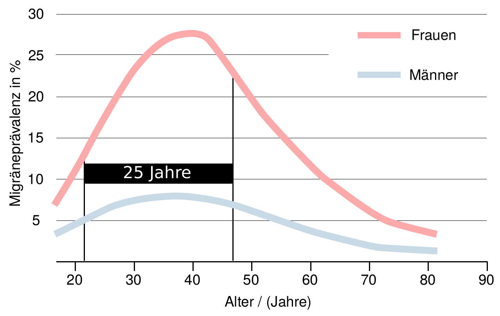

»Migräne: Frau hat dank Ernährungsumstellung nach 25 Jahren keine Kopfschmerzen mehr« titelt eine deutsche Boulevardzeitschrift, die [den Artikel](http://www.focus.de/gesundheit/ernaehrung/migraene-frau-hat-dank-ernaehrungsumstellung-nach-25-jahren-keine-kopfschmerzen-mehr_id_5761771.html) bei einer britischen Boulevardzeitung [abschrieb](http://www.dailymail.co.uk/femail/article-3697658/Mother-suffered-migraines-25-years-gets-life-ditching-two-ingredients.html).

Wir dürfen immerhin Fehler suchen. Nur zwei Klicks weit ist die Redaktion weg. Klasse. Also los:

Ich habe folgende Fehler in der Überschrift gefunden:

* „Frau“
* „dank“
* „Ernährungsumstellung“
* „25 Jahre“
* „keine Kopfschmerzen“

„**Frau**“, singular – also genau eine, sie lebt in der englischen Grafschaft Lincolnshire, so erfahren wir es, in der britische Boulevardzeitung sehen wir immerhin auch noch vier wirklich nette Familienbilder: Falsch daran ist, dass dies überhaupt eine Zeitungsmeldung wird. In dem verlinkten Video weist eine Ärztin darauf hin, dass in Großbritannien etwa 6 Millionen Menschen an Migräne erkrankt sind, in Deutschland sind es etwa 10 Millionen. Soll wirklich für jede eintretende Besserung ein Artikel geschrieben werden?

„**dank**“: Falsch daran ist, dass es einen ursächlichen Zusammenhang vorgaukelt (siehe „25 Jahre“).

„**Ernährungsumstellung**“: Richtig ist – wie wir dann im Haupttext erfahren –, dass es um eine bestimmte Ausschlussdiät geht. Diese sei „*von einem Freund mit starker Gluten-Intoleranz wärmstens empfohlen*“ worden. Aha. Den Preis erfahren wir, wenn man sich etwas durchklickt: beworben wird eine Ausschlussdiät gegen Reizdarm für 319,00 £. Damit wir diese wärmstens empfohlene Diät auch nicht noch übersehen, gibt es einen rosaroten Infokasten. Fast schon löblich: die deutsche Boulevardzeitschrift lässt den Infokasten weg. Diese Diät propagiert eine kohlenhydratreduzierte Ernährung, was bei Migräne als kontraproduktiv gilt.

„**25 Jahre**“: Jetzt wird es wissenschaftlich. Die höchste Rate an Neuerkrankungen (Inzidenz) bei Migräne liegt bei Jugendlichen und jungen Erwachsenen zwischen 15 und 24 Jahren. Frauen eines Jahrgangs erkranken mit einer Rate von etwa 15‰, was in Deutschland ca. 128 000 junge Frauen im Alter zwischen 15 und 24 Jahren ausmacht. Männer mit nur mit 4,6‰ bzw. 40 000 junge Männer. Die höchste Häufigkeit (Prävalenz) der Migräne besteht wiederum zwischen dem 35. und 44. Lebensjahr. Frauen sind in dieser Altersgruppe mit über 25% mehr als dreimal häufiger betroffen als Männer. Mit 46 Jahren, so alt wie die Frau in der Meldung, ist die Rate der spontan eintretenden Besserung oder Genesung einer Migräneerkrankung wiederum am höchsten. Fassen wir zusammen: Der Fall ist mustergültig für einen natürlichen Krankheitsverlauf!

„**Keine Kopfschmerzen**“: Migräne sind nicht nur Kopfschmerzen. Gerade im Alter bleibt oft die Migräneaura bestehen, man ist also durchaus weiter erkrankt, auch wenn das Leitsymptom Kopfschmerz abnimmt.

Zusammengefasst: Ein natürlicher Krankheitsverlauf wird benutzt, um eine überteuerte und sogar gegebenenfalls schädliche Diät an kranke Menschen zu vertreiben.
