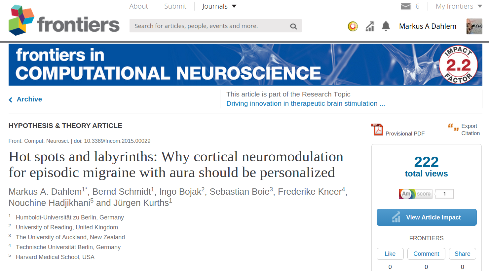

Wir haben eine [neue Veröffentlichung in *Frontiers in Computational Neuroscience*](http://journal.frontiersin.org/article/10.3389/fncom.2015.00029/abstract). Der Artikel ist Teil des Sonderhefts zur Innovationsförderung in der therapeutischen Hirnstimulation mit biophysikalischen Modellen.

Über die noch unbegutachtete Version habe ich im September letzten Jahres den Beitrag „[Personalisierte Elektrozeutika“](https://scilogs.spektrum.de/graue-substanz/personalisierte-elektrozeutika/) geschrieben. Es wurden die Hintergründe beleuchtet. Nach der Veröffentlichung gestern sollen nun hier kurz diese vier Fragen beantwortet werden: Was haben wir gemacht? Was haben wir dabei herausgefunden? Warum ist das wichtig? Wie soll es weiter gehen? 

## Was haben wir gemacht?

Im Computer simulierten wir die begrenzte Ausbreitung einer Welle übererregter Gehirnzellen im Gewebe des Großhirns. Untersucht haben wir insbesondere, wie die Hirnrindenfaltung diese Welle navigiert und dabei nur selektiv Hirnwindungen aufgesucht werden. Folglich werden auch nur selektiv funktionelle neurologische Störungen auslöst.

Wir haben dazu die anatomische Darstellung des Großhirns eines Migränikers mit der Magnetresonanztomographie (MRT) vermessen und konnten so personalisierte Computersimulationen durchführen. Diese Ergebnisse wurden dann mit Zeichnungen der Sehstörungen (wandernde Halluzinationen) des Migränikers verglichen. (Eine Kooperation mit dem Martinos Center for Biomedical Imaging, das zum Lehrkrankenhaus der Medizinischen Fakultät der Harvard Universität gehört.)

## Was haben wir herausgefunden?

Diese weltweit ersten personalisierten Computersimulationen bei Migräne führten uns zu der Hypothese, dass die Ausbreitung der Migränewellen in der menschlichen Großhirnrinde in Hot Spots aufkeimt und sich von dort durch die Hirnwindungen wie einem Labyrinth fortpflanzen kann. Diese Merkmale sind wie Fingerabdrücke individuell für jeden Menschen anders.

## Warum ist das wichtig?

Unsere Theorie erklärt erstmals, wie diese Migränewelle, die ein sehr tiefgreifender neurophysiologischer Prozess ist, letztlich doch nur relativ geringfügige und vor allem selektive neurologische Symptome verursacht. (Eine Liste aller möglichen neurologischer Symptome bei Migräne ist in einer Fußnote zusammengefasst.)  Und mehr noch, die Theorie erklärt, warum in vielen Fällen möglicherweise überhaupt keine neurologischen Symptome sondern nur die Kopfschmerzen auftreten.

## Wie soll es weiter gehen?

Als erstes muss diese Theorie in einer größer angelegten klinischen Studie belegt werden.

Bestätigt sich diese Theorie, bedeutet dies, dass auch Therapieansätze personalisiert werden sollten. Insbesondere Hirnstimulatoren, die heute schon mit Strom- und/oder Magnetfeldimpulsen Reizmuster in der Großhirnrinde induzieren und versuchen die außer Kontrolle geratenen Nervensignale zu überschreiben, müssten personalisiert werden. Andere sogenannte neuromodulatorische Konzepte versuchen beispielsweise mit  fokussierten Ultraschall die Blut-Hirn-Schranke lokal zu überwinden. Auch hier liefert der Fingerabdruck aus der personalisierten Computersimulation Zielgebiete für stereotaktische Bestrahlung.

Greift man so selektiv in den Hot Spots zentrale Schaltkreise an, könnten diese vielleicht plastisch umprogrammiert werden, so dass das physiologische Kontrollsystem erst gar nicht mehr Schaden nimmt. Die Krankheit würde neuronal verlernt.

## Fußnote

Die Menge der neurologische Störungen bei Migräne mit Aura ist groß, es treten aber immer nur sehr wenige dieser Störungen selektiv in einem Anfall auf. Warum das so ist, gilt bis heute als eine der [zentralen Fragen der Migräneforschung](https://scilogs.spektrum.de/graue-substanz/cortical-spreading-depression-migraene-letzte/). Die Liste und verlinkte Website ist in Englisch:

* [Auditory aura symptoms](http://www.migraine-aura.com/content/e27891/e27265/e26585/e26596/index_en.html)
* [Body image disturbances](http://www.migraine-aura.com/content/e27891/e27265/e26585/e43013/index_en.html)
  + [Size of the body](http://www.migraine-aura.com/content/e27891/e27265/e26585/e43013/e46020/index_en.html)
  + [Mass of the body](http://www.migraine-aura.com/content/e27891/e27265/e26585/e43013/e46067/index_en.html)
  + [Shape of the body](http://www.migraine-aura.com/content/e27891/e27265/e26585/e43013/e46060/index_en.html)
  + [Position of body in space](http://www.migraine-aura.com/content/e27891/e27265/e26585/e43013/e46075/index_en.html)
* [Depersonalization and derealization](http://www.migraine-aura.com/content/e27891/e27265/e26585/e26706/index_en.html)
* [Dreaming disturbances](http://www.migraine-aura.com/content/e27891/e27265/e26585/e48488/index_en.html)
  + [Perception of the pain of nocturnal migraine attacks during dreams](http://www.migraine-aura.com/content/e27891/e27265/e26585/e48488/e48508/index_en.html)
  + [Unusual powerful, vivid or weird dreams associated with migraine headaches](http://www.migraine-aura.com/content/e27891/e27265/e26585/e48488/e48529/index_en.html)
  + [Nightmares associated with migraine headaches](http://www.migraine-aura.com/content/e27891/e27265/e26585/e48488/e48533/index_en.html)
  + [Recurring dreams as migraine aura experiences](http://www.migraine-aura.com/content/e27891/e27265/e26585/e48488/e48543/index_en.html)
  + [Migraine aura symptoms experienced whilst dreaming](http://www.migraine-aura.com/content/e27891/e27265/e26585/e48488/e48573/index_en.html)
  + [Other disturbances of dreaming associated with migraine](http://www.migraine-aura.com/content/e27891/e27265/e26585/e48488/e48634/index_en.html)
* [Felt presences](http://www.migraine-aura.com/content/e27891/e27265/e26585/e50480/index_en.html)
* [Forced reminiscence](http://www.migraine-aura.com/content/e27891/e27265/e26585/e26732/index_en.html)
* [Gustatory aura symptoms](http://www.migraine-aura.com/content/e27891/e27265/e26585/e26771/index_en.html)
* [Language symptoms](http://www.migraine-aura.com/content/e27891/e27265/e26585/e26790/index_en.html)
* [Motor symptoms](http://www.migraine-aura.com/content/e27891/e27265/e26585/e26867/index_en.html)
* [Olfactory aura symptoms](http://www.migraine-aura.com/content/e27891/e27265/e26585/e26871/index_en.html)
* [Other disturbances of higher cortical functions](http://www.migraine-aura.com/content/e27891/e27265/e26585/e26915/index_en.html)
* [Paramnesias](http://www.migraine-aura.com/content/e27891/e27265/e26585/e48650/index_en.html)
  + [Déjà vu](http://www.migraine-aura.com/content/e27891/e27265/e26585/e48650/e48660/index_en.html)
  + [Jamais vu](http://www.migraine-aura.com/content/e27891/e27265/e26585/e48650/e48661/index_en.html)
* [Sleepwalking](http://www.migraine-aura.com/content/e27891/e27265/e26585/e51182/index_en.html)
* [Somatosensory symptoms](http://www.migraine-aura.com/content/e27891/e27265/e26585/e26970/index_en.html)
* [Speech symptoms](http://www.migraine-aura.com/content/e27891/e27265/e26585/e26982/index_en.html)
* [Synaesthesia](http://www.migraine-aura.com/content/e27891/e27265/e26585/e27009/index_en.html)
* [Time perception disturbances](http://www.migraine-aura.com/content/e27891/e27265/e26585/e27105/index_en.html)
* [Visual hallucinations](http://www.migraine-aura.com/content/e27891/e27265/e26585/e49268/index_en.html)
  + [Random form dimension](http://www.migraine-aura.com/content/e27891/e27265/e26585/e49268/e49269/index_en.html)
  + [Line form dimension](http://www.migraine-aura.com/content/e27891/e27265/e26585/e49268/e49327/index_en.html)
  + [Curve form dimension](http://www.migraine-aura.com/content/e27891/e27265/e26585/e49268/e49332/index_en.html)
  + [Web form dimension](http://www.migraine-aura.com/content/e27891/e27265/e26585/e49268/e49333/index_en.html)
  + [Lattice form dimension](http://www.migraine-aura.com/content/e27891/e27265/e26585/e49268/e49334/index_en.html)
  + [Tunnel form dimension](http://www.migraine-aura.com/content/e27891/e27265/e26585/e49268/e50080/index_en.html)
  + [Spiral form dimension](http://www.migraine-aura.com/content/e27891/e27265/e26585/e49268/e50093/index_en.html)
  + [Kaleidoscope form dimension](http://www.migraine-aura.com/content/e27891/e27265/e26585/e49268/e49335/index_en.html)
  + [Complex visual hallucinations](http://www.migraine-aura.com/content/e27891/e27265/e26585/e49268/e50109/index_en.html)
* [Visual illusions](http://www.migraine-aura.com/content/e27891/e27265/e26585/e48971/index_en.html)
  + [Autokinesis](http://www.migraine-aura.com/content/e27891/e27265/e26585/e48971/e48990/index_en.html)
  + [Cinematographic vision](http://www.migraine-aura.com/content/e27891/e27265/e26585/e48971/e49005/index_en.html)
  + [Corona phenomenon](http://www.migraine-aura.com/content/e27891/e27265/e26585/e48971/e49016/index_en.html)
  + [Diplopia](http://www.migraine-aura.com/content/e27891/e27265/e26585/e48971/e49084/index_en.html)
  + [Dysmetropsia](http://www.migraine-aura.com/content/e27891/e27265/e26585/e48971/e49032/index_en.html)
  + [Facial metamorphopsia](http://www.migraine-aura.com/content/e27891/e27265/e26585/e48971/e48996/index_en.html)
  + [Illusory visual splitting](http://www.migraine-aura.com/content/e27891/e27265/e26585/e48971/e49057/index_en.html)
  + [Metamorphopsia](http://www.migraine-aura.com/content/e27891/e27265/e26585/e48971/e49061/index_en.html)
  + [Mosaic illusion](http://www.migraine-aura.com/content/e27891/e27265/e26585/e48971/e48980/index_en.html)
  + [Polyopia](http://www.migraine-aura.com/content/e27891/e27265/e26585/e48971/e49048/index_en.html)
  + [Tilted vision, inverted vision and other forms of illusory rotation](http://www.migraine-aura.com/content/e27891/e27265/e26585/e48971/e49073/index_en.html)
  + [Visual perseveration](http://www.migraine-aura.com/content/e27891/e27265/e26585/e48971/e49110/index_en.html)
* [Visual loss](http://www.migraine-aura.com/content/e27891/e27265/e26585/e49135/index_en.html)
