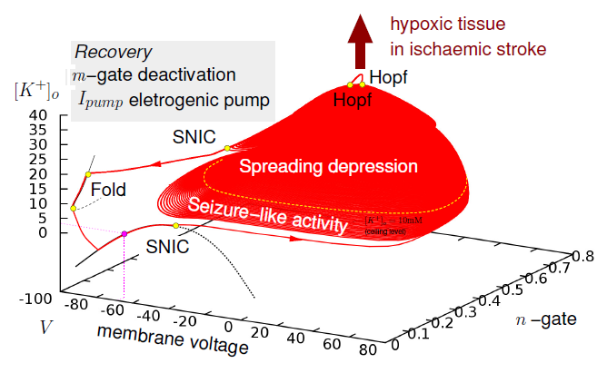

A new study [1] suggests exactly that, namely heightened consciousness in rats after cardiac arrest. First of all, whatever the brain’s briefly lasting (~30s) high frequency oscillations mean, they are not new.

The paper—though an elegant study with some new results from what I can see on the first glimpse—seems to completely ignore the literature on so called spreading depression/depolarization and anoxic depolarization, see for example the review paper in „*Nature Medicine*“ by Jens Dreier [2]. A similar study was published in 2011 talking wonderfully unagitated about „latency to unconsciousness“ only to conclude that the observed oscillations are the ‚wave of death‘ [3]. There was a theoretical study by the group of van Putten [4], which shed some light on the exact physiological mechanisms on a single cell level.

The question remains: These waves are the neural correlate of what? Heightened consciousness? The authors of the study conclude this linking the phenomenon to reports of near-death experiences (NDEs) when people survive. Well, the rats where not that lucky.

We were more merciful even to our computer model [5]. We also investigated this phenomenon, however we neither simulated decapitation nor cardiac arrest but let our model recover. A NDE simulation only that this is not exactly what we find. What we find is the neural correlate of a migraine aura—[which however shares features with NDEs](http://www.migraine-aura.org/content/e27891/e27265/e26585/e43013/e46075/index_en.html).

The wave of death is a well studied phenomenon that runs under various more sober names.

Therefore, the phenomenon that was observed in the new study should clearly be discussed in the context of what is known as the migraine-aura–ischemic stroke continuum.

Our new model even suggests to talk about the epilepsy-migraine-stroke continuum. We currently seek to understand in terms of quantitative mathematical models and personalized cortical geometries the role of large-scale spatial distribution patterns of ionic imbalances in three pathological conditions: epileptiform activity (EFA) during seizures, cortical spreading depression (SD) in migraine, and peri-infarct depolarizations (PID) after stroke or traumatic brain injury.

It is well know that a strong family history of seizures increases the chances of having severe migraines and certain patients with migraine are at greater risk for stroke. The multiplicity of potential links include common genetic risk factors and indirect links like common triggers outside the brain, e.g., microemboli caused by cardiac shunts. In our approach, however, we focus on pathophysiological mechanisms of neural excitability and the transitions between different activity forms related to ionic imbalances, mechano-electrical coupling, and volume transmission in cortical homeostasis.

The phase space of neural activity showing the epilepsy-migraine-stroke continuum

## References

[1] Borjigin, Lee, Liu, Pal, Huff, Klarr, Sloboda, Hernandez, Wang & Mashour. 2013. Surge of neurophysiological coherence and connectivity in the dying brain. PNAS (2013).

[2] Dreier, J. P. , The role of spreading depression, spreading depolarization and spreading ischemia in neurological disease, Nat. Med. 17, 439 (2011).

[3] van Rijn, C. M. , Krijnen, H. , Menting-Hermeling, S. and Coenen, A. M. , Decapitation in rats: latency to unconsciousness and the ‚wave of death‘, PLoS ONE 6, 1, e16514 (2011).

[4] Zandt, B. J. , ten Haken, B. , van Dijk, J. G. and van Putten, M. J. , Neural dynamics during anoxia and the “wave of death”, PLoS ONE 6, e22127 (2011).

[5] M. A. Dahlem, Migraines and Cortical Spreading Depression, Encyclopedia of Computational Neuroscience, Springer, (accepted, [due date Sept 2014](http://www.springer.com/biomed/neuroscience/book/978-1-4614-6674-1)). We used a model that is based on: Cressman JR, Ullah G, Ziburkus J, Schiff SJ, Barreto E , The influence of sodium and potassium dynamics on excitability, seizures, and the stability of persistent states: I. single neuron dynamics. J Comput Neurosci 26: 159–170. (2009). This was also the model used in [4]. Please visit my [homepage](https://sites.google.com/site/markusadahlem/home) for more information.
