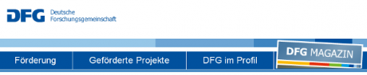

Gerade bekam ich eine Rundemail des Präsidenten der Deutschen Forschungsgemeinschaft (DFG) Prof. Matthias Kleiner – wie wahrscheinlich tausend andere auch. Es ist ein positiv ausfallendes "Wort zur Lage der Wissenschaft" verbunden mit den erklärten Ziel für dieses Jahr Forschung

> noch deutlicher ins Blickfeld zu rücken und sie noch erkennbarer und zugänglicher zu machen – für unsere Zuwendungsgeber, **für die interessierte Öffentlichkeit** ebenso wie für Sie und uns. Daher auch meine herzliche Bitte an Sie – die Antragstellerinnen und Antragsteller – die DFG-Förderung, die Sie erhalten, etwa in Publikationen noch konsequenter zu nennen.   
>  [*Hervorhebung durch mich*]

[  
 *Reingucken in die DFG Homepage.*](http://www.dfg.de)

Ziel dieses Blogs, insbesondere der Beiträge unter der Kategorie [Migräne](http://www.brainlogs.de/blogs/blog/graue-substanz/migrane), ist, Forschung *aus erster Hand* für die interessierte Öffentlichkeit zugänglich zu machen. Ich teile also dieses Ziel der DFG. Allerdings fragte ich mich natürlich sofort, ob und wie konsequent ich ihrer Bitte bisher entsprach, die Förderer zu nennen? Darüber hatte ich mir in einem [anderen Zusammenhang](http://www.brainlogs.de/blogs/blog/graue-substanz/2010-09-19/wissenschaftsbloggen-ist-lobbyismus) schon kritische Gedanken gemacht. Denn Förderer zu nennen, kann mehr als Dank sein. Es sorgt für Transparenz. Aber diesmal geht es vor allem auch um den Dank an die Förderer.

Im vorletzten Post "[Kontrolle der La Ola im Hirn](http://www.brainlogs.de/blogs/blog/graue-substanz/2010-11-17/kontrolle-der-la-ola-im-hirn)" habe ich ein bewilligtes und nun anlaufendes Forschungsvorhaben angekündigt mit gebührlicher Nennung der DFG als Förderer. Aber auch der Post vom 1. Dezember 2009 "[Ich sehe was, was du nicht siehst](http://www.brainlogs.de/blogs/blog/graue-substanz/2009-12-01/migraenewellen)" beschreibt eine, zu den damaligen Zeitpunkt schon abgeschlossene Forschungsarbeit, die von der DFG gefördert wurde. Dort hatte ich die DFG aber nicht direkt genannt. Und ich habe damals wahrscheinlich nicht einmal daran gedacht, dass dies durchaus einen Zweck erfüllt. 

Natürlich findet man in dem Originalartikel in [PLoS ONE](http://www.plosone.org/article/info%3Adoi%2F10.1371%2Fjournal.pone.0005007) die Deutsche Forschungsgemeinschaft erwähnt. Sogar explizit neben sehr kryptischen Abkürzungen:

> **Funding:** Deutsche Forschungsgemeinschaft DA 602/1-1 and SFB 555, and by an NIH grant 5PO1NS 35611.

wo z.B. NIH für das *National Institutes of Health* steht, eine Behörde des Gesundheitsministerium der Vereinigten Staaten. Aber beide Förderer DFG und NIH entgehen wohl dem Leser völlig, selbst wenn er sich zu der verlinkten Webseite mit der Originalpublikation traut.

Ich denke, es ist wirklich wichtig Förderung konsequenter zu nennen. Auch in Wissenschaftsblogs. Daher an dieser Stelle zunächst pauschal mein Dank an die DFG und in Zukunft weiter in den einzelnen Beiträgen und sei es nur als Fußnote.

Übrigens, dieses Blog selbst wiederum ist ein Experiment für mich. Als Wissenschaftler kann ich nicht anders, als es als solches neugierig zu betrachten. Gibt es eine Förderung für dieses Experiment? Ja die gibt es, eine indirekte. Gefördert wird dies alles allein durch die Kommentare, die ich bekomme. Mein Dank auch dafür.

---

Hier die Email aus der ich oben zitierte:

Sehr geehrte  
 Präsidentinnen und Präsidenten,  
 Rektorinnen und Rektoren,  
 Mitglieder der DFG-Gremien,  
 Gutachterinnen und Gutachter,  
 Antragstellerinnen und Antragsteller,  
 kurzum: liebe Wissenschaftlerinnen und Wissenschaftler,

für das neue Jahr wünsche ich Ihnen ungebrochene Tat- und Gedankenkraft, viele neue Ideen und gute Partnerschaften zu ihrer gemeinschaftlichen Umsetzung, Anlässe zur Heiterkeit und stetes Wohlergehen!

Zum Jahresbeginn lohnt sich ein Wort zur Lage der Wissenschaft – denn sie selbst und ihre gegenwärtigen Möglichkeiten bieten viele Gründe zur Zuversicht und ein sicheres Fundament für weitere Dynamik und Vielfalt, die unsere Forschung hierzulande zweifelsohne ausmachen:

Die DFG, unsere Selbstorganisation, ist in finanzieller Hinsicht derzeit in der glücklichen und keineswegs selbstverständlichen Situation, viele exzellente Themen, Fragestellungen und Projekte ideenreicher Forscherinnen und Forscher fördern zu können, wie es ihrer Qualität gebührt. Die Relevanz von Wissenschaft und Forschung für die Gesellschaft wird von dieser anerkannt und gestützt – auch jenseits kurzfristiger Nützlichkeit. Die Politik hat sich in den vergangenen Jahren – insbesondere mit der Exzellenzinitiative, dem Pakt für Forschung und Innovation sowie dem Hochschulpakt und ihrer Fortschreibung – in bemerkenswerter Weise zu „uns“ bekannt. Das ist auch das Ergebnis eines kontinuierlichen, intensiven Dialogs, und die Wissenschaft ist nun ihrerseits dabei, die begonnenen, hoch dynamischen Entwicklungen in ruhiger Konzentration fortzuführen und produktiv zu entfalten.

Auch auf europäischer und internationaler Ebene sind die wissenschaftlichen Aktivitäten, die in und aus Deutschland angestoßen werden, vielfältig und werden intensiv wahrgenommen. Ebenso stärken der nationale Dialog und die Vernetzung untereinander natürlich unsere Sichtbarkeit. Da wollen wir ansetzen: Eines unserer erklärten Ziele in diesem Jahr ist es, DFG-geförderte Forschung und deren Vielfalt, insbesondere bei den Einzelprojekten, noch deutlicher ins Blickfeld zu rücken und sie noch erkennbarer und zugänglicher zu machen – für unsere Zuwendungsgeber, für die interessierte Öffentlichkeit ebenso wie für Sie und uns. Daher auch meine herzliche Bitte an Sie – die Antragstellerinnen und Antragsteller – die DFG-Förderung, die Sie erhalten, etwa in Publikationen noch konsequenter zu nennen.

Zusammengefasst: Gute Aussichten also! Auf ein an Erkenntnissen, herausragenden Projekten und Konzentrationsphasen reiches Jahr 2011 – und auf weiterhin gute Zusammenarbeit!

Ihr

Matthias Kleiner

\_\_\_\_\_\_\_\_\_\_\_\_\_\_\_\_\_\_\_\_\_\_\_\_\_\_\_\_\_\_\_\_\_\_\_\_  
 Professor Dr.-Ing. Matthias Kleiner  
 Deutsche Forschungsgemeinschaft (DFG)  
 Präsident  
 -DFG-Vorstand-  
 D-53170 Bonn

**Link**

Diesen Beitrag einfach verlinken:

http://goo.gl/GLLgz
