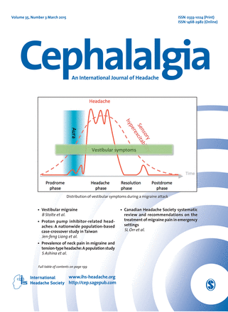

Kopfschmerzen, Refluxkrankheit und Magengeschwüre sind Volkskrankheiten. Besteht eine Verbindung zwischen ihnen? Was hat es mit der Kombination von Migräne mit Schwindel sowie mit Gleichgewichtsstörungen auf sich? Zwei Themen in der aktuellen Ausgabe von Cephalalgia, der Fachzeitschrift der Internationalen Kopfschmerzgesellschaft.

 Es ist bekannt, dass bei Magen-Darm-Beschwerden die Kopfschmerzhäufigkeit zunehmen kann. Allerdings haben Studien, die Volkskrankheiten vergleichen, ihre Tücken. Scheinkorrelationen müssen mit bestimmten statistischen Verfahren bei der Analyse kontrolliert werden. Denn wenn die Krankheit große Teile der Bevölkerung betrifft, kann es leicht zu falschen Wechselbeziehungen kommen.

In der neuen Ausgabe von Cephalalgia ist eine Studie veröffentlicht, die die Auswirkung bestimmter Medikamente auf Kopfschmerzen untersucht. Nämlich die Einnahme sogenannter Protonenpumpenhemmer. Das sind Medikamente, die die Säureproduktion im Magen vermindern.

Die Studie liefert erste Hinweise auf eine spezifische Verbindung von Protonenpumpenhemmer mit Kopfschmerzen. Doch – so ein zusätzlich veröffentlichter redaktioneller Kommentare in Cephalalgia – bleiben viele Aspekte dieser möglichen Verbindung unklar.

In einen zweiten Artikel geht es um die 1% der Bevölkerung, die an der vestibulären Migräne leiden, eine Krankheit, die noch weitgehend unbekannt und vor allem auch unterdiagnostiziert ist. Langsam erst werden die diagnostischen Kriterien für vestibulären Migräne von allen medizinisch fachkundigen Seiten anerkannt.

Zu Schwindel und Übelkeit gesellen sich leicht auch Bauchschmerzen, was wiederum den Zusammenhang zu der ersten Studie aufzeigt. Schmerzmittel und mit Migräne assoziierte Magenbeschwerden erhöhen die Wahrscheinlichkeit einen Protonenpumpeninhibitor verschrieben zu bekommen. Solche Faktoren machen es sehr schwierig, eine Verbindung von Kopfschmerzen und Refluxkrankheit oder Magengeschwüre epidemiologisch nachzuweisen. Gleichzeitig wird zurecht in dem redaktionellen Kommentare in Cephalalgia darauf hingewiesen, dass auch nur eine moderate Beziehung einen großen Einfluss auf die öffentliche Gesundheit haben könnte, weil es eben Volkskrankheiten betrifft.

Beide Themen sind Beispiele von wissenschaftlichen Zusammenhängen, die ich zukünftig gerne nicht nur hier im Blog sondern auch nochmal besser aufgearbeitet auf „[Migräne Sichtbarmachen](https://www.sciencestarter.de/migraene-website)“ kommunizieren will.

Wie ich bei Sciencestarter, wo das Projekt gecrowdfundet werden soll, schreibe: Es geht um Wissenschaftskommunikation im Bereich der Migräneforschung. Die Migräneforschung hat enorme Fortschritte in den letzten 15 Jahren erzielt. Zwar stehen diese Ergebnisse den Fachkreisen zur Verfügung. Doch gleichzeitig wurde es versäumt, auch Betroffenen und deren Mitmenschen diese Forschung verständlich und nachvollziehbar näherzubringen.

Der Weg zu Kopfschmerzen mag auch durch den Magen führen, der Weg zu mehr Aufklärung führt nur über gute Wissenschaftskommunikation. Darum bitte ich, das Projekt [hier zu unterstützen](https://www.sciencestarter.de/migraene-website).

Zunächst **muss man sich anmelden und „Fan“ werden**. Nur wenn noch etwa 50 Fans **in den nächsten zwei Wochen** zusammenkommen, geht das Projekt in die nächste Runde. Bitte auch weiter sagen!

