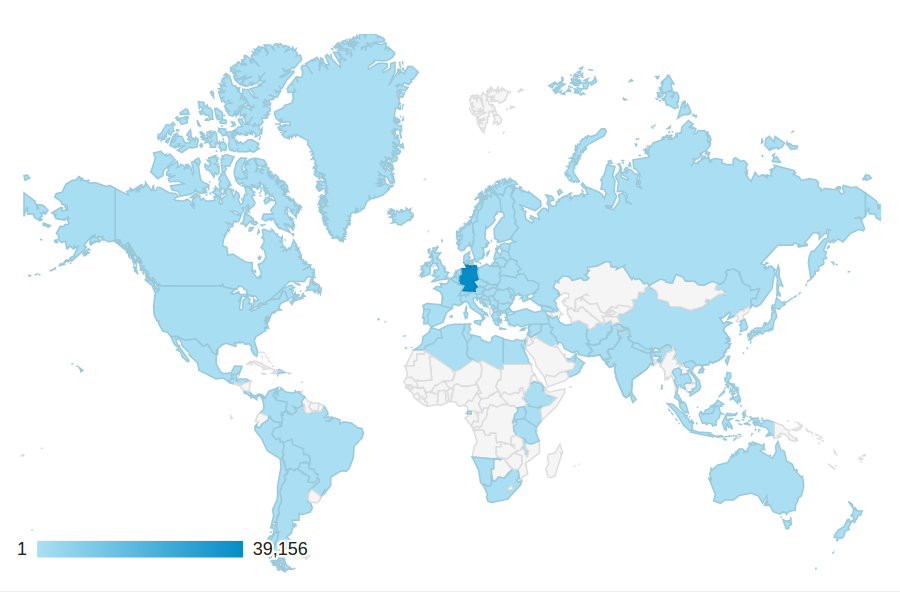
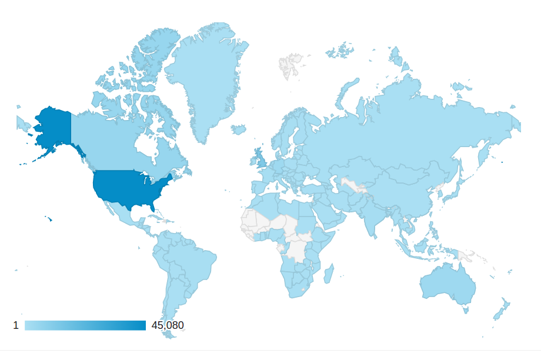
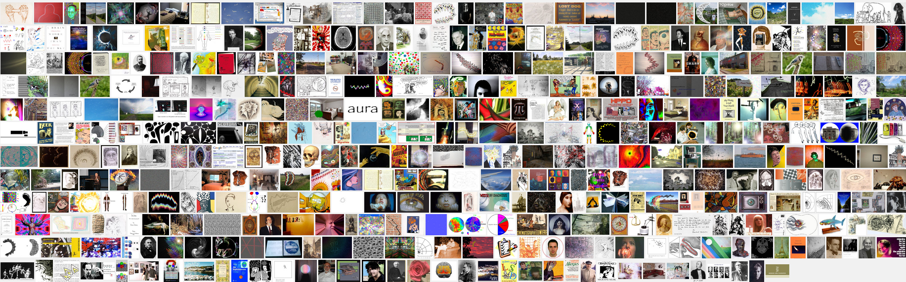

Im Gehirn zeigt die graue Substanz mit dem Alter funktionelle und strukturelle Veränderungen. Nicht anders ist es mit der „Grauen Substanz“ auf SciLogs: ob Laborbuch, Neuinszenierung der Kaffeepause oder Warenhaus an Wissen, nur zu einem taugt ein Wissenschaftsblog nicht: es ist kein Feigenblatt.

## Von den Einblicken in die tägliche Arbeit …

Mit im Schnitt fast jede Woche einen Beitrag hat die Taktfrequenz über die Jahre deutlich zugenommen. Am Anfang alle zwei Wochen, später eher zweimal pro Woche: Ich schrieb häufiger, als ich begann die „Graue Substanz“ als offenes Logbuch des Forschungsprozesses zu sehen.

Ein Laborbuch, in dass ich hineinschreibe, was ich zusammenfassen und dabei überdenken will – treu der Devise: „Writing is nature’s way of letting you know how sloppy your thinking is“ (Dick Guindon, [hier gefunden](http://www.scilogs.com/hlf/writing-for-mathematical-clarity/)). Ich schreibe auch zu Themen, von denen ich mir von außen weitere Anregungen erhoffe (und oft von Lesern auch bekomme) oder zu Themen, die ich erstmal sammeln, ordnen und später wiederfinden will.

Als interdisziplinäres „[dry lab](http://en.wikipedia.org/wiki/Dry_lab)“ geht es bei mir nicht darum, Experimentverläufe zu protokollieren sondern Brücken zu schlagen. Jenes ist ein klassischer Grund ein Laborbuch zu führen. Wobei es selbst beim klassischen Laborbuch um mehr geht. Der übergeordnete Zweck ist nachhaltig auf relevante Informationen zurückgreifen zu können.

Die „Graue Substanz“ erfüllt für mich zusätzlich weitere Funktionen der [Science-to-Science-Kommunikation](https://scilogs.spektrum.de/graue-substanz/science-to-science-kommunikation-der-blinde-fleck-der-wissenschaftskommunikation/). Vielleicht verdeutlicht dies eine Anekdote am besten.

## … über die Kaffeepause …

Im Oktober 2011 schrieb ich ein Empfehlungsschreiben für eine Studentin. Sie bewarb sich auf eine Doktorandenstelle an einer anderen Universität, arbeitete damals jedoch noch als studentische Hilfskraft bei mir. Nachdem der Adressat das Empfehlungsschreiben las, rief er mich an und erhielt am Telefon weitere gewünschte Auskunft. Gegen Ende kam er – zu meiner Überraschung – auf meinen Blog zu sprechen! Er würde meine Beiträge mit Interesse lesen und ob ich nicht einmal im Seminar eines großen Forschungsverbund vor Ort bei ihnen vortragen wolle?

Es hat über ein Jahr gedauert, bis es zu diesem Vortrag kam. Daraus ergab sich dann noch ein weiterer neuer Kontakt zu einem anderen Arbeitsgruppenleiter dieses Verbundes, mit dem ich daraufhin zwei Veröffentlichungen geschrieben habe.

Der Beginn dieser Geschichte, und mit ihr das Wissenschaftsblog, ist dabei mehr als nur die digitale Neuinszenierung des entspannten Kaffeepausengesprächs am Rande einer Konferenz. Dass diese Geschichte in der Neuinszenierung erzählenswert wird, liegt nicht allein an der Neuheit der Wissenschaftsblogs sondern (und vielleicht noch mehr) daran, dass die Kommunikation als Teil des wissenschaftlichen Prozesses sich selbst geändert hat, „weil sich die Wissenschaft geändert hat und weil sich die Rezeption der Öffentlichkeit … geändert hat“, wie es [Josef Zens](http://wijo.wordpress.com/alte-seiten/29-06-14-was-ich-bei-der-diskussion-um-wissenschaftskommunikation-vermisse/) [ausführt](http://wijo.wordpress.com/alte-seiten/29-06-14-was-ich-bei-der-diskussion-um-wissenschaftskommunikation-vermisse/).

## … zu einem Warenhaus an Wissen

Wer konkret hier mitliest, weiß ich nicht. Die allerwenigsten teilen es mir leider mit. Doch es gibt Statistik über die Datenverkehrsanalyse von SciLogs.

Besucherzahlen der „Graue Substanz“ visualisiert. Wissenschaftsblogs repräsentieren Forschung weltweit.

In den letzten 12 Monaten waren es über 46 Tausend Besuche, knapp 40 Tausend davon aus Deutschland. Gut 13% der Leser sind also weltweit verstreut.  Bei jedem Besuch werden im Schnitt eineinhalb Beiträge gelesen, pro Beitrag mit etwa 2 Minuten Lesezeit. Das regte zu über 7 Tausend Kommentaren an (meine Antworten mitgezählt). Dabei ist die „Graue Substanz“ nicht mein einziger Internetauftritt.

Weltkarte mit Besucherstatistik der Migraine Aura Foundation

Ich schreibe noch das Blog „[Gray Matters](http://www.scilogs.com/gray-matters/)“ in Englisch auf scilogs.com und zusätzlich betreibe ich zusammen mit Dr. med Klaus Podoll, einem Kollegen aus Aachen, die [Website der Migraine Aura Foundation](http://www.migraine-aura.com). Das wiederum ist eine statische Website, d.h. mit sehr unregelmäßigen Updates und ohne Kommentar-Funktion für Leser. Dafür gibt es regelmäßig Austausch über Email mit Betroffenen, die ihre Krankheits- und Leidensgeschichte teils mit Bildern (unten sind nur ein Bruchteil gezeigt) schildern und die auf der Website gesammelt, kategorisiert und so umfassend dokumentiert werden.

Die statische Website ist jetzt fast 15 Jahre alt. Auch dort sind die Inhalte auf Englisch und bei allem geht es darum für mein Forschungsgebiet Öffentlichkeit herzustellen. Die Besucherstatistik ist übrigens gar nicht so unterschiedlich zu dem deutschsprachigen Blog. Mit 85 Tausend Besuchern pro Jahr ist die Reichweite erwartbar größer, wobei auch wieder im Schnitt eineinhalb Seiten pro Besuch gelesen werden; die Besucher verweilen jedoch etwas kürzer.

## Offenheit ist kein Epiphänomen

Ohne dieses schriftliche Festhalten hätte sich viel Wissen längst wieder verflüchtigt, einiges hätte mich erst gar nicht erreicht. So aber habe ich mein eigenes Warenhaus an gesammelten Wissen und zwar nicht nur für mich allein sondern für alle online verfügbar. Dabei wirken fünfzehn Jahre Migräne und Migräneforschung im Internet zu präsentieren zurück auf die eigene Forschung.

Wenn man als theoretischer Physiker eine Krankheitsgeschichte zur Migräne mit Aura liest, denkt man über diese Dynamik und über deren zugrundeliegenden funktionellen und strukturellen Strukturen im Gehirn in Form von mathematischen Gleichungen nach. Wenn man einige hundert Krankheitsgeschichten liest (persönlich per Email zugeschickt oder im Blog kommentiert), denkt man unweigerlich viel über diese fehlschlagende Gehirndynamik nach. Deswegen bin ich überzeugt, dass jede meiner wissenschaftlichen Veröffentlichungen in Fachzeitschriften der letzten Jahre wurden zumindest indirekt durch diese prägende Erfahrung eines offenen Forschungsprozesses beeinflusst ist – und das ist auch gut so.

Das ist Teil meiner Antwort auf die Frage, ob das Schreiben eines Wissenschaftsblogs nicht zuviel Zeit gekostet. Ich kann mit dieser Frage schlicht wenig anfangen. Was soll das heißen? Wie soll ich einen Vergleich führen? Es kostet Zeit ein Lehrbuch zu schreiben. Zuviel Zeit? Oder eine Habilitationsschrift, die am Ende wohl auch nicht mehr zusammenfasst oder mehr zum Überdenken zwingt, die kaum jemand je lesen würde und die fürwahr kaum mehr als wenige schmückende Buchstaben vor dem Namen für die Allgemeinheit (andere Fachdisziplinen eingeschlossen!) nachhaltig hinterlässt.

## Einflussfaktor nicht Feigenblatt

Ich habe seit 2009 insgesamt 21 wissenschaftliche Artikel (peer review) veröffentlicht, die 348 mal seitdem zitiert wurden. Vielleicht wären es ohne „Graue Substanz“ mehr, vielleicht aber auch weniger, wie die Anekdote oben zeigt. Beides wäre kein Grund gegen bzw. für ein Wissenschaftsblog. Allein dass es wohl andere Fachartikel wären, scheint mir wirklich interessant und durchaus eine „[funktionale Begründung für öffentliche Wissenschaftskommunikation](http://www.volkswagenstiftung.de/wowk14/marcinkowski_kohring.html)“.

Wer mich heute nach dem Zeitaufwand fragt, dem sage ich als Zusatz zu dieser funktionalen Begründung auch, es ist doch gut, dass in einer wissenschaftlichen Arbeitsgruppe stets so viel passiert, dass es gerade in einen Blog passt.

Für mich ist immer noch der beste Grund, dass ich mich entscheiden kann meinen wissenschaftlichen Kompass nicht allein an Zahlen wie den „impact factor“ und „h-index“ auszurichten oder meinen Einflussfaktor gar aus akademischen Graden abzuleiten. Ich bekomme Resonanz auf das Blog. Wie viel mehr das für die Allgemeinheit bringt, um wie viel mehr es einen selbst motiviert und auf die eigene Forschung zurückwirkt, das muss und kann jeder selbst abschätzen bzw. zulassen. Klar ist: ein Wissenschaftsblog taugt nicht als Feigenblatt, das kaum mehr als notdürftig den eigenen wissenschaftlichen Impakt verhüllen könnte, wie es vielleicht die für jeden Forschungsantrag nötigen „[allgemeinverständlichen 15 Zeilen](http://www.dfg.de/formulare/1_19/1_19_de.pdf)“ tun können, die von der Deutschen Forschungsgemeinschaft eingefordert werden – maximal 1600 Zeichen passen dort herein. Dieser Beitrag, der hiermit endet, hatte ungefähr 8500 Zeichen. Er ist einer von 246 Beiträgen in den letzten fünf Jahren.
