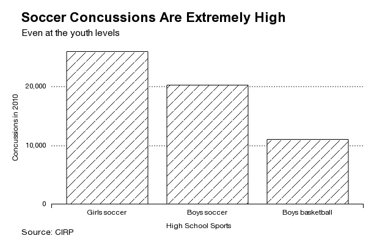

Es wird wieder über Sicherheit im Fußball diskutiert. Wo? In den USA! [Fußball soll dort für Kinder sicherer werden](http://www.sportslegacy.org/policy/safer-soccer/). Keine Kopfbälle unter 14 Jahren, so lässt sich eine aktuelle Initiative zusammenfassen, die man auch auf Twitter unter [#noheadernobrainer](https://twitter.com/search?q=%23noheadernobrainer) verfolgen kann.

Dabei geht es nicht nur um den Kopfball, sondern auch um den Versuch zu köpfen. Der Kopf steigt dem sich sinkenden Ball entgegen und oft nicht nur ein Kopf, sondern gleich zwei Kinderköpfe im Wettstreit, die dann statt nur den Ball auch sich gegenseitig treffen, Bumms – durch die Wucht, mit der sie aneinander knallen, tragen beide Kinder eine Gehirnerschütterung davon. Wie oft passiert das?

Die Häufigkeit von Gehirnerschütterungen im Fußball ist extrem hoch. (Aus: Soccer Concussions Are More Frequent Than You Think ([Link](http://www.bloomberg.com/bw/articles/2014-07-07/soccer-concussions-are-more-frequent-than-you-think)), Center for Injury Research and Policy)

Schon bei Verdacht auf eine Gehirnerschütternug **muss ein Arzt konsultiert werden**. Nur der kann eine genügend lange Pause festlegen. Diese muss bis zur Wiederaufnahme des Trainings eingehalten werden, um langfristige Schäden zu vermeiden. Das Gehirnerschütterungen im Sport nicht nur für Profis ein ernstes Problem sind, zeigt die [traurige Geschichte von Curtis Baushke](https://scilogs.spektrum.de/graue-substanz/gehirnerschuetterungen-sport-nicht-profis-probleme/), die letzten Monat im Blog thematisiert wurde (dort sind auch weiterführende Links, sowie die wissenschaftliche Literatur zur chronisch traumatischen Enzephalopathie, die ein migräneähnliches Krankheitsbild aufweist, angeführt).

Man fragt sich, warum diese Initiative gerade in den USA jedoch nicht in Europa hochkommt? Natürlich liegt das momentan auch an der Fußballweltmeisterschaft der Frauen, die gerade in Nordamerika läuft. Doch das Interesse ist dort schon länger groß an diesem Thema,

In den USA spielt Fußball im Profisport eine untergeordnete Rolle. Ist das ein Teil der Erklärung? Fußball (oder Soccer, wie sie es dort nennen) ist nämlich durchaus sehr beliebt bei Kindern und Jugendlichen. Soccer ist einer der meist gespielten Sportarten überhaupt in dieser Altersgruppe in den USA – wie übrigens überall auf der Welt.

Ohne bedeutende Einflüsse vom Profisport steht dort allerdings weniger der Wettkampfcharakter im Vordergrund als die Fitness und ein gesunder Lebensstil. Auch aus eigener Erfahrung weiß ich, dass in Deutschland kaum noch ein Kind in einen Fußballverein bekommt, ohne Talentsichtung und ohne dass es sich dem Wettkampf mit gehörigem Leistungsdruck verschreibt. Eltern fahren die Kinder jedes Wochenende zum Turnier und können ein Lied davon singen.

Oberflächlich betrachtet könnte man das leicht mit dem US-amerikanischen Phänomen der sogenannten „soccer mom“ verwechseln. Auch die „soccer mom“ (die „Fußball-Mutter“) steht dafür, dass Eltern einen beträchtlichen Teil ihrer Zeit mit den Freizeitaktivitäten ihre Kinder verbringen. Es gibt jedoch einen Unterschied. In den USA symbolisiert der Begriff „soccer mom“ die gehobene US-amerikanische Mittelschicht, deren Erziehungsstil man mit abgestimmter Fürsorge umschreibt („concerted cultivation“). Eltern gerade dieser sozialen Schicht investieren Zeit und Geld für eine lehrreiche und sinnvolle Freizeitgestaltung, die letztlich dem Statuserhalt und -verbesserung zugute kommen soll. Das hat zwar mit Talentförderung zu tun. Doch es hat viel weniger mit einer Heranführung an den Profisport zu tun, der in Deutschland leider im Vordergrund zu stehen scheint – nicht zuletzt als Folge des Debakels bei der EM 2000, der die Nachwuchsförderung im deutschen Fußball bis in der Ortsvereine hinein veränderte.

Zusammengefasst: Den US-amerikanischen Mittelschichteltern liegt etwas an den Köpfen ihrer Kinder, bei und in Deutschland geht es um die Titel im Profisport.
