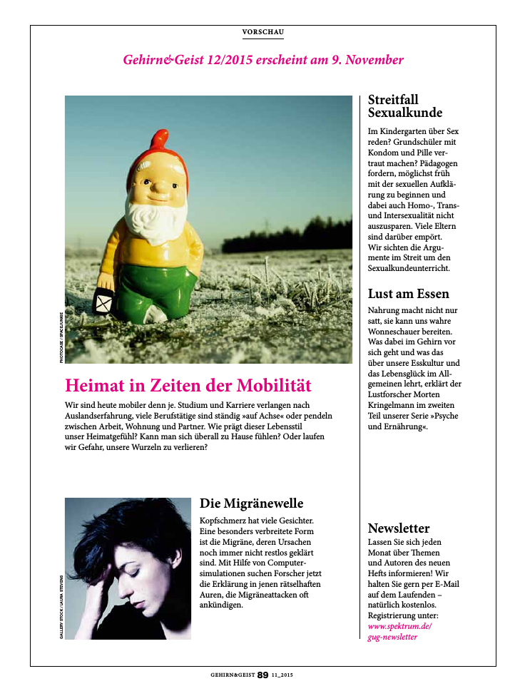

Wer möchte, kann die neuste Ausgabe von [„Gehirn & Geist“ kostenlos](http://www.spektrum.de/lp/gug_vorbestellen?utm_source=GUG&utm_medium=FB&utm_campaign=GUG_FB_VORBESTELLEN_RELAUNCH) bestellen. Die Zeitschrift kommt im neuen Kleid daher. [Seht selbst](http://www.spektrum.de/lp/gug_vorbestellen?utm_source=GUG&utm_medium=FB&utm_campaign=GUG_FB_VORBESTELLEN_RELAUNCH). Noch lieber will ich das nächste Heft empfehlen. Das erscheint erst am 9. November und gibt es dann leider nicht mehr umsonst, immerhin aber mit dem Beitrag über die „Migränewelle“.

Bis dahin muss man: warten. Einen Belohnungsaufschub gibt es nicht, also jetzt schon einmal [zugreifen](http://www.spektrum.de/lp/gug_vorbestellen?utm_source=GUG&utm_medium=FB&utm_campaign=GUG_FB_VORBESTELLEN_RELAUNCH).

