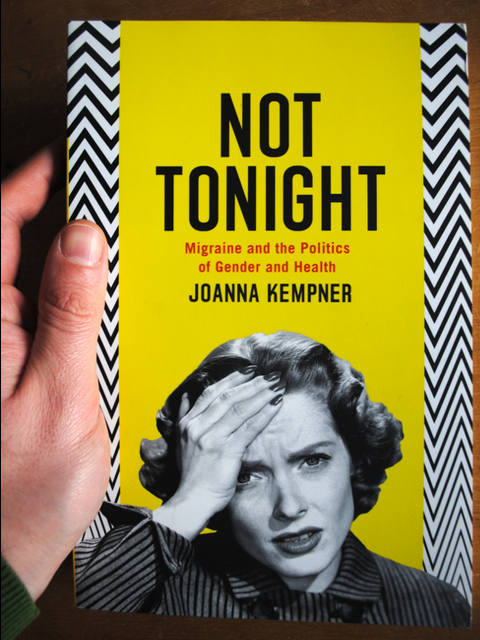

„[Migräne wird zum Politikum](http://www.faz.net/aktuell/wissen/medizin/patienten-manifest-migraene-wird-zum-politikum-1979550.html)“ titelte Joachim Müller-Jung in der F.A.Z. vor fünf Jahren. Migräne sollte endlich besser als stark behindernde Krankheit gesellschaftlich anerkannt werden.

> An jedem einzelnen Tag des Jahres sind es [in Europa] zwei Millionen [Migräne-Patienten], die von den extremen Kopfschmerz-Attacken gequält und nicht selten bis zur Arbeitsunfähigkeit zusätzlich von Schwindel, Licht- und Geräuschempfindlichkeit und von getrübtem Blick geplagt werden.

## Globale Gesundheitsbelastung

Von 2000 bis 2012 wurden von der Weltgesundheitsorganisation (WHO) Daten über die globale Gesundheitsbelastung erhoben. Diese Studie zeigt, dass Migräne weltweit für fast 3% der Behinderungen verantwortlich ist. Damit befindet sich Migräne an achter Stelle der am schwersten behindernden Krankheiten und auf dem ersten Platz unter den neurologischen Erkrankungen. 

Wenn dem so ist, warum wird relativ wenig Geld in die Forschung gesteckt? Anhand der Daten der WHO kann objektiv festgelegt werden, wieviel Geld für Forschung wohin fließt. Nähme man diesen Maßstab, müsste Migräneforschung gleich um ein vielfaches mehr finanziert werden.

## Wessen Leiden sind legitim?

Wie also bestimmt eine Gesellschaft bisher, wessen medizinische Leiden erforscht und bekämpft werden? Welche Leiden befindet die Gesellschaft für legitim, so stellt die Frage die Soziologin Joanna Kempner (Rutgers University, New Jersey). In ihrem Buch “Not tonight” beleuchtet sie Hintergründe.

Genau wie Müller-Jung schreibt auch Kempner, dass wahrscheinlich jeder in seinem eigenen Bekanntenkreis Leidtragende kennt. An der Häufigkeit der Fälle liegt es also nicht. Das macht die stiefmütterliche Behandlung ja gerade seltsam. Darf man nicht eine wirksame Lobbyarbeit bei Volkskrankheiten vermuten? Es sei denn, man möchte sich in seinem Vorurteil bestärkt sehen, dass Migräne eine eingebildete Krankheit sei.

“Not tonight” zeigt, dass es keine einfachen Antworten gibt. Eindrucksvoll wird die Medizingeschichte fast drei Jahrhunderte zurück verfolgt. Dabei zeigt Kempner, wie gesundheitspolitische, kulturelle,und sprachliche Prozesse ein Legitimitätsproblem tief in unserer (westlichen) Welt verankert haben. Das ist die wichtigste Aussage des Buches. Es gibt nicht nur keine einfache Antwort, sondern – und für mich wichtiger noch – es gibt auch keine isolierte Erklärung spezifisch für Migräne. Es kann sie nicht geben.

## «Vernebelte Bereiche» sprengen Krankheitslehren

Schaut man Jahrhunderte zurück, erfährt man, dass sich die Diagnose der facettenreichen Krankheitsbilder immer wieder verändert haben. Schon früh wurde beispielweise die Verwandschaft der Migräne zur Epilepsie erkannt. Anfang des 20. Jahrhundert geriet dies jedoch in Vergessenheit. Mit der strikteren Trennung in organische und psychosomatische Krankheiten passte Epilepsie nicht mehr ins Bild. Noch bis in die frühen 1970er Jahre galt Migräne als psychosomatische Erkrankung mit Folgen für die Blutgefäße. Ein Fall eher für die Psychiatrie und Innere Medizin als für die Neurologie. Siri Husdvedt schrieb ein lesenswertes, in kein Genre passendes [Buch über ihre Krankheitsgeschichte](https://scilogs.spektrum.de/graue-substanz/natur-gott-teufel-koerper-menschen/), über Hysterie (heute Dissoziative Störungen, da Hysterie als stigmatisierend und mit dem weiblichen Geschlecht verbunden gilt) und Migräne (mit ganz ähnlichen Etiketten).

Erst ab 1960 – und bis heute andauernd – weist neue Forschung auf organische Ursachen im Gehirn. Migräne ist nun zurecht in der Neurologie angekommen. Nicht nur die alte Verwandschaft zur Epilepsie wurde über genetische Befunde wiederentdeckt, auch eine neue zu Formen des Schlaganfalls wurde durch Bildgebung nachgewiesen. Doch warnen heute auch Stimmen, dass das Pendel zuweit in die Neurologie ausschlägt.

Oliver Sacks schrieb in seinem Buch „Migräne“ von 1970, das «vernebelte Bereiche» existieren, die den Rahmen «rigider Nosologien» [rigider Krankheitslehren] sprengen. Auf den Punkt gebracht geht es um Krankheiten des Gehirns, die «quasi unsichtbar geblieben sind, obwohl keiner behaupten könnte, die Beschwerden seien selten» – und hier zitiere ich wieder Müller-Jung, der Migräne auch nur als Beispiel für das Phänomen des Legitimitätsproblems sieht, dass selbst große Patientengruppen es bislang selten schaffen, starke Lobby zu organisieren.

## Die Hoffnung

Dabei gab es eine Hoffnung für Migräne. Sie hat sich nur nicht erfüllt. Kempner beschreibt dies zentral und aus vielen Blickwinkeln in ihrem Buch. Die Hoffnung lautete so: In dem Maße, wie organischen Ursachen der Migräne entdeckt werden und psychosomatische Faktoren zugunsten der Neurologie verdrängen, hätte man erwarten können, dass Migräne stärker legitimiert würde. Dies geschah nicht. Kempner erklärt es uns damit, dass das betroffene Organ das Gehirn ist und die Schäden unsichtbar bleiben.

Der Versuch die Verantwortung nicht in einer Migränepersönlichkeit zu sehen und der damit  angeblich verbundenen Lebensführung, sondern sie an das *Migränegehirn* abzugeben, hieße dem Gehirn ein Handlungspotential oder eine „agency“ außerhalb unserer selbst zuzuschreiben. Das muss in der westlichen Tradition fehl schlagen. Während *Es* Schmerzen, Sehstörungen, Geräusche, Hörverlust und viele weitere sensorische, motorische und kognitive Symptome verursacht, ist zugleich *Es* ja es, das in Folge die Schmerzen fühlt, schlecht sieht, hört usw. Das erkrankte Organ ist also gar nicht vom *Ich* zu trennen. Bei Herz, Leber und Niere geht das.

Migräne, genau wie psychiatrische Störungen, manifestiert sich vor allem im subjektiven Erlebnisgehalt eines mentalen Zustandes. Daran konnten weder bildgebende Verfahren noch Genetik etwas ändern. Die Kenntnis organischer Ursachen half also nicht das Legitimitätsdefizit zu verringern. Und Kempner deutet an, dass je länger die Hoffnung schwindet und je weniger man die wahren Gründe dafür verstand, desto stärker versuchte man, die Relevanz auch psychosomatischer Aspekte zu leugnen.

Die Genetik hat die Lage wahrscheinlich sogar verschlimmert. Zumindest verweist Kempner auf Studien hin ihrer Kollegin, Jo C. Phelan (Soziologin an der Columbia University, New York), die für Schizophrenie und Depression nachwies, dass das Stigma sich eher durch aufdecken genetischer Ursachen erhöht hat. Betroffene werden seitdem als fundamental andere Personen wahrgenommen. Die Personifizierung der Krankheit zeigt sich auch in der Wortschöpfung „Migräniker“. Kempner widmet dem Tema, wie wir über Migräne reden, zurecht viele Seiten.

## Worum es geht

Es gibt sehr gute Gründe warum Migräniker – Menschen mit Migräne seit Jahren darum kämpfen, dass ihre Erkrankung als Behinderung mehr anerkannt wird. Es geht um den Anspruch auf kürzere Arbeitszeiten und weiteren Schutz, aber auch darum solche Entscheidungen verlässlicher, valider und transparenter zu machen. Das Patienten-Manifest, über das Müller-Jung vor fünf Jahren berichtete, appellierte an die europäischen Regierungen und Gesundheitspolitiker. Es legte 5-Jahres-Ziele fest, um Krankheitsbewältigung und Lebensqualität zu verbessern. In einer [ersten Einschätzung](http://www.europeanheadachealliance.org/projects/access-to-care/) lässt sich jedoch keine Verbesserung in der Patientenzufriedenheit und Behandlungsraten beobachtet. So geht es mit nun mit den jährlichen Europäischen Migräne Aktionstagen (12. September) weiter:

> Bildung sollte eine Priorität für Migräne bekommen, nicht nur Informationen für die Patienten, sondern auch für alle, die in Kontakt mit Menschen mit Migräne stehen, einschließlich den im Gesundheitsbereich tätigen Menschen, Arbeitgebern, Familie und Freunden und die breite Öffentlichkeit. Ein größeres Bewusstsein und Kenntnisse über den Zustand soll helfen, Diskriminierung und Stigmatisierung zu beenden, die viele Menschen mit Migräne erfahren.
>
> [Audrey Craven, Gründungsmitglied und Präsidentin der Europäischen Headache Alliance, zitiert von [hier](http://www.europeanheadachealliance.org/projects/european-migraine-day-of-action/).]

Dies ist der wahre Zusammenhang, in den man die in meinen Augen undurchdachten Gedanken von Bayerns Innenminister Joachim Herrmann stellen muss, der ein Berufsverbot für Depressive für denkbar hält. Solche Forderungen fördern Stigma und führen in einen Teufelskreis. Lange bevor man Verbote in Spiel bringen darf, geht es um die Gleichbehandlung in Beschäftigung und Beruf (siehe: [Pressemitteilung des Gerichtshofs der Europäischen Union](http://curia.europa.eu/jcms/upload/docs/application/pdf/2013-04/cp130042de.pdf)).

Es ist daher gut, dass Gehirnkrankheiten heute wieder ein Politikum sind.

„Migräne Sichtbarmachen“ ist eine Crowdfunding-Aktion, die sich der Reduzierung des Stigmas bei Migräne widmet, indem interdisziplinäre, wissenschaftliche Ansätze aus der Migräneforschung kommuniziert werden. [Unterstützen Sie es auch](https://www.sciencestarter.de/migraene-website).

**Quellennachweis**: Der rechte Teil des Beitragsbilds, das nur beim Verlinken angezeigt wird, stammt aus dem Wikipedia-Eintrag zu [facepalm](http://en.wikipedia.org/wiki/Facepalm) und zeigt einen Ausschnitt eines Bildes von Alex E. Proimos, dass unter CC BY 2.0 steht.
