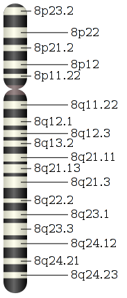

Wenn 65 Forscher aus 13 Ländern an einem Großprojekt forschen, dann denke ich unweigerlich an Teilchenbeschleuniger und an die Suche nach den Bausteinen der Materie. Aber auch bei den Bausteinen des Lebens, der Genetik müssen Institutionen länderübergreifend zusammenarbeiten. Die weltweit größte Genetikstudie in der Migräneforschung wurde nun in der Zeitschrift *Natur Genetics* veröffentlicht [1].

Gefunden wurde erstmals ein genetischer Risikofaktor für Migräne. Es gab zwar schon ähnliche Befunde in einer seltenen Unterform der Migräne, der familiären hemiplegischen Migräne (FHM),  aber diese Form ist eher atypisch in ihrem Symptomverlauf. Diese alten Befunde unterscheiden sich auch dadurch, dass bei FHM ein ursächlich hinreichender Gendefekt gefunden wurde, so dass sich diese Unterform der Migränekrankheit klassisch nach den Mendelschen Gesetzen vererbt. Der nun neue genetische Risikofaktor prädisponiert ihre Träger nur für eine Migräneerkrankung.

**Kein Migräne-Gen und auch keine *Channelopathie***

In der aktuellen Studie wurden zunächst 2731 Migränepatienten und 10747 Probanden aus Kontrollgruppen untersucht. Die überraschenden Ergebnisse mußten und konnten dann nochmals bestätigt werden mit zwei sogar etwas größeren Gruppen (3202 Patienten und 40062 Probanden).

Überraschend waren in meinen Augen zwei Sachen.

Zum einen, dass überhaupt eine genetische Grundlage gefunden werden konnte. Vermutet wurden nämlich multifaktorielle Merkmale, also eine verzwickte Wechselwirkung mehrerer Gene mit zusätzlichen Umweltfaktoren. In diesem Fall würde Migräne zwar immer noch familiär gehäuft auftreten, aber es können nur sehr schwierig wenn überhaupt genetische Merkmale in einer Studie lokalisiert werden. Da natürlich auch vorab keine Kandidatenregion im Genom bekannt war, führten die Forscher eine sehr aufwendige genomweite Assoziationsstudie (GWAS) durch. Diese führte nun tatsächlich nach gut zehn Jahren Forschung zum Erfolg.

 Damit ist nun aber kein Migräne-Gen gefunden, sondern eher genau das Gegenteil. Ein solches gibt es offensichtlich nicht, sondern nur genetische Risikofaktoren. Entdeckt wurden Genvarianten im Band des langen Arm des Chromosoms 8, bezeichnet mit dem Kürzel 8q22.1, welches in dem vereinfachten Idiogramm rechts von der National Library of Medicin noch gar nicht zu finden ist.  Aber das ist eher ein Detail. Die Träger dieser Variante sind also  prädisponiert für eine Migräneerkrankung.

Der zweite für mich überraschende Punkt ist, was für eine physiologische Veränderung diesem Gendefekt zugrunde liegt. Oder eigentlich muss ich schreiben, was für eine es *nicht* ist. Es sind nämlich keine Veränderung in der Dynamik der Ionenkanäle von Nervenzellen. Krankheiten, die damit in Verbindung stehen werden auch als Channelopatie bezeichnet*.* Überraschend ist also, dass Migräne keine Channelopatie ist, wie doch einige Forscher vermuteten*.* Dies lag zunächst nahe, da in der sehr seltenen Unterform der familiären hemiplegischen Migräne solche Veränderungen auftraten, nämlich in dem transmembranen Na+– und Ca2+-Kanal einer Nervenzelle und auch in ihrer Na+-K+-Pumpe. (Wobei Na+, Ca2+ und K+  für die entsprechenden Ionen von Natrium, Calcium und Kalium stehen.)

Die jetzt veröffentlichten Resultate deuten auf eine genetisch bedingte Fehlregulation des hauptsächlichen Glutamat-Membrantransporters hin. Die Bedeutung des Neurotransmitters Glutamat war hinlänglich bekannt – nicht zuletzt durch die landläufige Bezeichnung China-Restaurant-Migräne verursacht durch Glutamat den Gewürzverstärker. Auch eine genauere Sicht auf die Physiologie, welche allerdings in dem Paper nicht weiter erwähnt wurde, will ich anmerken.

**Gewürz- und Entladungsverstärker**

Eine Besonderheit des Glutamats ist, dass dieser Neurotransmitter, sobald er einmal durch Gehirnaktivität freigesetzt wurde, nicht gleich metabolisiert wird, also abgebaut und damit unschädlich wird. Glutamat kann nur über Membrantransporter aus dem extrazellulären Raum entfernt werden. Membrantransporter spielen also die zentrale Rolle im Glutamathaushalt.

Seit ziemlich genau 20 Jahren weiß man, dass Membrantransporter, die in den glialen Helferzellen sitzen, ihre Transportrichtung umdrehen, also Glutamat freisetzen, sobald das extrazelluläre K+ sich stark erhöht. Ein Teufelskreis kann entstehen, in dessen Folge Nervenzellen sich nahezu komplett entladen [2]. Damit wäre eine Fehlregulation des Membrantransporters konsistent mit der Theorie, dass eine Welle neuronaler Entladung (spreading depression, SD) durch diesen Gendefekt entsteht bzw. ihre Entstehung im Gehirn wahrscheinlicher wird.

**Bedeutung für Krankheitsursache**

Im letzten Absatz beschreibe ich nur meine persönliche erste Vermutung, die mir spontan in den Kopf kam. Denn noch liefern diese spannenden neuen Daten keinen Aufschluss über die zwei konkurrierende Mechanismen, die ich gerade erst am [30. August hier vorgestellt](http://www.brainlogs.de/blogs/blog/graue-substanz/2010-08-30/unbemerkte-aura) habe. Nämlich, dass diese Welle neuronaler Entladung (spreading depression, SD) sowohl die Aura auslöst als auch den Kopfschmerz.

  
 *Führt ein gestörter Glutamathaushalt zu SD, die wiederum die Aura und Kopfschmerzen verursacht?*

Oder könnte der hohe Glutamtspiegel für beides getrennt Verantwortlich sein?

 *Glutamat könnte beides: Aura und (verzögert) Kopfschmerzen verursachen.*

Die Autoren schreiben dazu

> Migraine headache is believed to be caused by activation of the trigeminovascular system and the aura by cortical spreading depression, a slowly propagating wave of neuronal and glial depolarization. However, these are considered to be downstream events, and it is unknown how migraine attacks are initiated.

und kommen dann zu dem Schluß

> It is reasonable to speculate that this accumulation can increase susceptibility to migraine through increased sensitivity to cortical spreading depression as well as through glutamate involvement in central sensitization.

Diese Frage bleibt also weiter spannend. Da in dieser Studie nur aus wenigen europäischen Kopfschmerzkliniken Patienten rekrutiert wurden, bleibt es auch abzuwarten, ob diese Gruppe repräsentativ ist und sich die Ergebnisse in einer größeren Gruppe mit einem breiteren Verlaufsspektrum der Migränekrankheit wiederfinden.

**Literatur**

[1] [Anttila et al., Genome-wide association study of migraine implicates a common susceptibility variant on 8q22.1, *Nature Genetics*, 2010 **42**,869–873](http://dx.doi.org/10.1038/ng.652)

[2] [Szatkowski M, Barbour B, Attwell D.](http://dx.doi.org/10.1038/348443a0) [Non-vesicular release of glutamate from glial cells by reversed electrogenic glutamate uptake.](http://dx.doi.org/10.1038/348443a0) [*Nature*,](http://dx.doi.org/10.1038/348443a0) [1990 **348**,443-446.](http://dx.doi.org/10.1038/348443a0)

Ein sehr gute Zusammenfassung der Studie findet sich auch aus erster Hand auf den Seiten der [Schmerzklinik Kiel](http://www.schmerzklinik.de/2010/09/22/risikofaktor-fuer-migraene-im-erbgut-entdeckt/), die unter Leitung von Prof. Hartmut Göbel maßgeblich an dieser Studie beteiligt war.
