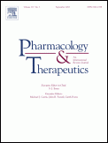
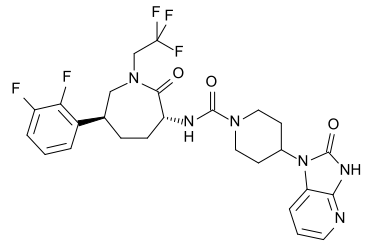

 Der Titel des Überblickartikel ist nicht gerade ansprechend, die Zeitschrift nicht weithin bekannt und eigentlich ist der Artikel auch nur für Fachleute interessant [1]. Wäre da nicht ganz unscheinbar noch die neue Namensgebung einer Wirkstoffgruppe zur Akutbehandlung der Migräne: *Gepant*.

> … two antimigraine principles in therapeutics, namely: 5-HT1B/1D receptor agonists (known as triptans) and CGRP receptor antagonists (known as gepants).

Triptane, soweit bisher vielen Betroffenen als Wirkstoff bekannt [2], sind selektive Serotoninagonisten.  Gepants, also Antagonisten des Neuropeptids CGRP (Calcitonin Gene-Related Peptide, ein Gefäßerweiterer) sind bisher weniger bekannt.

   
 *Strukturformel des Moleküls Telcagepant*

Es gibt zwei Gepante, also CGRP-Antagonisten. Telcagepant (vorher als MK-0974 bezeichnet) und Olcegepant (vorher BIBN4096BS). Und es ist noch nicht lang her, dass überhaupt die kryptischen Namen in etwas halbwegs aussprechbares umgewandelt wurden. Nun kommt die prägnante Kurzform "Gepant". Diese Kurzform wurde bisher nur einmal in einem spanischen Überblickartikel benutzt [3], wenn auch auf wissenschaftlichen Tagungen dieser Begriff schon informel genutzt wird.

Die Namen "Telcagepant" und "Olcegepant" der CGRP-Antagonisten waren 2009 noch so wenig geläufig, dass selbst eine Koryphäe im Titel eines Artikels in der sehr renomierten Fachzeitschrift "The Lancet" diese verwechselte [4]. Wenn nun die Autoren von  "CGRP receptor antagonists (known as gepants)" schreiben, darf man getrost von einer Übertreibung sprechen. Bekannt sind diese unter diesem Namen nicht – noch nicht.

Als 1992 mit Sumatriptan das erste Triptan auf den Markt kam, war der Name Triptan auch noch nicht bekannt. Heute findet Google 921 000 Treffer für "triptans migraine" (12 700 für "Triptane und Migräne").

Es bleibt abzuwarten, was aus den Gepanten wird. Ihr Vorteil gegenüber Triptanen soll in den geringeren Nebenwirkungen liegen. Triptane dürfen z.B. bei Gefäßerkrankungen, Bluthochdruck, oder während der Auraphase nicht eingenommen werden, weil sie eine gefäßverengende Wirkung haben. Bei den Gepanten soll dies anderes sein. Ein Rückschlag allerdings gab es schon für die prophylaktische Behandlung der Migräne mit Telcagepant. Eine [Studie (Phase II)](http://www.clinicaltrials.gov/show/NCT00797667) musste abgebrochen werden.

Gepant, ein neuer Name am Horizont der Migräneforschung wird sicher noch weiter von sich reden machen. Vielleicht will sich ja schon mal jemand die Domainnamen www.gepant.com/de/org reservieren. Noch sind sie verfügbar.

**Nachtrag**

Den Begriff "gepants" fand ich nun auch noch in [5] im Text. Im pubmed aber ist "gepants" nur in [1] und [3] zu finden, da hier nur Titel und Abstrakt durchsucht werden. Ob der Begriff wirklich auf Prof. Goadsby zurückgeht, kann ich nicht sagen.

**Literature**

[1] Saurabh Gupta and Carlos M. Villalón, The relevance of preclinical research models for the development of antimigraine drugs: Focus on 5-HT1B/1D and CGRP receptors, *Pharmacology & Therapeutics*, in press ([doi](http://dx.doi.org/10.1016/j.pharmthera.2010.06.005))

[2] [Triptane, Migräne-Schule](http://www.schmerzklinik.de/service-fuer-patienten/migraene-wissen/anfallsbehandlung/grundsaetzliches/)  (Schmerzklinik Kiel)

[3] J. Pascual-Gómez, [Gepants: the beginning of a new age in the symptomatic treatment of migraine?] [Orignal in Spanisch], Rev. Neurol. **48**,337-338 (2009).

[4] Peer Tfelt-Hansen,  [Migraine and olcegepant](http://dx.doi.org/10.1016/S0140-6736%2809%2960598-5), *The Lancet*, **373**,1003, 21 (2009) [in der korrigierten Form muss es "Migraine and telcagepant" heißen]

[5] Peter J. Goadsby, The vascular theory of migraine—a great story wrecked by the facts, *Brain*, **132**,6-7 (2009)
