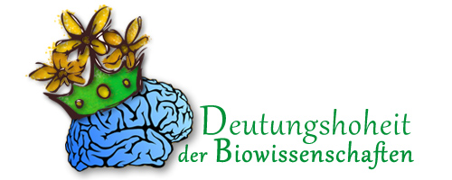

Neulich war ich auf einem Workshop "Computational Neuroscience and the Dynamics of Disease States". Den Titel könnte ich mit "Computational Neuroscience und die Dynamik in Krankheitszuständen" übersetzen.

Sie sollten nun zunächst fragen: Was ist denn Computational Neuroscience (CN)? Warum übersetze ich das nicht? Das ist eine ganz gute Frage. CN wird manchmal mit Neuroinformatik übersetzt. Das trifft es aber schlecht. CN ist eine eigenständige Disziplin, die sehr stark von der angewandten Mathematik beeinflusst ist; Informatik ist dagegen eine Ingenieurwissenschaft. Es spielen aber noch mindestens drei weitere wissenschaftliche Disziplinen mit – welche, darüber sollten sich Studierende im klaren sein und den entsprechenden Schwerpunkt bei der Wahl ihrer Spezialisierung berücksichtigen.

**Was ist Computational Neuroscience?**

Auf der [Webseite des Nationalen Bernstein Netzwerk Computational Neuroscience](http://www.nncn.de/) findet man diese Beschreibung:

> Sie [CN] verbindet biomedizinische Experimente mit theoretischen Modellen und eröffnet so den Weg zu neuen Erkenntnissen und technologischen Anwendungen.

Ein theoretisches Modell ist nichts anderes als eine mathematische Gleichung1. Computer unterstützen lediglich die Modellentwicklung. Sie sind insbesondere dann nötig um Aussagen über das Modell treffen zu können, wenn sich die mathematischen Gleichungen nicht (zeitnah) mit Bleistift und Papier lösen lassen. Das ist in der Regel so.

So weit, so gut. Gucken wir nochmal auf den Titel des Workshops. Die nachfolgende Einschränkung auf Krankheitszustände ist nämlich von Bedeutung, weil sich viele Forschungsfelder im Bereich CN mit normalen Hirnfunktionen beschäftigen. Bevor ich also [in einem folgenden Beitrag im Detail auf diesen Workshop eingehe](https://scilogs.spektrum.de/blogs/blog/graue-substanz/2011-09-03/migraene-ctrl-alt-del), will ich hier drei Felder, mit denen sich CN beschäftigt, anreißen, in dem ich kurz auf Fragestellung und Methoden eingehe.

Diese drei Felder sind keine übliche Einteilung. Gerade darum will ich die Computational Neuroscience hier einmal explizit so darstellen. Denn in diesen jeweiligen Feldern werden oft nicht nur spezifische Methoden genutzt sondern auch die Arbeits- und Denkweise unterscheidet sich teilweise stark.

Es geht, wie der Titel schon sagt, um gesunde, kranke und neue Hirnfunktionen, deren Funktionsweise im mathematischen Modell nachgebildet werden soll. Ich hätte mit einiger Berechtigung auch normale, gestörte und unterstützende/ersetzende/entlastende Funktionen schreiben können.

**Gesunde Hirnaktivität**

Was ist Bewusstsein? Wie entsteht Aufmerksamkeit? Wie funktioniert Gedächtnis? Wie funktioniert sensorische Integration? Wie kommunizieren Nervenzellen im Netzwerk? Wie feuert eine Nervenzelle? Einige Fragen, von hoffnungslos nach bodenständig sortiert, geben Beispiele für Bereiche der Computational Neuroscience, die sich mit den gesunden Hirnfunktionen beschäftigen.

Die Modellierung geht meist mit entweder tierexperimentellen Daten einher oder, insbesondere bei den höheren Hirnfunktionen (Aufmerksamkeit, Gedächtnis etc), mit Daten der nicht-invasiven Bildgebung (EEG, fMRI etc).

Das wäre eigentlich auch einen eigenen Beitrag wert, den ich aber nicht wirklich fundiert schreiben könnte, da ich nicht in diesem Bereich arbeite. (Gastbeiträge sind willkommen.) Ansatzweise habe ich darüber in "[Fleckologie oder das Fehlen der Bunt-Hirn-Schranke](https://scilogs.spektrum.de/blogs/blog/graue-substanz/2011-04-09/bunt-hirn-schranke)" geschrieben, bin dann aber schnell bei den Hirnfehlfunktionen gelandet.

**Kranke Hirnaktivität**

Zu den kranken, oder gestörten Hirnfunktionen, also meinen Forschungsfeld, komme ich im Detail im nächste Beitrag.

**Neue Hirnaktivität**

Eine Neuroprothese bietet Ersatz von Hirnfunktionen durch künstliche Geräte. Fallfuß-Stimulatoren oder Cochleaimplantate sind beides Prothesen (außerhalb bzw. innerhalb des Körper, s.a. "[Das Wo und Wann der Neuromodulation](https://scilogs.spektrum.de/blogs/blog/graue-substanz/2010-03-02/neuromodulation)"). Prothesen arbeiten oft, aber nicht immer, funktionell ähnliche wie die ausgefallenen Körpersysteme. Das besondere an den Neuroprothese ist aber die Verbindung, die Schnittstelle, zum Gehirn.

Dieses dritte Feld im Bereich der CN umschreibe ich daher hier als Modellierung neuer Hirnaktivität, weil mittels Gehirn-Computer-Schnittstellen die Möglichkeiten des Gehirns erweitert werden sollen. In diesem Sinn meine ich mit neuen Funktionen unterstützende, ersetzende oder entlastende Funktionen. Es muss aber nicht erst eine Körperfunktion ausfallen, um auf die Idee zu kommen neue Hirnfunktionen schaffen zu wollen (s. "[Die technische Art des Neuro-Enhancement](https://scilogs.spektrum.de/blogs/blog/graue-substanz/2009-11-18/moderne_therapeutische_neurotechnologie)").

Mittels alchemistischer geschickter Analyse von Hirnaktivität kann zum Beispiel ein Computerprogramm gesteuert werden. Vielleicht werde ich später mal meine Beiträge ohne Tastatur schrieben, aber letztlich stehen auch hier medizinische Anwendungen im Vordergrund. Stephen Hawking, ein ALS-Patient, hat nicht mehr die Möglichkeit etwas mit einer Tastatur zu schreiben. Bei CN geht es selbst um Gedankenlesen, aber das ist, zu wörtlich genommen, schlicht Hokuspokus. Lügen zu detektieren ist aber schon eher möglich.

Alle drei Bereiche bewegen sich zwischen der angewandten Mathematik, Informatik, Psychologie, Medizin und Biophysik, setzen aber die Schwerpunkte anders, was sich wiederum in der Ansatz- und Denkweise äußert. Ich rate deswegen den Studenten immer, diese Einteilung und die eben genannten fünf (oder sechs: Biophysik= Biologie+Physik) Disziplinen im Auge zu haben, wenn sie sich für Computational Neuroscience entscheiden und sie sich bei Bachelor- und Master-Arbeiten spätestens innerhalb der CN spezialisieren.

**Fußnote**

1 Mathematische Gleichungen können auch Gleichungen zwischen Größen und deren zeitlichen Änderungen sein, also sind wir, mathematisch gesprochen, im Teilgebiet der Differentialrechnung. Biologisch gesprochen sind zeitliche Änderungen von Größen eng mit der Funktion der Organsysteme verbunden. Beispiel: Das Herz pumpt periodisch Blut, dabei ändert sich etwas über die Zeit. Das Teilgebiet der Biologie, das sich mit Funktion beschäftigt ist die Physiologie oder eben Pathophysiologie, wenn es Fehlfunktion ist (die Unterscheidung zwischen Funktion und Fehlfunktion ist eine sehr menschliche, wissenschaftlich eher fragwürdig). Lange Rede kurzer Sinn: Physiologie=Differentialrechnung.

**Link**

Kurze URL zu diesem Beitrag:

http://goo.gl/VK9nZ
