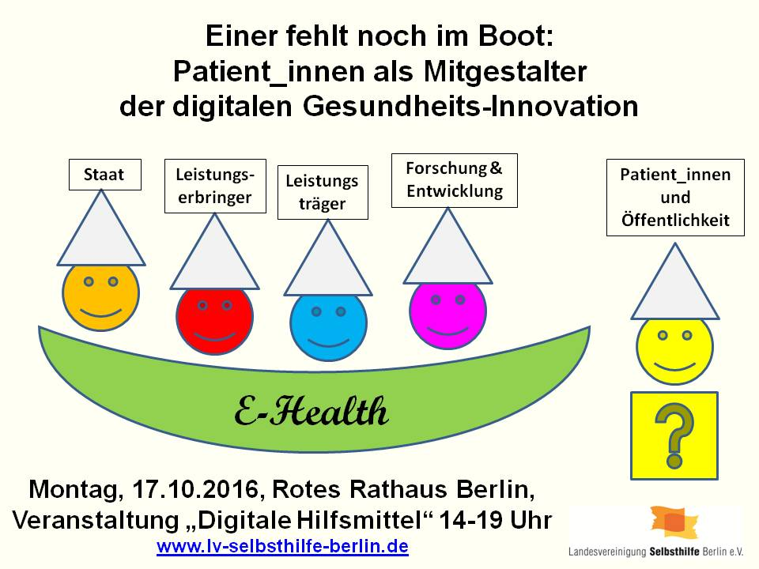
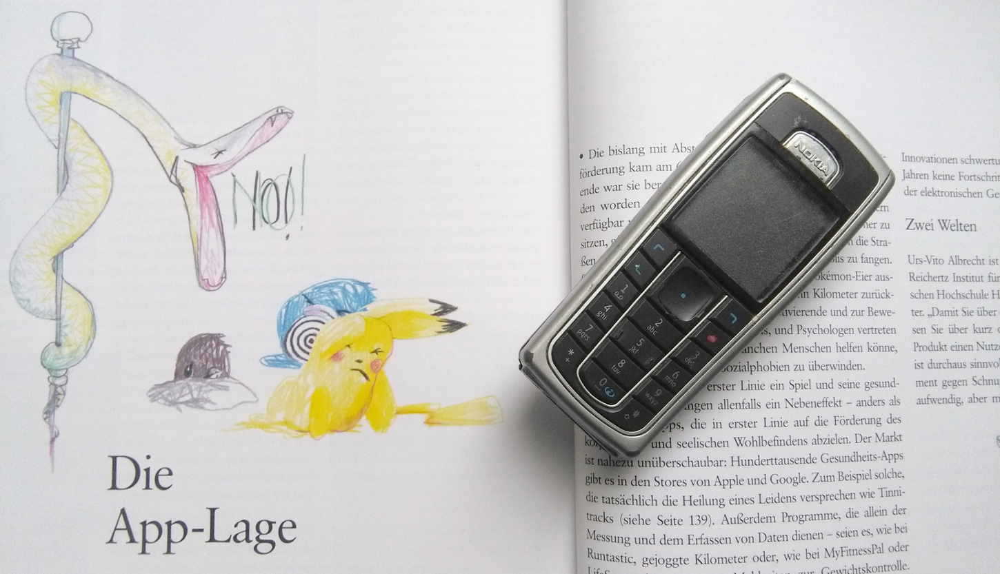

Was sind Gesundheits-Apps? Pokémon Go ist ein Videospiel. M-sense ist ein Medizinprodukt. Damit spannen diese beiden Apps beispielhaft das Spektrum möglicher digitaler Anwendungen mit Bezug zur Gesundheit auf.

Bei Pokémon Go können die Spieler nur punkten, wenn sie das Haus verlassen und sich draußen bewegen, manche laufen 10 Kilometer am Tag. Mit der [Migräne-App M-sense](https://www.m-sense.de/) können Betroffene eine durch den Arzt empfohlene, weitgehend automatisch geleitete Selbsttherapie nutzen und mitgestalten. Das Spektrum der Gesundheits-Apps reicht also von Spiele-Apps bis hin zu Medizin-Apps, dazwischen liegen Wellness-Apps, Fitness-Apps und Info-Apps, die dokumentieren und informieren. Diese breite »App-Lage« wird in der aktuellen »brandeins« mit einen Bericht über die verschiedenen Möglichkeiten ausgeleuchtet, wie Menschen, die unter bestimmten Krankheiten leiden, Apps heute schon nutzen.

https://twitter.com/christophkoch/status/786106333372219392

Nun wird auch auf zwei Veranstaltungen in Berlin versucht, etwas Ordnung in dieses breite Spektrum der Gesundheits-Apps zu bekommen. Zwei Fragen stehen Mittelpunkt: Brauchen wir ein Qualitätssiegel? Wie können Betroffene die Angebote mitgestalten?

## Zwei Welten: Qualitätssiegel und Mitgestaltung bei Gesundheits-App

Zum einem nimmt sich dem Thema »Gesundheits-Apps« ein [Fachgespräch](https://www.gruene-bundestag.de/termin/im-dschungel-der-gesundheits-apps-brauchen-wir-ein-qualitaetssiegel.html) der Bundestagsfraktion Bündnis 90/Die Grünen an, unter dem Motto: Im Dschungel der Gesundheits-Apps – brauchen wir ein Qualitätssiegel? Bei der Breite der Gesundheits-Apps von Spiele-Apps, über Wellness-Apps und Fitness-Apps zu Medizin-Apps brauchen wir wahrscheinlich eine ebenso breite Palette von Qualitätssiegeln.

Außerdem lädt zeitgleich die Landesvereinigung Selbsthilfe Berlin e.V [ins Rote Rathaus zu der Veranstaltung „Digitale Hilfsmittel“](http://lv-selbsthilfe-berlin.de/veranstaltungen/17-oktober-2016-digitale-hilfsmittel/) ein. Betroffene erfahren nicht nur, wie sie die digitale Gesundheitsversorgung nutzen, sondern auch wie sie diese mitgestalten können. Denn bei vielen Gesundheits-Apps fehlt einer im Boot: der Patient als Mitgestalter.

Gesundheits-Apps mitgestalten.

Wir sind bei beiden Verantstaltungen mit dabei. Denn wir sind überzeugt, die Themen »Qualitätssiegel« und »Mitgestaltung« gehören zusammen. Wir, das ist das Team von M-sense: vier Wissenschaftler aus den Bereichen Mensch-Computer-Interaktion, maschinelles Lernen, Biosingnalverarbeitung und Migräneforschung. Wir haben mithilfe eines [EXIST-Gründerstipendium](http://EXIST-Gründerstipendium)  an der Humboldt Universität zu Berlin die Migräne-App M-sense zusammen mit Betroffenen entwickelt und gestalten diesen gemeinsamen Prozess als Uni-Spin-Off weiter.

M-sense ist die einzige Migräne-App, die ein Medizinprodukt ist, wie auch die einzige Miräne-App, die systematisch durch Betroffene aktiv und in einen offenen Prozess mitgestaltet wurde und zukünftig weiter mitgestaltet wird. Beispielsweise haben wir mit einen Usability-Test mit Eye Tracking [M-sense im wahresten Sine des Wortes durch die Brille der Nutzerin betrachtet](https://scilogs.spektrum.de/graue-substanz/migraene-app-konzipieren-entwickeln-und-testen/).

Usability-Test einer Gesundheits-App in Verbindung mit Eye Tracking.

Bei den Themen Qualitätssiegel und Mitgestaltung treffen zwei Welten aufeinander – deren gegensätzliche Kulturen auch in dem Artikel in »brandeins« herausgearbeitet werden.

Um nur einen Aspekt hier im Blog anzusprechen: Unsere CE-Kennzeichnung als Medizinprodukt gilt als ein Qualitätssiegel. Bei genauerer Betrachtung sie ist erstmal eine sog. Konformitätserklärung von uns als Hersteller eines Medizinprodukts. Bei der Entwicklung eines Medizinprodukts und Abgabe dieser notwendigen Konformitätserklärung stoßen wir auf ein konzeptionell-strategisches Problem.

Wie können Hersteller Patienten aktiv bei der Entwicklung einbinden? Denn das heißt, nicht ein fertiges Produkt allein durch Fachkreise entwickelt auf den Markt zu bringen, sondern mit regelmäßigen Release-Zyklen auch optimal auf die Nutzer abzustimmen. Dazu brauche wir das Feedback vieler Nutzer. Alle Produkte der digitalen Revolution haben sich so entwickelt. Gleichzeitig müssen wir bei jeder technischen Erweiterung die Sicherung der Qualität als Medizinprodukt waren. Als Hersteller müssen wir auf die Frage achten, unter welchen Voraussetzungen funktionelle Erweiterungen an M-sense durchgeführt werden können, ohne dass unsere ursprüngliche Konformitätsbewertung als Medizinprodukt ungültig wird. Die Antwort auf diese Frage nach einem Qualitätssiegel bei aktiver Mitgestaltung der Betroffenen ist der Schlüssel zum Verständnis, wie Gesundheits-Apps heute entwickelt und morgen genutzt werden. Keine Frage: Wir stehen erst am Anfang der Gesundheits-Apps.

Das [erste digitale Angebot für Migräne auf einem Telefon](https://scilogs.spektrum.de/graue-substanz/die-erste-migraene-app/) lief über ein rein statisches Angebot der Dokumentation. Mit nur 128 × 128 Pixel dem Nutzer einen Mehrwert zu bringen, war vor den Zeiten des Smartphones beschränkt. Heute werden Smartphones zum Medizinprodukt. Und morgen?
