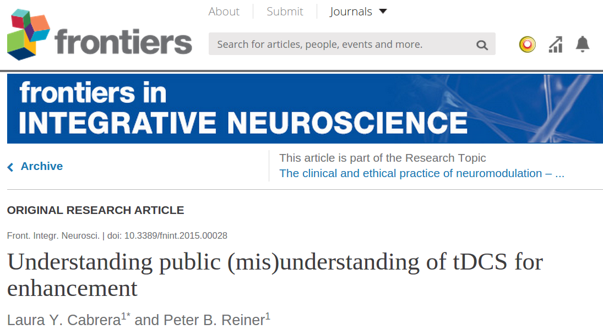

Eine neue wissenschaftliche Publikation gibt erste Einblicke in das öffentliche Verständnis bzw. Missverständnis von Enhancement durch neurotechnologische Verfahren. Ich habe die Arbeit begutachtet und will hier kurz darauf hinweisen.

Die zentrale Schlussfolgerung dieser explorativen Untersuchung ist, dass die öffentliche Wahrnehmung bezüglich der transkraniellen Gleichstromstimulation sich in den letzten Jahren verschoben hat. Es geht ein Trend weg von Missverständnissen hin zu einem „warnenden Realismus“.

Analysiert und verglichen wurden Kommentare in online Publikationen (Zeitschriften und Zeitungen) zwischen zwei Zeiträumen, einmal von August 2007 bis Mai 2013 und einmal von Mai 2013 bis August 2014, mit jeweils 13 bzw. 14 Artikeln, die zehn oder mehr Kommentare hatten. Somit gingen 248 bzw. 465 Kommentare in die Analyse ein.

Als Missverständnisse wurde z.B. Vergleiche der transkraniellen Gleichstromstimulation mit der Elektrokrampftherapie oder mit Elektroschockpistole angesehen. Während die Technologie reift, korrigiert sich auch ihr Bild in der Öffentlichkeit. So könnte man es zusammenfassen. Die Autoren weisen aber – in meinen Augen zurecht – auf den nötigen politischen Regulierungsrahmen hin, den der mediale Diskurs durchaus hilfreich unterstützen kann. (Es lohnt sich also, online Beiträge zu kommentieren!)

Hier ist der Referenz der Publikation:

Cabrera, L. Y., & Reiner, P. B. (2015). Understanding public (mis) understanding of tDCS for enhancement. Frontiers in Integrative Neuroscience, 9, 10. ([Link](http://journal.frontiersin.org/article/10.3389/fnint.2015.00028/abstract))  
   

