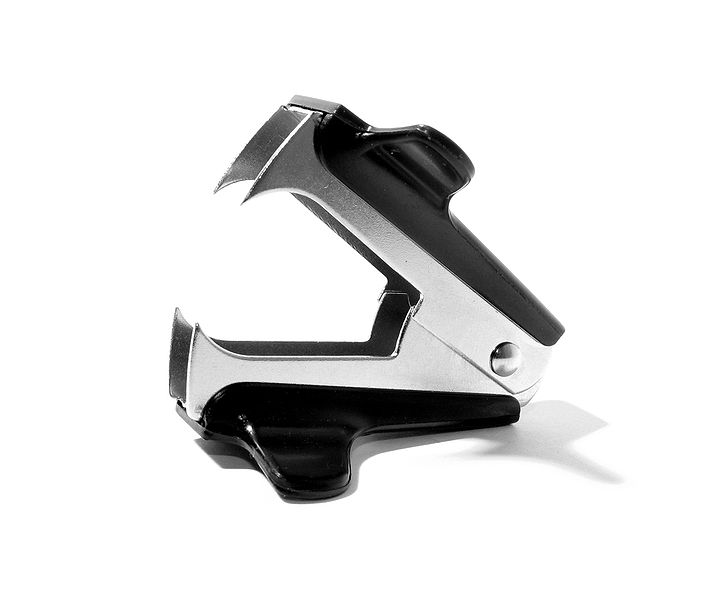
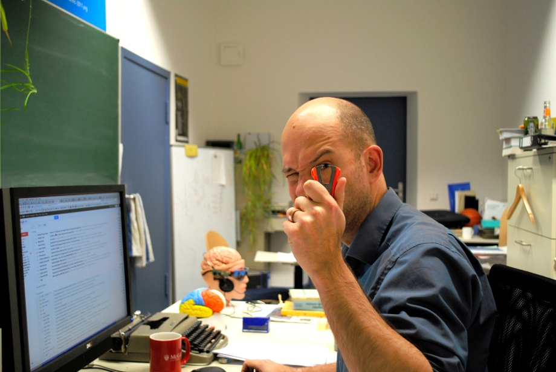
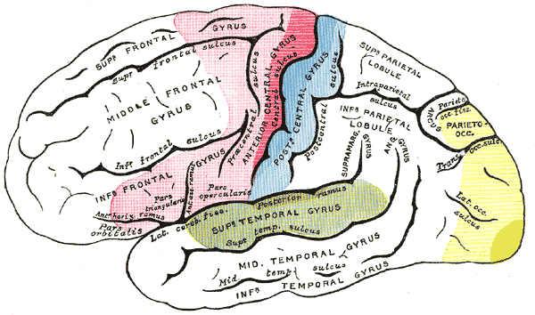
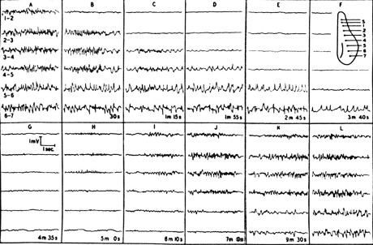

Das Gehirn gilt als ein Organ, das selbst schmerzunempfindlich ist. Es besitzt keine Nozizeptoren, die Schmerzrezeptoren. Kneifen Sie sich mal in die Haut am Ellbogen, dann wissen Sie was ich meine. Die ist dort auch schmerzunempfindlich. Dachte ich. Ich habe es mit einem Klammerentferner nochmal kräftig probiert und siehe da, es tut ja doch weh. Es blutet auch ein wenig. Offenfühlbar kommt es auf die richtige Technik an. So ähnlich ist es im Gehirn.

  
*Ich tue alles für die Forschung solange Klammern und Integralzeichen involviert sind.*

Woher man das weiß? Neugierig wie ich meine Haut am Ellbogen untersuchte, so hat auch ein Gehirnchirurg am offenen Gehirn von Patienten mit seinem OP-Besteck die Hirnrinde traktiert; die Patienten – bei vollem Bewusstsein – berichteten ihm von keinerlei Schmerzen, wohl aber die wunderlichsten Sinneseindrücke oder gar traumartige Situationen, komplexe Halluzinationen und längst vergessene Erinnerungen. (Migränepatienten kennen so was ganz ohne Chirurg; unter ihrer geschlossenen Schädeldecke läuft etwas anderes unnatürliches ab: die Migränewelle, *Spreading Depression* genannt.)

Dann das: stocherte der Chirurg hier, kribbelt der Unterarm. Stocherte er etwas weiter unten, kribbelte es am Handgelenk. Nun weiter (im Bild rechts, den blauen Pfad  hinunter):  Hand, kleiner Finger, Ringfinger, Mittelfinger, Zeigefinger, Daumen. Jetzt war die Extremität zu Ende, was würde kommen, er muss ungeheuer neugierig gewesen sein — siehe da, Nase und Lippen kribbelten hinterm Daumen. So entdeckte er den [Homunculus](https://scilogs.spektrum.de/blogs/blog/graue-substanz/2011-09-26/der-homunculus-ein-daumenlutscher). Aber nicht den Schmerz. Egal wie sehr der Chirurg auch zusticht oder gar elektrische Ströme durch eine spitze Nadel ins offene Hirn leitet. Kein Schmerz. Dass er auch einen Klammerentferner nutzte, kann ich mir nicht vorstellen, aber auch das hätte nichts gebracht.

## „Gehirnchirurgie ist ein grausamer Beruf“

„Gehirnchirurgie ist ein grausamer Beruf“, seufzte er daraufhin. Wer? Wilder Penfield. Das war 1921 und eigentlich wollte Penfield, der zu Lebzeiten als der größte lebende Kanadier bezeichnet wurde, bei den Patienten Epilepsie-Herde aufdecken und sein Seufzen war der Frustration über das Scheitern geschuldet. Erst mit einen von seinem Mitarbeiter Herbert Henri Jasper selbstgebauten Elektroencephalographen (EEG) sollte Penfield Ende der 1930er Jahre Fortschritte erzielen. Übrigens, sein größter Konkurrent, Hallowell Davis, hatte 500 km weiter südöstlich von Montreal, in Bosten an der Harvard Medical School, auch so einen Prototypen des Elektroencephalographen, den ersten Sechs-Kanal-Tintenschreiber, ein feines Gerät. Durch diese Kanäle, gemessen über sieben Elektroden (1-2, …, 6-7), platziert im gleichen Abständen entlang einer Geraden, beginnend bei einer achten Stimulationselektrode (S) auf der Hirnrinde, das Versuchskaninchen war hier ein eben solches, sah sein Mitarbeiter, Aristides Leão, plötzlich die erste Migränewelle vom Ort der Stimulation (S) loslaufen, in Form einer Unterdrückung des EEG-Signals [1].

  
*Keine Epilepsie-Herd-Prämie, dafür Migränewelle entdeckt.*

10 Minuten später war der still sich ausbreitende Spuk wieder vorbei. Leão nannte es so wie es sein Tintenschreiber aufzeichnete: *spreading depression of electroencephalographic activity* kurz und eingedeutscht: Spreading Depression. Auch Leão war eigentlich auf der Suche nach einem Epilepsie-Herd, vermute aber sogleich aufgrund der langsamen Migration der Welle, die Ursache der neurologischen Migränesymptome entdeckt zu haben. Das langsam sich ausbreitende Kribbeln entlang der Körperoberfläche und die im Gesichtsfeld sich fortbewegenden Sehstörungen konnte man mit diesem Phänomen erklären [2]. Ein Zufallsfund also, jedoch sogleich richtig interpretiert. Das alles ist teils lang vergessene Geschichte.\*

## Schmerz ohne ersten Wohnsitz

Heute kann man mit nichtinvasiven Techniken, wie der transkraniellen Magnetstimulation, kurz TMS, die Hirnrinde stimulieren und findet immer noch kein funktionelles Zentrum als primäres Areal in der Hirnrinde welches Schmerz kodiert. Stattdessen erfand man den schicken Terminus [Schmerzmatrix](https://scilogs.spektrum.de/blogs/blog/graue-substanz/2012-02-05/die-schmerzmatrix), ein delokalisiertes Netzwerk verschiedener kortikaler Areale und anderer Kerngebiete im Gehirn bis hinunter in den Hirnstamm. Dieses Netzwerk kann man als Graph durch eine Nachbarschaftsmatrix repräsentieren und in dieser die Dynamik studieren. In der Matrix, nicht in einem einzelnen primären kortikalen Areal, wohnt der Schmerz ohne je sesshaft zu sein. Schmerz ist Dynamik im Netzwerk. Oder noch kürzer: Schmerz ist Physik.

1987 gelang – misslang trifft es sicher besser – Raskin et al. eine klinische Studie [3]. 15 Patienten, denen eine Stimulationselektrode tief ins Gehirn getrieben wurde, ins zentrale Höhlengrau und in den sensorischen Thalamus, beides Spalten in der Schmerzmatrix, jenes wird nicht minder schön auch periaquäduktales Grau genannt, eine Ansammlung grauer Substanz um die „Wasserleitung“,  den länglichen, feinen Verbindungsgang zwischen dem dritten und vierten Ventrikel, … wo war ich, ach ja, diese 15 Patienten also entwickelten Migräne-typische Kopfschmerzen. Nochmal: Stimulationselektrode tief an eine bestimmte Stelle ins Hirn gesetzt verursacht Kopfschmerzen, die man ohne diese Behandlung als Migräne bezeichnet hätte. Das. ist. erstaunlich. Schmerz allgemein: im Bauch, in den Händen oder sonst wo, mag keinen festen Wohnsitz in der Dachterrasse haben, wo man ihn lange vermutete, doch Migränekopfschmerz (und wohl auch Clusterkopfschmerz) scheint im Souterrain neben der Wasserleitung eingemietet.

Schon 1979 begann eine ähnliche Studie [4], die aber erst 18 Jahre später, 1997, abgeschlossen und publiziert wurde. Dort ähnliche Resultate. Von 43 Patienten, denen wieder eine Stimulationselektrode im zentralen Höhlengrau implantiert wurde, entwickelten 12 Kopfschmerzen.

Bei dieser Art der Tiefenhirnstimulation kommt es auf viele noch unklare Faktoren an. Die Migräne-typischen Schmerzen entwickelten sich erst über die Zeit, im Schnitt erst nach zwei Monaten. Man kann den Migräneschmerz oder gar eine Attacke also nicht einfach durch wenige elektrische Impulse einschalten. Man kann es noch nicht. Was ich aber eigentlich will, ist natürlich genau das Gegenteil, kann ich eine Attacke zum Beispiel mit Hilfe der TMS ausschalten? Wenn ja, welches Stimulationsprogramm setzt die Dynamik in der Schmerzmatrix optimal auf normal zurück? Die Fragen sind noch offen.

Wieder führte also unter anderem ein Zufallsfund zu der anderen heute großen Theorie der Migräne, die man als Migränegenerator im Hirnstamm bezeichnet. Ein Mustergenerator, der die Dynamik in der Matrix kontrolliert und wohl auch episodisch außer Kontrolle geraten kann.  Für die neuronale Aktivität bei Migräne im Hirnstamm findet man heute auch weitere Belege durch nichtinvasive Bildgebung. Ebenso auch für Aktivität in Form einer Spreading Depression bei Migräne mit Aura. Beide Ätiologien könnten parallel existieren. Ich bin zuversichtlich, dass in den nächsten Jahren durch die moderne Medizintechnik und klinische Studien am Menschen viel weiter aufgeklärt werden kann.

„Gehirnchirurgie ist ein grausamer Beruf. Wenn ich nicht das Gefühl hätte, es wird anders werden in meiner Lebenspanne, ich würde es hassen.“ So beendete Penfield seine Aussage. Er starb 1976. Ich denke, das war zu früh.

**Literatur**

[1] Leão AAP, Spreading depression of activity in the cerebral cortex. *J Neurophysiol* **7**,359–390, 1944.

[2] LeaoAAP, Morrison RS, Propagation of spreading cortical depression. *J Neurophysiol* **8**:33-46, 1945.  \*

[3] Raskin NH, Hosobuchi Y, Lamb S, Headache may arise from perturbation of brain. *Headache* **27**:416-420, 1987.

[4] Veloso F, Kumar K, Toth C, Headache secondary to deep brain Implantation, *Headache* **38**,507-515, 1998.

**Fußnote**

\* Zitat aus dem Artikel von Leao, da es immer wieder vergessen wird, dass schon 1945 Migräne und Spreading Depresssion in einem Zusammenhang gebracht wurden.

> Much has been written about vascular phenomena both in clinical epilsy and the presu mably related condition of migraine. The latter disease with the marked dilatation of major blood vessels and the slow march of scotomata in the visual or somatic sensory sphere is suggestively similar to the experimental phenomenon here described, in spite of the fact that known scotomata are still felt to be vasoconstrictor in nature.

© 2012, Markus A. Dahlem
