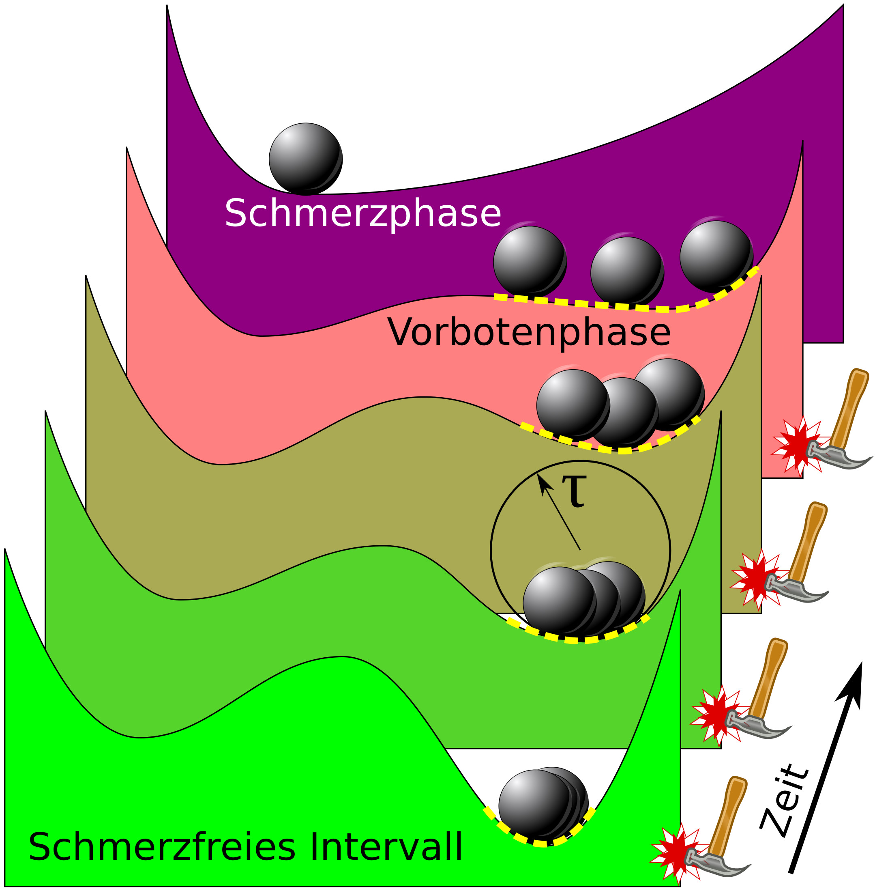

Einen neuen Mechanismus, nämlich wie bei Migräne Auslöser und Symptome der Erkrankung ununterscheidbar verschmelzen können, schlagen wir jetzt in der Fachzeitschrift der Internationalen Kopfschmerzgesellschaft „Cephalalgia“ vor. Wir hoffen damit auch einer tieferliegenden Ursache näher zu kommen.

M.A. Dahlem, J. Kurths, M. D. Ferrari, K. Aihara, M. Scheffer, and A. May, Understanding Migraine using Dynamical Network Biomarkers, online first, Cephalalgia, (2014). [doi:10.1177/0333102414550108](http://dx.doi.org/10.1177/0333102414550108)

Ähnlich den hormonell bedingten Heißhungeranfällen in der Schwangerschaft kann Heißhunger auch bei Migräne auftreten und zwar in einer der Schmerzphase einer Migräneattacke viele Stunden vorausgehenden Vorbotenphase. Man verspürt dann z.B. Lust auf Schokolade, isst diese und bekommt kurz darauf einen Migräneanfall. Die Schokolade ist wie die Gurke Symptom nicht Trigger, denn der Kopfschmerz ist längst in seiner „pränatalen“ Entwicklung.

## Vermeintliche Auslöser: Schokolade, Licht, Sport und mehr

In dieser Vorbotenphase, die bis zu 24 Stunden den Kopfschmerzen vorausgehen kann, sind Betroffene eventuell auch besonders lichtempfindlich, so dass selbst relativ normale Lichtverhältnisse als äußert grell empfunden werden können. Auch dieses subjektiv grelle Licht ist dann, wie die Lust auf Schokolade, nicht Auslöser sondern ein Symptom.

Oder der eigenen Körper ~~scheint~~ ist† in hohe Leistungsbereitschaft versetzt und man betätigt sich sportlich. Etwas später kommt ein Migräneanfall. Auch die hohe körperliche Aktivität ist dann nur Symptom nicht Auslöser.

Diese Liste ließe sich sehr lange fortsetzen, denn eine Vielzahl von angeblichen Auslösefaktoren der Migräne sind bekannt. Es betrifft hormonelle, emotionelle, Ernährungs- und weitere physiologische Veränderungen. Schokolade, Licht und körperliche Aktivität gehören dabei zu den Klassikern, die nachweislich mit Auslösern verwechselt werden.

## Werden Migäniker von ihrer Erkrankung ferngesteuert?

Gibt es also gar keine Auslöser bei Migräne? Sind Betroffene gar ihres freien Willens völlig beraubt, werden von ihrer Erkrankung gezwungen Schokolade zu essen, Sport zu treiben und sie können ihren Sinnen nicht mehr trauen? Beides stimmt so auch wieder nicht oder zumindest nur bedingt. Migäniker sind von ihrer Erkrankung nicht ferngesteuert, die Erkrankung scheint vielmehr zeitweise und nur in einem Teil eines sogenannten „resting state networks“ im Gehirn ein gewisses „Eigenleben“ zu führen.

Laut eines neuen Mechanismus‘, den wir in der oben zitierten Fachzeitschrift jetzt vorschlagen, gibt es Auslöser, allerdings werden sie nur wirksam in der Vorbotenphase und sind außerhalb dieser Phase ungefährlich. Gleichzeitig verschmelzen diese Auslöser mit den auftretenden Vorbotensymptomen. Was potenter Auslöser ist, ist auch gleichzeitig verknüpft mit einem Vorbotensymptom. Es erscheint in der Tat perplex: Eine klare Unterscheidung zwischen Symptom und Auslöser ist gar nicht mehr sinnvoll zu definieren!

Die Illustration unten erklärt diesen Mechanismus stellvertretend durch eine Kugel in einer Hügellandschaft. Das Auftreten großer Schwankungen symbolisiert die Vorbotenphase. Diese Schwankungen stellen die Vielfalt hormoneller, emotioneller, Ernährungs- und physiologischer Veränderungen dar. Sie können in dieser Form, also mit großer Amplitude, nur nahe an einem sogenannten Kipppunkt auftreten. Das zeichnet die Vorbotenphase der Migräne aus. In dieser Phase ist man dann auch für Auslöser sehr empfindlich, jedoch bedarf es diese gar nicht mehr. Denn der eintretende Kipppunkt ist längst programmiert. Dieser unweigerliche Kipppunkt stellt den Übergang von dem noch schmerzfreien Intervall zur Kopfschmerzphase bei Migräne dar. Bei einem Kipppunkt-Mechanismus treten zwangsläufig Frühwarnhinweise auf, also eine Vorbotenphase mit charakteristischen Symptomen und auch mit besonderer Anfälligkeit für Auslöser.

Es war lange bekannt, dass Vorbotensymptome häufig als Auslösefaktoren missverstanden werden und dass diese Auslösefaktoren meist zumindest nicht wirksam sind, manchmal aber anscheinend doch. Die Kipppunkt-Theorie löst das plausibel auf.

## Vorhersagen

Diese Kipppunkt-Theorie macht Vorhersagen: die Schwankungen der Vorbotenphase sollten objektiv messbar sein und würden so als erster klinischer Indikator (Biomarker) einer Migräneerkrankung dienen. Bisher war nicht klar, wo die Vorbotensymtome herrühen. Trifft die Kipppunkt-Theorie zu, entstammen sie alle – trotz ihrer Vielfalt – aus einem einzigen Untersystem des Gehirns. Dieses Untersystem weist nicht nur große Schwankungen in der Aktivität auf. Es ist außerdem gekennzeichnet durch starke Korrelationen dieser Aktivität in verschiedenen Arealen oder Kerngebieten. In der Tat wird das Untersystem als Subnetzwerk gerade erst funktionell definiert durch diese starken Korrelationen. Es ist also ein Untersystem, das sich nicht notwendigerweise strukturell anatomisch auszeichnet. Grundsätzlich wird in der Gehirnforschung zwischen struktureller Konnektivität und funktioneller Konnektivität unterschieden. Beides zusammen ergibt das Konnektom. Es gibt noch ein drittes vorhergesagtes Kennzeichen, nämlich eine kritisch verlangsamte Dynamik in diesem Untersystem.

Zusammengefasst ist die Vorhersage also, dass bei Migränikern ein besonderer Teil des funktionellen Konnektoms existiert, in dem vor den eigentlichen Kopfschmerzen korrelierte, langsame und hochamplitudige Schwankungen auftreten.

Diese vorhergesagte Auffälligkeit im funktionellen Konnektom bei Migränikern ist ein Biomarker, ein sogenannter dynamisch-vernetzter Biomarker. Ihn gilt es jetzt klinisch nachzuweisen. Das geht, weil wir nun wissen wonach wir suchen. Messungen im Ruhezustand („resting state“) müssen vorgenommen werden und dieses „resting state network“ verändert sich in der Vorbotenphase. Würde solch ein Biomarker nachgewiesen, führt er uns, so die Hoffnung, auch zu einem besseren Verständnis der hinter einer Migräneattacke liegenden Fehlfunktionen.

PS: Heute war dazu auch ein Bereicht in der Berliner Zeitung:  „[Migräne ist so komplex wie der Klimawandel](https://www.hu-berlin.de/pr/medien/publikationen/regelmaessig/blz/2014/blz-20141029.pdf)“

## Fußnote

† Wie in dem [Kommentar](https://scilogs.spektrum.de/graue-substanz/gurke-machen-nicht-schwanger/#comment-9955) angemerkt wurde, ist hier das Verb „*scheint“* wirklich falsch oder zumindest irreführend. Das ist ein interessanter Aspekt aus gleich mehreren Gründen. Zum einen gibt es keine Grund hier von einer subjektiven Einschätzung zu reden (anders etwa bei der Beurteilung, ob Licht grell ist oder nicht). Zum anderen deutet hohe Leistungsbereitschaft und folgende proaktive Maßnahmen auf eine erhöhte neuronale Aktivität in dem dorsolateralen Bereich eines Kerngebietes im Hirnstamm hin, nämlich im periaquäduktalen Grau (PAG). Wenn man sich im Anfall dann z.B. in ein ruhiges, dunkles Zimmer zurückzieht, korreliert dies mit dem ventrolateralen Bereich dieses Kerngebietes [siehe: K. A. Keay and R. Bandler, “[Parallel circuits mediating distinct emotional coping reactions to different types of stress](http://www.ncbi.nlm.nih.gov/pubmed/11801292),” Neurosci. Biobehav. Rev. 25, 669–678 (2001)]. Hier wandert also im Hirnstamm Aktivität beim Kippprozess.
