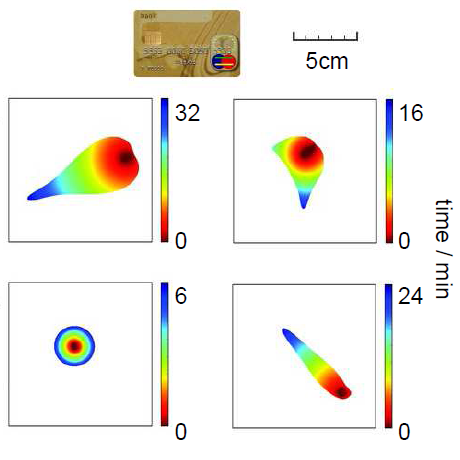

Wer nach "[Tiermodell für Epilepsie](http://www.google.com/search?q=%22Tiermodel+f%C3%BCr+Epilepsie)" und "[Tiermodell für Migräne](http://www.google.com/search?q=%22Tiermodell+f%C3%BCr+Migr%C3%A4ne%22)" bei Google sucht, bekommt in der Trefferquote große Unterschiede: 60 gegenüber 4 Treffern oder ein Verhältnis 15:1. Die gleiche Suche mit entsprechenden englischen Suchbegriffen "*Animal models of …*" ergibt noch einen Unterschied von 9:1, nur sind es gut 10 000 Treffer allein für die Suche nach "*… migraine*".1

**Was ist ein Tiermodell für Migräne?**

Nach der Mittagsfütterung kriegte Frau Maus Pogge ihre Migräne. Migräne sind Kopfschmerzen, auch wenn der Forscher diese seiner Maus im Labor gar nicht ansieht. Fragen kann er die Maus nicht.2

Muss er sie fragen? Eigentlich ja.  Denn Migräne ist eine Krankheit dessen Diagnose symptombasiert erfolgt. Das allein ist noch kein Problem. Aber die Symptome einer Migräne sind für Mitmäuse und Mitmenschen nicht klar sichtbar. Neuronale Korrelate, wie ein auffälliges EEG, gibt es nicht.

Auch oder gerade deswegen ist die Krankheitsursache bei Migräne noch weitgehend unbekannt.

Gäbe es sichtbare Symptome oder neuronale Korrelate, könnten Forscher versuchen diese Fehlfunktion bei Frau und Herrn Maus auszulösen.  Bei Epilepsie sind sowohl objektive Symptome, wie ein Krampfanfall, als auch neuronale Korrelate, wie eine abnormale Synchronizität im EEG, sichtbar und so vergleichbar. Es gibt deswegen Tiermodelle, die zunächst auf ihre Entsprechung hin geprüft werden. Erst danach können neue Therapieansätze an diesem *Modell* getestet werden.

Haben Sie sich oben gefragt, wohin denn nun zumindest die 4 bzw. 10 000 der Suchtreffer für "Tiermodell für Migräne" zeigen? Gleich der erste geht zur Süddeutschen Zeitung, ein Bericht von Fabian Seyfried von vor vier Jahren: "[Warum Frauen öfter der Kopf schmerzt](http://www.sueddeutsche.de/leben/migraene-warum-frauen-oefter-der-kopf-schmerzt-1.104756). Dies wird so beantwortet:

> Liegt es an Hormonen, den Genen oder der Durchblutung? Alles falsch, sagt das Team um Andrew Charles von der University of California: Dass Frauen häufiger unter Migräne leiden als Männer, liegt daran, dass ihr Gehirn leichter erregbar ist.
>
> Zumindest bei weiblichen Mäusen breiteten sich bestimmte Wellen von Nervenaktivität schneller aus, als dies bei den männlichen Nagern der Fall war. …
>
> Das untersuchte Phänomen nennt sich kortikal ausbreitende Depression (CSD) und gilt als **brauchbares Tiermodell für Migräne**. Ähnliche Aktivitätsmuster im Gehirn von Menschen können bei den Betroffenen die pulsierenden Kopfschmerzen auslösen.   
>  (Hervorhebung durch Fettdruck von M.A.D.)

Zu dem Unterschied zwischen Frau und Herrn Maus komme ich einmal in einem extra Blogbeitrag. Das erwähnte Tiermodell, die kortikal ausbreitende Depression, ich nenne sie meist *Cortical Spreading Depression* (CSD), ist eine neuronale Welle, die recht gemütlich [durch die Furchen der Hirnrinde](http://www.brainlogs.de/blogs/blog/graue-substanz/2010-08-23/das-gehirn-ist-ein-torus) (Cortex) wandert und dabei nur ca. wenige Millimeter pro Minute voran kommt. Während einer 20-minütigen, speziellen Migränephase durchwandert die Cortical Spreading Depression so ca. 20 Quadratzentimeter.

Das entspricht einem Hirnrindengebiet, das etwa halb so groß wie eine Kreditkarte ist, jedoch normalerweise unvergleichlich nützlicher. Nur eben nicht in der Zeit während die CSD in diesem Gebiet die Gehirnaktivität vollständig unterdrückt; daher kommt der Name *Cortical Spreading* *Depression* (kortikal ausbreitende Unterdrückung), das hat nichts mit der Erkrankung Depression zu tun. Die Welle wandert, auch das ist eine interessante Kennzahl, von ihrem Entstehungsort etwa 6 Zentimeter weit – 20 Quadratzentimeter, 6cm. Da braucht es große Mäuse.

Der erste Suchtreffer für "*animal models of migaine*" führt zu einem Übersichtsartikel von Katharina Eikermann-Haerter und Michael Moskowitz, der mit folgender Zusammenfassung beginnt:

> *First generation migraine models mainly focused on events within pain-generating intracranial tissues, for example, the dura mater and large vessels, as well as their downstream consequences within brain. Upstream events such as cortical spreading depression have also been modeled recently and provide insight into mechanisms of migraine prophylaxis. Mouse mutants expressing human migraine mutations have been genetically engineered to provide an understanding of familial hemiplegic migraine and possibly, by extrapolation, may reflect on the pathophysiology of more common migraine subtypes.*  
>  [Die erste Generation der Migräne-Modelle konzentriert sich hauptsächlich auf Ereignisse die den Schmerz im intrakraniellen Gewebe erzeugen, zum Beispiel, in der Dura mater und in den großen Gefäßen, sowie deren nachgeordneten Konsequenzen im Gehirn. Vorhergehende Ereignisse wie die Corticale Spreading Depression wurden ebenfalls kürzlich modelliert und geben einen Einblick in Mechanismen der Migräne-Prophylaxe. Mausmutanten wurden gentechnisch mit menschlichen Migräne-Mutationen verändert, um ein Verständnis der familiären hemiplegischen Migräne zu gewinnen und möglicherweise kann dies durch Extrapolation die Pathophysiologie der Migräne häufiger Subtypen auch reflektieren. (Übersetzung M.A.D.)]

Auch hier kommen, wie zuvor in der SZ, die Gene und die Durchblutung vor – und das "*upsteam event*" Corticale Spreading Depression. Die Einteilung in *upstream* und *downstream*, hier mit vorhergehende bzw. nachgeordneten übersetzt, ist bedeutend.

Die Gene stehen, wenn sie mitwirken, immer *upstream*, am Ursprung also. Auch wenn heute [die Genetik der Migräne](http://www.brainlogs.de/blogs/blog/graue-substanz/2010-10-01/genetik-der-migraene) nicht nur für den erwähnten, sehr seltenen Subtyp (familiäre hemiplegische Migräne) sondern für die Haupttypen besser bekannt ist, hilft dies nicht unbedingt weiter. Natürlich kann (und wird) nun mit Hilfe gentechnischer Methoden das Erbmaterial von Versuchstieren verändert. Gefunden hat man für die Haupttypen der Migräne allerdings nur multifaktorielle Merkmale, also eine verzwickte Wechselwirkung mehrerer Gene mit zusätzlichen Umweltfaktoren und zudem ist Migräne eine episodische Erkrankung. Wann also Frau Maus Pocce (nun gentenisch verändert) ihre Migräne hat, weiß der Forscher immer noch nicht.

Einen anderen Zugang gewinnt man in Tiermodellen durch massive Gefäßerweiterungen, die Kopfschmerzen als Symptom auslösen, so wie Krampfanfälle durch Anschluss an einer Autobatterie ausgelöst werden können. Mit der Krankheitsursache der Migräne (oder Epilepsie) haben aber diese nachgeordneten (*downstream*) Ereignisse wenig zu tun. Denn nicht die Autobatterie sondern das wirkliche "*upstream event*" sollte verhindert oder unterdrückt werden.

Morgen auf dem [15. Kongress der Internationalen Kopfschmerzgesellschaft (IHC2011)](http://www2.kenes.com/ihc2011/sci/Pages/Timetable.aspx) in Berlin treffe ich die oben [genannten Wissenschaftler und einige mehr](http://www2.kenes.com/ihc2011/sci/Pages/Speakers.aspx). Zusammen mit zwei Kollgen organisiere ich dort ein Sympoisum "*[Migraine and Spreading Depression](http://www.sessionplan.com/ihc2011/psIPlanner.aspx?t23k9fhcboss3t33du9h5s5o81)*" in dem es neben der Modellierung auch um Therapie und Genetik geht.

Um Modelle geht es gleich zweimal. Neben den Tiermodellen stelle ich ein andersartiges Modell der Migräne vor – ein mathematisches. Mit Hilfe dieses mathematischen Modelles sagen wir voraus, dass die oben erwähnten 20 Quadratzentimeter, d.h. die vollständige Ausbreitung DER Corticale Spreading Depression und dessen genaue Form durchaus eine große Rolle spielen kann.

Nach einer Keimbildung (rot, s.o.), die wir zunächst untersucht haben, durchläuft die Cortical Spreading Depression das durch die Regenbogenfarben gekennzeichnete Gebiet und kollabiert anschließend (blau). Diese Ausbreitung kann laut Modell unterschiedlich weit und unterschiedlich lang laufen. Oben gezeigt sind Raumzeitmuster die von 6 bis 32 Minuten andauern. Drei unterschiedliche Muster der Corticale Spreading Depression, so unsere modellbasierte Hypothese, entsprechen zwei Haupttypen der Migräne und einer seltenen Unterform. Auf ein kleines Mäusegehirn, es ist ganz unten rechts, können solche Muster nicht experimentell skaliert werden.3

   
 Noch ist die Bühne leer.

Wenn also, so wie unser Modell es vorhersagt, die Kopplung der Corticale Spreading Depression *downstream* an den Kopfschmerz vor allem eine Frage der räumlichen Ausbreitung ist, dann müssen wir bildgebende Verfahren beim Menschen einsetzen, um diese Vorhersage zu überprüfen. Auch das haben wir bereits [getan und erste Vorhersagen wurden bestätigt](http://www.brainlogs.de/blogs/blog/graue-substanz/2009-12-01/migraenewellen). Eine gute Nachricht für Mäuse und Menschen.4

  
 Noch ist die Bühne leer. Gut tausend Forscher werden erwartet.

**Fußnoten**

**Nachtrag 27.6.2010**

Heute kam auf nature.com unter der Rubrik [Spoonfull of medicine – musing on science, medicine and politics](http://blogs.nature.com/nm/spoonful/2011/06/new_animal_model_of_migraine_h.html) ein Bericht über ein Mausmodell der Migräne.

1 Andere Kombinationen führen nur zu leicht veränderten Resultaten. Ein Fazit ist: wir finden auf deutschen Webseiten bei weitem nicht die Informationen, die wir in Englisch bekommen. Dem entgegenzuwirken, auch dafür sind deutsche Wissenschaftsblogs da. Und deutsche Wissenschaftler, die zwar zurecht überwiegend in Englisch publizieren, sind zusätzlich gefordert um gerade bei heiklen Themen in die Öffentlichkeit  hineinzuwirken. Mich hat die magere Ausbeute und dass krasse Missverhältnis zum englischen Suchbegriff wirklich überrascht. "Tiermodell der Migräne" ergeben z.B auch nur 28 Treffer. Das Informationsangebot ist also sehr eingeschränkt. Dabei wäre es gesellschaftlich durchaus interessant zu erfahren, wie Migräneleidende zur Tiermodellen für Migräne stehen.

2 Man kann Mäuse im gewissen Sinne schon "fragen", d.h. aus deren Verhalten Rückschlüsse ziehen. Ist die Maus lichtscheut, ist sie wenig aktive und so weiter.

3 Das ist ein typischer Ansatz aus der Physik: wie Phänomene skalieren, wenn man sie auf größeren oder kleineren Raumskalen betrachtet. Die Zeitangaben in Minuten in der Abbildung und im Text kommen auch aus einer Skalierung.

4 [Gorillas können hier nachlesen.](http://www.wissenslogs.de/wblogs/blog/libertarian/allgemein/2011-06-09/peter-singer-immer-noch-persona-non-grata)

**Link**

Kurze URL zum Beitrag:

http://goo.gl/FUdWD
