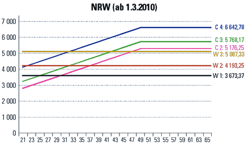

Gut das sie weg ist, die Billigprofessur, denn sie diente leider auch als zynische Argumentationsfigur, Wissenschaftler im Mittelbau als befristete Billigforscher zu halten. Auf einer vollen Stelle in der Entgeltgruppe E13 oder gar mit E14 bis E15 verdienen Mitarbeiter im Mittelbau ja mehr als ein Professor, gäbe es da nicht halbe Stellen, Lehraufträge und andere Auswege aus diesem Dilemma.

In der Tat, promovierte Mitarbeiter an der TU Berlin erhalten Brutto 4361,59€ monatlich in der 5. Stufe in E13, eine Stufe, die bei einer Promotion 2005 heute erreicht ist. Ein Professor hat meist sogar mehr als 7 Jahre seit seiner Promotion hinter sich. Er bekommt letztlich ja auch nur scheinbar weniger, denn er ist verbeamtet, so dass sein Grundgehalt von 3890,03€, welches nun in Karlsruhe zurecht verurteilt wurde, oder 4.027,35€ in Berlin (W2) mit den Gehältern im öffentlichen Dienst nicht direkt vergleichbar ist. Dem Zynismus aber, mit dem in den Hochschulen leider oft halbe Stellen und Lehraufträg als angemessen bezeichnet werden, tut dies kein Abbruch.

  
*Nicht nur C überholte W schnell, auch E13 zieht vorbei an W2.*

Tarifabschlüsse des öffentlichen Diensts werden so für viele an den Hochschulen hinfällig und das in einem Land, das sich gerne als Bildungsrepublik sieht.

> Die Hochschulen können also nicht länger von der Vorstellung ausgehen,… daß eine kleine Anzahl von Ordinarien riesige Einzelgebiete in Forschung und Lehre verantwortlich vertritt, … Wir werden die Öffentlichkeit darüber aufklären, was an den Universitäten wirklich geschieht und inwiefern es dabei nicht nur um die Freiheit der Wissenschaft, sondern auch um den freiheitlichen Staat geht. Wir werden dabei insbesondere die jüngeren Wissenschaftler gegen die entwürdigenden Abhängigkeiten verteidigen, in die sie zu geraten drohen.

Das klingt jetzt endlich wieder hochaktuell, denn zurecht wird nach der dritten Niederlage der Hochschulreform von 2002 nun der Blick auf die gesamte Reform und deren Ziele gerichtet. Ob eine Reform überhaupt in dieser Form nötig war, lässt sich lange hin und her diskutieren. Doch sahen zumindest in einem Punkt wohl alle Beteiligten an einer Verbesserung Bedarf: bei der Diversifikation der wissenschaftlichen Karrierewege gegen Ende und nach der Qualifikationsphase. Und nicht zu vergessen: mehr Transparenz auf diesen neuen Wegen.

In dieser zentralen und unumstrittenen Zielsetzung ist die Reform grandios gescheitert, was aus meiner Erfahrung aber weniger an der Gesetzgebung liegt als an deren Handhabung vor Ort. Das war allerdings auch leicht vorauszusehen.

Das Zitat zu Beginn stammt aus dem [Gründungsaufruf vom Bundes Freiheit der Wissenschaft](http://bund-freiheit-der-wissenschaft.de/) von 1970. Wir sollten nicht vergessen, dass heute jeder Reform schon mal eine Reform vorausging, die genau zu analysieren sich gerade dann lohnt, wenn deren alte Ziele damals längst übereinstimmten mit den aktuellen heute, diese jedoch schon einmal gescheitert sind. Wir brauchen folglich nicht einfach eine dritte Reform sondern dazu den Willen vor Ort die Dinge in die Hand zu nehmen und zu ändern. Denn daran scheitert es bislang.

Jürgen Kaube erinnert dazu an die Verantwortung der Professoren und beschreibt [in der F.A.Z. die „Schieflage“ des ganzen Hochschulsystems](http://www.faz.net/aktuell/feuilleton/professorenbesoldung-zulage-aus-karlsruhe-11649316.html) treffend – bis auf einen Punkt, der in diesem Zusamenhang weiter hinterfragt gehört:

> Die lange Ausbildungszeit wiederum ist einerseits in vielen Fächern dysfunktional, weil die Leute noch mit vierzig zum „Nachwuchs“ deklariert werden und sich auf Assistentenstellen „qualifizieren“, obwohl sie dort längst mehr an Forschung leisten als ihre Vorgesetzten. Sie ist andererseits eine honorierte Zeit, und der Skandal liegt wohl eher darin, wie viele Forscher auf „halben Stellen“ älter werden. Das ganze System der universitären Karriere ist verlogen und sinnwidrig, gerade weil es auf die späte, große Entfristung zuläuft, anstatt Dauerstellen unterhalb des Professorentitels zu schaffen.

Sind halbe Stellen oder auch zweidrittel und dreiviertel Stellen wirklich der eigentliche Skandal? Ich denke, Kaube nennt hier ein Symptom aber leider nicht Ursache des Skandals. Der Skandal ist, dass es seit den 1970er Jahren noch immer nicht gelungen ist, Diversifikation und Transparenz in die wissenschaftlichen Karrierewege zu bringen. Das stattdessen auch mit geteilten Stellen gearbeitet wird und dass seit einigen Jahren das Gewissen – sollte es sich denn je zu Wort gemeldet haben – mit dem Vergleich zum W-Gehalt beruhigt werden konnte, ist ein Symptom, aber nicht die Ursache des „verlogenen und sinnwidrigen“ Systems des Karriereweges – ja singular.

Diese Graphik, [die ich erst neulich hier zeigte](https://scilogs.spektrum.de/blogs/blog/graue-substanz/2012-01-29/wissenschaftszeitvertragsgesetz-wisszeitvg)1, verdeutlicht das Grundproblem der fehlenden akademischen Juniorposition (Junior Staff).

Wir brauchen deutlich mehr Vollmitglieder des Lehrkörpers („faculty“ oder Oberbau) mit grundsätzlich gleichen Rechten und Pflichten in Lehre und Forschung wie Professoren aber auf einer verwaltungstechnisch untergeordneten Hierarchie in Form akademischer Juniorpositionen. Von dort ist ein weitere Aufstieg zwar möglich aber nicht zwingend notwendig.

Kein Gesetz und nicht mal die klamme finanzielle Lage hindert die Universitäten daran, riesige Fachgebiete weiter aufzuteilen und Beschäftigte im Mittelbau als Dozenten im Oberbau mit Rechten in Lehre und Forschung aufzuwerten, die Pflichten freilich nehmen sie längst wahr. Ein Professor hat sicher ein Recht auf angemessene Bezahlung. Ein Recht auf „seine“ dauerhaften wissenschaftlichen Mitarbeiter hat ein Professor ebenso wenig wie das seiner exklusiven Stellung im Oberbau. Das Lehrstuhlprinzip ist längst überholt. Wenn an die Verantwortung der Professoren appelliert wird, dann ist diese Erkenntnis gemeint und alle jüngeren Professoren, mit denen ich sprach, sehen das auch so und befürworten eine Diversifikation im Oberbau. Letztlich sind auf diesem Weg die C3-Professoren (heute W2) auch ursprünglich mal entstanden.

Wenn also qualifizierte Wissenschaftler nach der Promotion unfreiwillig eine geteilte Stellen bekommen aber dennoch nicht in Teilzeit sondern voll arbeiten oder wenn auf andere Art versucht wird Wissenschaftler deutlich unter Tarif zu bezahlen, zum Beispiel mit Lehraufträgen wobei auch da dreist die volle Leistung in der Forschung verlangt wird, wenn Forscher ihre eigenen Ideen in Drittmittelanträge stecken, diese Anträge dann aber Professoren als Vollmitglieder des Lehrkörpers überlassen müssen, damit sie selbst (über das WissZeitVG) eingestellt werden dürfen, … Kurzum: wenn immer neue Umwege gesucht und gefunden werden, weil es schlicht keinen einzigen anderen Karriereweg mehr gibt als den durch den Flaschenhals, dann ist das unser perfides Problem; starker Eigenantrieb, Leistungsbereitschaft und Engagement werden verantwortungslos ausnutzt und nur deswegen kann man sich die fehlende Diversifikation im Oberbau überhaupt leisten. Es ist das ursprüngliche Problem, das alles andere verlogene und sinnwidrige hinter sich her zieht.

Wir brauchen eine akademische Juniorposition. Wer das Urteil des Verfassungsgericht mit Genugtuung hinnimmt, sollte sich nun dafür einsetzten, z.B. in der facebook-Gruppe [25% akademische Juniorpositionen](http://www.facebook.com/akademischeJuniorposition). In kurzer Zeit kamen über 850 „like“ zustande und ich bitte um weitere Aufmerksamkeit auf dieses in meinen Augen zentrale Problem in der deutschen Hochschullandschaft. Ändern wir es jetzt.

**Nachtrag** 18. Feb. 20012

[Hier wird z.Z. ein Dokument gemeinsam geschrieben](http://willyou.typewith.me/p/25_Prozent_akademische_Juniorpositionen) (jeder kann mitschreiben in einem einfachen Online-Texteditor, der kollaboratives Schreiben erlaubt), welches die wesentlichen nun genannten Punkte zusammenfasst und Vorgeschläge erarbeitet als Ergänzung zu den nun ohnehin notwendigen Korrekturen der W-Besoldung durch das Urteils des Verfassungsgerichts.

Und nun auch auf google+ [25% akademische Juniorposition](https://plus.google.com/u/0/105372939966022141725/posts).

**Bildquellen**

1. Graphik: Forschung & Lehre 12/2009, S. 892.

2. Graphik: Forschung & Lehre 1/2012

**Fußnote**

1 Einen Kritikpunkt yu der Graphik hörte ich nun aber häufiger, so dass eine längere Fußnote angebracht scheint, nämlich dass im Ländervergleich der hohe Anteil an befristen Stellen in Deutschland auch durch Doktoranden auf halben und anders geteilten Stellen entsteht. Letztlich jedoch sind in dieser Graphik die hauptberuflich arbeitenden Wissenschaftler in den jeweiligen Ländern gezeigt. Der Vergleich ist also aussagekräftig, weil der zur Verfügung stehende Geldtopf betrachtet wird, also ca. 5.2% des BIP in Deutschland (der OECD-Durchschnitt ist 5.9%).

Wenn nun eine Drittmittel-finanzierte Forscherstelle deswegen geteilt ist, weil in einer Restteilzeit die unbezahlte und noch benötigte Weiterqualifizierung erfolgt, dann sollte derjenige dies nicht beklagen und tut es meist auch nicht. Beklagenswert ist eher schon die Verquickung von Drittmittelinteressen und Qualifizierung innerhalb der durchgeführten wissenschaftlichen Projektaufgaben, weil eine Trennung der Arbeitszeit in die eine und andere Tätigkeit oft Haarspalterei ist. Das macht die Promotion als frühe und nur in Teilzeit bezahlte Phase der Qualifizierung nicht zu einem Problem. Das fängt erst in der letzten Phase der Qualifizierung an und verstärkt sich nach der Qualifizierungsphase noch einmal weil Diversifikation und Transparenz in den wissenschaftlichen Karrierewegen von da an fehlen.

Noch ein Wort zu den Doktoranden: Auch bei ihnen sollten die Alarmglocken schrill läuten. Denn sie sind es die später in einen Flaschenhals laufen, wenn sie in der Wissenschaft bleiben wollen. Gehen sie in die Industrie (dient also die Promotion als weitere Qualifizierung, als Anreiz für die steile Karriere), selbst dann sollten sie besorgt sein. Jeder will zumindest gut betreut werden und hat darauf ein Anrecht, insbesondere weil man zu einem Teil unbezahlt Forschungsarbeit leistet während der Qualifizierungsphase. Diese Phase teils selbst zu finanzieren, das ist das eine, unzureichende  Betreuung ist etwas anderes, das ist inakzeptable. Auch deswegen ist ein größerer Oberbau notwendig.
