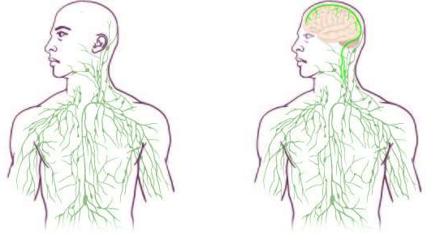

Links: traditionelles Lymphsystem; rechts: das aktualisierte Gehirn-Immunsystem.

**Viele sprechen von einer medizinischen Sensation: eine Verbindung zwischen Immunsystem und Gehirn. Welche Mechanismen bei Kopfschmerzen sind von dieser neuen Entdeckung betroffen?**

Häufig wiederkehrende Kopfschmerzattacken führen in den Schmerz weiterleitenden Nerven zu einer Sensibilisierung. Das begünstigt weitere Attacken. So entstehen chronische Entzündungen mit andauernden Schmerzen.

Bei diesem Teufelskreis stehen Makrophagen im Verdacht ein Wörtchen mitzureden. Makrophagen sind die Fresszellen des Immunsystems, und insbesondere bei Migräne diskutiert man einen „functional cross-talk“ dieser Zellen [1].

Doch das Gehirn und das Rückenmark wurden bisher als immunprivilegiertes Organe angesehen. Das heißt, der Zugang des Immunsystems zum Gehirn galt als streng reguliert. Fresszellen können nicht so einfach ins Gehirn einwandern, um Tumorzellen und Krankheitserreger, wie Bakterien, Viren, Parasiten, Pilze und subzelluläre Erreger, wie die Prionen, abzuwehren.

Auch die molekularen Antikörper, die in der Immunabwehr eingesetzt werden, kommen nicht so leicht ins Gehirn, denn sie können nicht die Blut-Hirn-Schranke passieren. Die Lösung schienen Fresszellen im Gehirn zu sein, die schon immer da sind. In der Tat besitzt das Gehirn eine solche eigene Abwehr: die Mikrogliazellen. Diese Zellen sind im zentralen Nervensystem ansässige Makrophagen, sie sind also nicht aus den Blutgefäßsystem eingewandert. Diese Zellen bilden die Hauptform der aktiven Immunabwehr im Gehirn.

All das dachte man bis Anfang vorletzter Woche. Dann puplizierte „Nature“ eine Arbeit, die alles wieder in Frage stellt. Forscher fanden Lymphbahnen im Gehirn. Mit anderen Worten eine direkte Gehirn-Immun-Verbindung [2]. Das Gehirn ist also doch kein immunprivilegiertes Organ.

Jonathan Kipnis, der leitende Wissenschaftler hält die Entdeckung seines Teams für bedeutend für jede neurologische Krankheit, von Autismus über die Alzheimer-Krankheit zu Multiple Skleros.

Was also bedeutet das für die Kopfschmerzforschung? Ich denke, in einigen Labors wird schon hektisch geforscht. Drei Ansätze sehe ich:

* Chronische Entzündungen mit andauernden Schmerzattacken, wie bei chronischer Migräne, müssen neu betrachtet werden.
* Ebenso die chronisch traumatische Enzephalopathie (CTE). CTE weist nicht nur ein migräneähnliches Krankheitsbild auf, sondern gehört aber zu den sogenannten Tauopathien, d.h. es ist eine neurodegenerative Krankheit, die durch die Ansammlung des Tau-Proteins im Gehirn gekennzeichnet ist, genau wie auch die Alzheimer-Krankheit, die schon Kipnis erwähnt.
* Des Weiteren gab es seit langen Hinweise, dass die Migräne-Welle (die sog. Spreading Depression), die die Aura verursacht, die Mikrogliazellen auf einen Lévy-Flug schickt [3], womit man einen Random Walk bezeichnet, auf dem man deutlich schneller wandern können als allein durch Diffusion getrieben. Auch hier könnte die bisher unbekannte Gehirn-Immun-Verbindung eine Rolle spielen. Vielleicht haben Mikroglia  einen “Migrationshintergrund” im Immunsystem?

Noch sind das nur erste Vermutungen und ich kann die Bedeutung dieser neuen Gehirn-Immun-Verbindung für primäre Kopfschmerzen nicht wirklich abschätzen. Klar ist aber, dass viele Fragen wieder offen sind.

## 

## Literatur

[1] Franceschini, A., Nair, A., Bele, T., van den Maagdenberg, A. M., Nistri, A., & Fabbretti, E. (2012). [Functional crosstalk in culture between macrophages and trigeminal sensory neurons of a mouse genetic model of migraine](http://www.biomedcentral.com/1471-2202/13/143). BMC neuroscience, 13(1), 143.

[2] Louveau, A., Smirnov, I., Keyes, T. J., Eccles, J. D., Rouhani, S. J., Peske, J. D., … & Kipnis, J. (2015). Structural and functional features of central nervous system lymphatic vessels. Nature. ([Link ohne Bezahlwand](http://www.nature.com/nature/journal/vaop/ncurrent/full/nature14432.html))

[3] Grinberg, Y. Y., Milton, J. G., & Kraig, R. P. (2011). [Spreading depression sends microglia on Lévy flights](http://journals.plos.org/plosone/article?id=10.1371/journal.pone.0019294). PLoS One, 6(4), e19294.  
ISO 690
