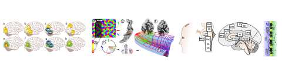

Ich blogge seit drei Jahren hier im Portal. SciLogs ist in vielen Punkten ein absolut herausragendes Portal für Wissenschaftsblogs.

Was mich zur Zeit stört und wahrscheinlich auch einige meiner Leser ist u.a. die schlechte Lesbarkeit von Beiträgen, wenn man mobil unterwegs ist. Mobil bequem lesen zu können, ist für mich ein wichtiges Merkmal eines attraktiven Blogs.

Auch die Kommentar-Funktion auf SciLogs ist schlecht. Leicht kommentieren zu können ist ein weiteres wichtiges Kriterium für die Wahl meines Blogs.

Dass ich nun [eine neue Heimat teste](http://grauesubstanz.wordpress.com/), hängt also vor allem an der Technik und letztlich ist entscheidend, ob auch meine Leser dieses Format bevorzugen.

